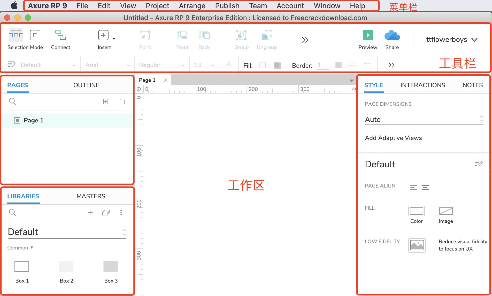
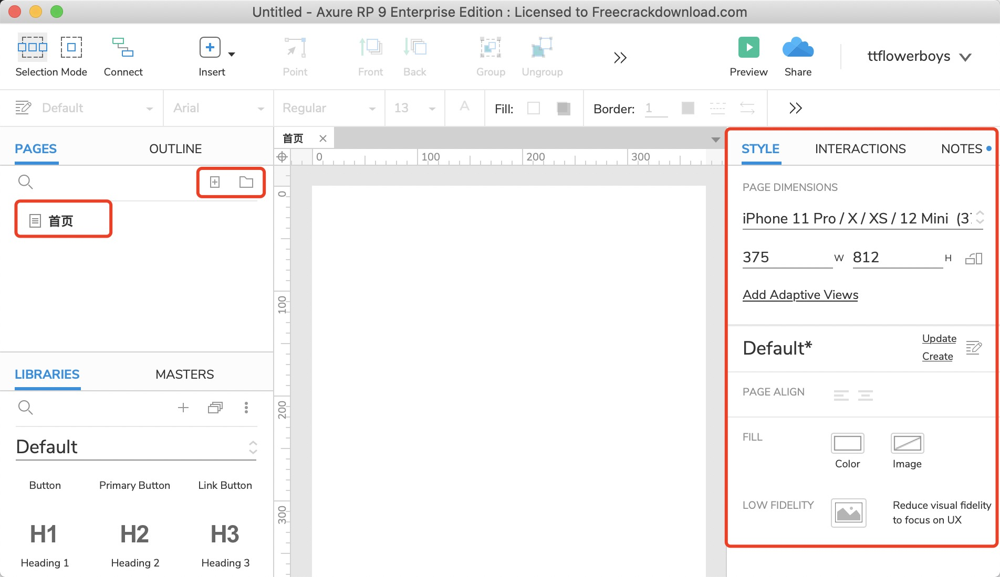
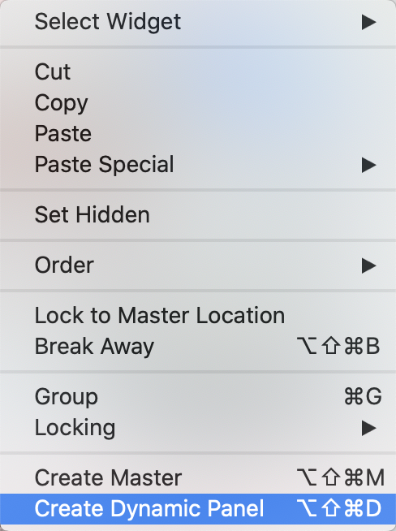
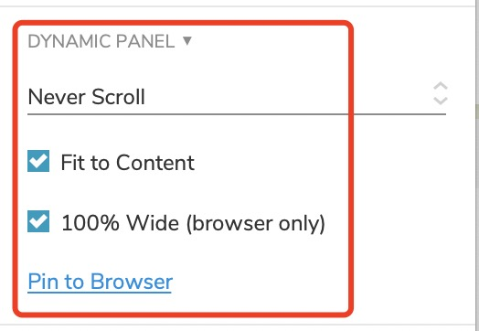
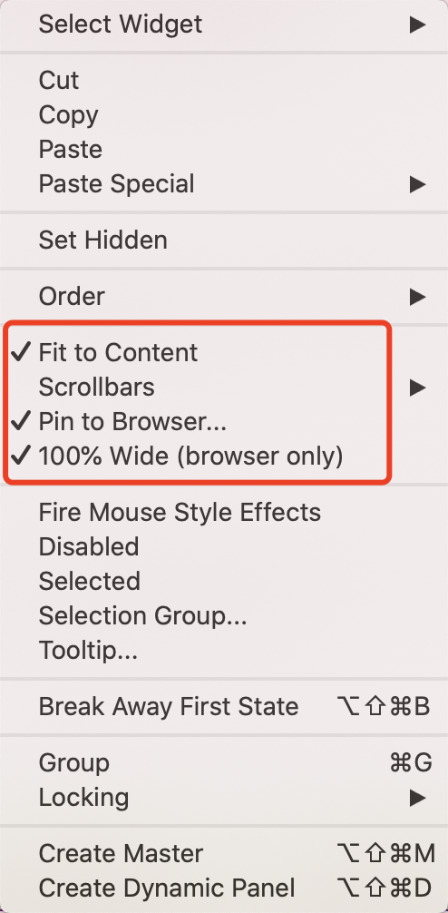
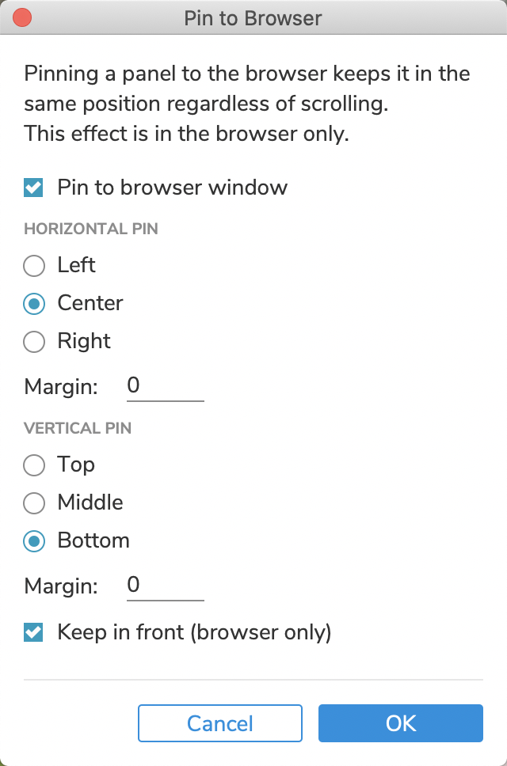

# Axure

:::tip 说点啥
不干正事的前端开发，干起了产品的活，Axure走一波
:::

## Axure软件介绍
> * 菜单栏
> * 工具栏
> * 面板：
>   * PAGES、OUTLINE
>   * LIBRARIES、MASTERS
>   * STYLE、INTERACTIONS、NOTES
> * 工作区

## 开始

### Add Page

* 左侧面板PAGES下的+图标，增加一个页面

* 设置页面样式：右侧面板 `STYLE`，PAGE DIMENSIONS（页面尺寸），如：`iPhone 8 Plus(414 x 736)`

  

### Masters（母板）

> 母板（**Master**）是在你的文件中可以重复使用的widgets的集合。通常被用于headers，footers，navigation（导航）和页面模板中。

* 鼠标右键，create master

## 导航栏固定到浏览器底部或顶部

### Create Dynamic Panel

* 选择某一区块，右键，**Create Dynamic Panel(创建动态面板)**

  

### DYNAMIC PANEL

* 在右侧 `STYLE` 面板里找到如下：

  

* 或**右键**转换后的“动态面板” 

  

### Pin to browser window

- [x] Pin to browser window

- [ ] HORIZONTAL PIN
  - [x] Center

- [ ] VERTICAL PIN
  - [x] Bottom

- [x] Keep in front (browser)

## 参考文献

* [Axure RP使用基础教程](https://www.jianshu.com/p/97fd99e38d71)

