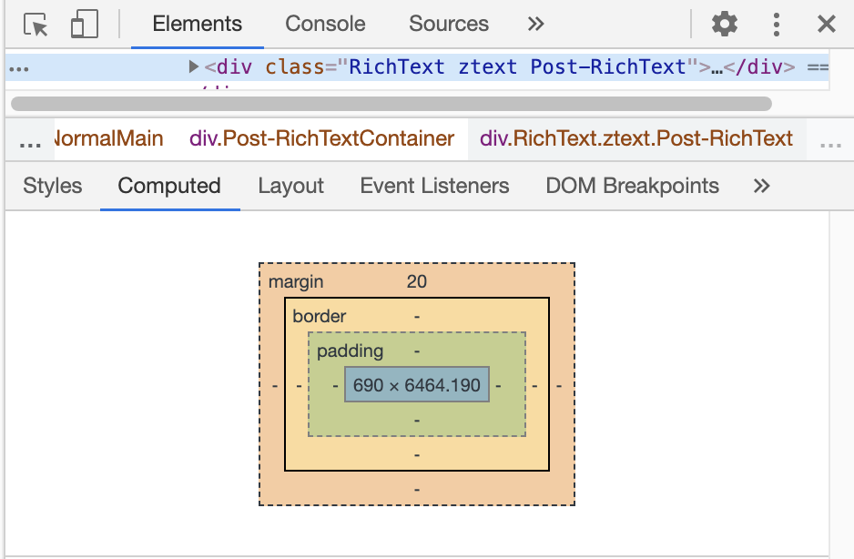

# CSS面试

:::tip 哎，就是玩...

本着出道既是巅峰，只学有用的原则。整理归类该知识点相关面试题，对所学知识进行巩固和深入。

:::


## 1. CSS盒模型(Box Model)

> 所有HTML元素可以看作盒子，在CSS中，**box model**这一术语是用来设计和布局时使用。

### a. CSS Box Model是什么？

1. 先来通过可视化直观的看下 css box model长啥样吧？

   打开 [google chrome 开发者工具](/chrome/) -> 选择 `Elements`(元素) -> 找到下面的 `Computed`(计算) 。呐，下面那些四环就是。

2. 环线的意义

* 一环（width、height）- 盒子的内容(自带宽度属性)，显示文本和图像。
* 二环（padding）- 清除内容周围的区域，内边距是透明的。
* 三环（border）- 围绕在内边距和内容外的边框。
* 四环（margin）- 清除边框外的区域，外边距是透明的。

3. CSS盒模型到底是什么？

   * css的盒模型由：content(内容)、padding(内边距)、border（边框）、margin（外边距）组成。
   * css的盒模型大小由：content + padding + border 决定

4. 盒模型的content（内容，即元素宽高）是如何计算的呢？

   盒模型的内容，当没有设置宽高属性时，会根据元素内容自动撑开。决定元素内容大小计算还与 css3中的 `box-sizing`属性有关



### b. box-sizing属性的理解

 * 语法：

    ```css
    box-sizing: content-box | border-box | inherit
    ```

 * 属性：

   	* `content-box`：使得元素的宽高即为内容区的宽高(默认模式)
    * `border-box`：计算方式`content + padding + border` = 本身元素大小，即缩小了`content`大小
    * `inherit` ：指定 `box-sizing` 属性的值，应该从父元素继承

### c. 应用：CSS画一个三角形

> 元素宽高设置为 0，通过 `border` 属性来设置，让其它三个方向的 `border` 颜色为透明或者和背景色保持一致，剩余一条 `border` 的颜色设置为需要的颜色。

```css
div {
    width: 0;
    height: 0;
    border: 5px solid transparent;
    border-top-color: red;
}
```


## 2. 清除浮动

> 连环三问：清除浮动是什么？什么时候需要清除浮动？清除浮动方法？

:::tip 清除浮动

浮动的元素是脱离文档标准流的，如果我不清楚浮动，那么就会造成**父元素高度塌陷**，影响页面布局。

:::

### a. 清除浮动方法

* 父元素设置高度 `height: <string>`

* 父元素添加 `overflow: hidden` 属性

* 父元素添加伪元素 `::after`

  ```css
  .clearfix::after{
    display: block;
    clear: both;
    content:"";
  }
  ```


### b. 哪种方法最好？

:::tip 推荐

推荐使用伪元素（`::after`），它的好处在于，不增加冗余的DOM节点，且符合结构语义化

:::

:::warning overflow:hidden

透过现象看本质！之所以，推荐伪元素的方式来清除浮动，并不是笔者主观个人习惯或倾向。

* `overflow: hidden` 会触发 **[BFC](/CSS/BFC/)** 机制

:::

## 3. 元素水平垂直居中

> 实际项目开发中，我们会经常遇到**让一个不定宽高的盒子水平垂直居中**

### a. 定位（position）方式

```css
.box {
    position: relative;
}
.item {
    position: absolute;
    top: 0;
    right: 0;
    bottom: 0;
    left: 0;
    margin: auto;
}
```

### b. CSS3 transform属性

> [transform](https://developer.mozilla.org/zh-CN/docs/Web/CSS/transform)，通过修改CSS视觉格式化模型的坐标空间来实现

```css
.box {
    position: relative;
}
.item {
    position: absolute;
    top: 50%;
    left: 50%;
    transform: translate(-50%, -50%); /* 会开启GPU加速，推荐使用 */
}
```

### c. CSS3 flex布局

```css
.box {
    display: flex;
    justify-content: center;
    align-items: center;
}
```

## 4. 两列布局（左侧固定宽度、右侧自适应）

* 浮动布局

  ```css
  .left{
    width:200px; height:300px; background:#5A6A94;
    float:left;
  }
  .right{
    height:300px; background:#BE4F4F;
    margin-left:200px;
  }
  ```

* 绝对定位

  ```css
  left{
    position: absolute;
    left:0;
  }
  .right{
    position: absolute;
    left:200px;
    width:100%
  }
  ```

* flex布局

  ```css
  .box{ display: flex; }
  .left{ width: 200px; }
  .right{ flex:1 }
  ```

* table布局

  ```css
  .box{ display: table; width:100%; }
  .left{ width: 200px; display: table-cell; }
  .right{ display: table-cell; }
  ```


## 5. position定位

CSS **`position`**属性用于指定一个元素在文档中的定位方式。`top`，`right`，`bottom`和 `left` 属性则决定了该元素的最终位置。

### a. [定位类型](https://developer.mozilla.org/zh-CN/docs/Web/CSS/position#定位类型)

- **定位元素（positioned element）**是其计算后位置属性为 `relative`, `absolute`, `fixed `或 `sticky` 的一个元素（换句话说，除`static`以外的任何东西）。
- **相对定位元素（relatively positioned element）**是计算后位置属性为 `relative `的元素。
- **绝对定位元素（absolutely positioned element）**是计算后位置属性为 `absolute` 或 `fixed` 的元素。
- **粘性定位元素stickily positioned element）**是计算后位置属性为 `sticky` 的元素。

### b. [语法](https://developer.mozilla.org/zh-CN/docs/Web/CSS/position#语法)

`position` 属性被指定为从下面的值列表中选择的单个关键字。

- `static`

  该关键字指定元素使用正常的布局行为，即元素在文档常规流中当前的布局位置。此时 `top`, `right`, `bottom`, `left` 和 `z-index `属性无效。

- `relative`

  该关键字下，元素先放置在未添加定位时的位置，再在不改变页面布局的前提下调整元素位置（因此会在此元素未添加定位时所在位置留下空白）。`position:relative` 对 `table-*-group`, `table-row`,` table-column`, `table-cell`, `table-caption` 元素无效。

- `absolute`

  元素会被移出正常文档流，并不为元素预留空间，通过指定元素相对于最近的非 static 定位祖先元素的偏移，来确定元素位置。绝对定位的元素可以设置外边距（margins），且不会与其他边距合并。

- `fixed`

  元素会被移出正常文档流，并不为元素预留空间，而是通过指定元素**相对于屏幕视口**（viewport）的位置来指定元素位置。元素的位置在屏幕滚动时不会改变。打印时，元素会出现在的每页的固定位置。`fixed` 属性会创建新的层叠上下文。当元素祖先的 `transform`, `perspective` 或 `filter` 属性非 `none` 时，容器由视口改为该祖先。

- `sticky`

  元素根据正常文档流进行定位，然后相对它的*最近滚动祖先（nearest scrolling ancestor）*和 [containing block](https://developer.mozilla.org/en-US/docs/Web/CSS/Containing_block) (最近块级祖先 nearest block-level ancestor)，包括table-related元素，基于`top`, `right`, `bottom`, 和 `left`的值进行偏移。偏移值不会影响任何其他元素的位置。

  该值总是创建一个新的[层叠上下文（stacking context](https://developer.mozilla.org/en/docs/Web/CSS/CSS_Positioning/Understanding_z_index/The_stacking_context)）。注意，一个sticky元素会“固定”在离它最近的一个拥有“滚动机制”的祖先上（当该祖先的`overflow` 是 `hidden`, `scroll`, `auto`, 或 `overlay`时），即便这个祖先不是最近的真实可滚动祖先。这有效地抑制了任何“sticky”行为（详情见[Github issue on W3C CSSWG](https://github.com/w3c/csswg-drafts/issues/865)）。


## 6. flex弹性布局

> 这年头要不会点 [flex](https://developer.mozilla.org/zh-CN/docs/Web/CSS/flex) 布局，你都不好意思跟人说你是枚切图仔。推荐两个学习网址
>
> * [A Complete Guide to Flexbox](https://css-tricks.com/snippets/css/a-guide-to-flexbox/)
> * [Flex布局教程：语法篇](http://www.ruanyifeng.com/blog/2015/07/flex-grammar.html)、[Flex布局教程：实例篇](https://www.ruanyifeng.com/blog/2015/07/flex-examples.html)

* 水平、垂直居中

```css
div{
  display: flex;
  justify-content: center;
  align-items: center;
}
```

* 分栏布局

```css
div{
  display: flex;
}
.item_l{
  width: 200px;
}
.item_r{
  flex: 1;
}
```


## 7. 文字超出显示 ...

### a. css 一行文本超出...

```css
.text{
  overflow: hidden;
  text-overflow: ellipsis;
  white-space: nowrap;
}
```

### b. 多行文本超出显示...

```css
.text{
  display: -webkit-box;
  -webkit-box-orient: vertical;
  -webkit-line-clamp: 3;
  overflow: hidden;
}
```


## 8. BFC

**块格式化上下文（Block Formatting Context，BFC）** 是Web页面的可视CSS渲染的一部分，是块盒子的布局过程发生的区域，也是浮动元素与其他元素交互的区域。


## 9. 重绘 和 回流

[重绘、回流](https://juejin.cn/post/6844903569087266823)**回流必将引起重绘，重绘不一定会引起回流。**

:::tip 浏览器使用流式布局模型 (Flow Based Layout)。

* 浏览器会把`HTML`解析成`DOM`，把`CSS`解析成`CSSOM`，`DOM`和`CSSOM`合并就产生了`Render Tree`。

* 有了`RenderTree`，我们就知道了所有节点的样式，然后计算他们在页面上的大小和位置，最后把节点绘制到页面上。

* 由于浏览器使用流式布局，对`Render Tree`的计算通常只需要遍历一次就可以完成，但`table`及其内部元素除外，他们可能需要多次计算，通常要花3倍于同等元素的时间，这也是为什么要避免使用`table`布局的原因之一。

:::

### a. 回流（Reflow）

当`Render Tree`中部分或全部元素的尺寸、结构、或某些属性发生改变时，**浏览器重新渲染部分或全部文档的过程**称为回流。

会导致回流的操作：

- 页面首次渲染
- 浏览器窗口大小发生改变
- 元素尺寸或位置发生改变
- 元素内容变化（文字数量或图片大小等等）
- 元素字体大小变化
- 添加或者删除**可见**的`DOM`元素
- 激活`CSS`伪类（例如：`:hover`）
- 查询某些属性或调用某些方法

一些常用且会导致回流的属性和方法：

- `clientWidth`、`clientHeight`、`clientTop`、`clientLeft`
- `offsetWidth`、`offsetHeight`、`offsetTop`、`offsetLeft`
- `scrollWidth`、`scrollHeight`、`scrollTop`、`scrollLeft`
- `scrollIntoView()`、`scrollIntoViewIfNeeded()`
- `getComputedStyle()`
- `getBoundingClientRect()`
- `scrollTo()`

### b. 重绘 (Repaint)

当页面中**元素样式的改变并不影响它在文档流中的位置**时（例如：`color`、`background-color`、`visibility`等），浏览器会将新样式赋予给元素并重新绘制它，这个过程称为重绘。


## 10. 图标字体

[icon](/css/icon/)

`@font-face`

## 11. 响应式设计

响应式网站设计是一个网站能够兼容多个终端，而不是为每一个终端做一个特定的版本。基本原理是通过媒体查询检测不同的设备屏幕尺寸做处理

* `@media`媒体查询
* `rem`，rem单位无论嵌套层级如何，都只相对于浏览器的根元素（HTML元素）的`font-size`
* `vw/vh`，vw表示相对于视图窗口的宽度，vh表示相对于视图窗口高度，除了vw和vh外，还有vmin和vmax两个相关的单位
* `rem2px`和`px2rem`

## 12. CSS3新特性

- 实现圆角`border-radius`，阴影`box-shadow`，边框图片`border-image`
- 对文字加特效`text-shadow`，强制文本换行`word-wrap`，线性渐变`linear-gradient`
- 实现旋转`transform:rotate(90deg)`,缩放`scale(0.85,0.90)`,`translate(0px,-30px)`定位,倾斜`skew(-9deg,0deg)`;
- 增加了更多的CSS选择器、多背景、`rgba()`
- 唯一引入的伪元素是`::selection`；
- 实现媒体查询`@media`，多栏布局`flex`
- 过渡`transition` 动画`animation`

## 13. 伪元素

* **::before 和 :after中双冒号和单冒号有什么区别？解释一下这2个伪元素的作用**

单冒号(:)用于`CSS3`伪类，双冒号(::)用于`CSS3`伪元素。（伪元素由双冒号和伪元素名称组成）,双冒号是在当前规范中引入的，用于区分伪类和伪元素

## 14. 为什么要初始化CSS样式

因为浏览器的兼容问题，不同浏览器对有些标签的默认值是不同的，如果没对 `CSS` 初始化往往会出现浏览器之间的页面显示差异初始化样式会对 `SEO` 有一定的影响

## 15. 隐藏页面元素

* `display: none`：元素不存在，从 `dom` 中删除，会引发 回流
* `visibility: hidden`：元素隐藏，但元素仍旧存在，页面中无法触发该元素的事件。
* `opacity: 0`：元素透明度将为 0，但元素仍然存在，绑定的事件仍旧有效仍可触发执行。


## 16.CSS优化、提高性能的方法有哪些

- 移除空的`css`规则（Remove empty rules）
- 正确使用`display`的属性
- 不滥用浮动、`web`字体
- 不声明过多的`font-size`
- 不在选择符中使用`ID`标识符
- 遵守盒模型规则
- 尽量减少页面重排、重绘
- 抽象提取公共样式，减少代码量

## 17. CSS预处理器