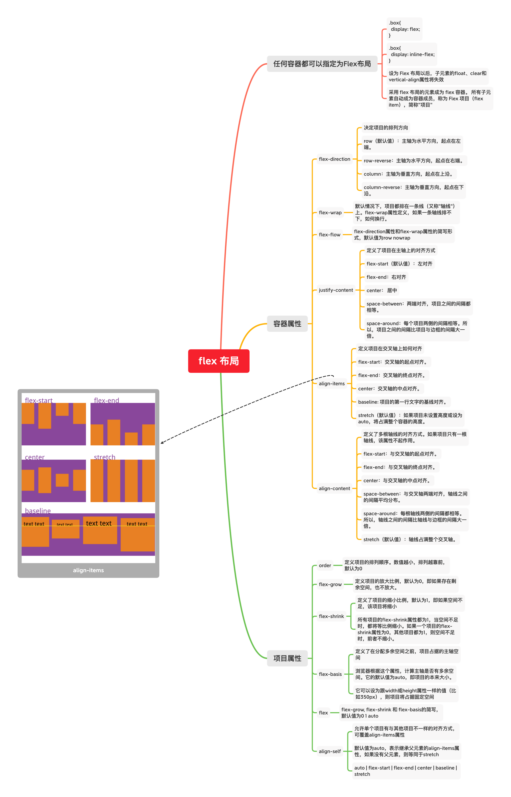

# flex弹性布局

:::tip

Flexible Box 模型，通常被称为 [flexbox](https://developer.mozilla.org/zh-CN/docs/Web/CSS/CSS_Flexible_Box_Layout/Basic_Concepts_of_Flexbox)，是一种一维的布局模型。它给 flexbox 的子元素之间提供了强大的空间分布和对齐能力。

flexbox 是一种一维的布局，是因为一个 flexbox 一次只能处理一个维度上的元素布局，一行或者一列。作为对比的是另外一个二维布局 [CSS Grid Layout](https://developer.mozilla.org/en-US/docs/Web/CSS/CSS_Grid_Layout)，可以同时处理行和列上的布局。

:::



# 父元素 (flex container)

- flex-direction
- flex-wrap
- flex-flow
- justify-content
- align-items
- align-content

## 一、两根轴线（flex-direction）

:::tip

当使用 flex 布局时，首先想到的是两根轴线 — 主轴和交叉轴。主轴由 [`flex-direction`](https://developer.mozilla.org/zh-CN/docs/Web/CSS/flex-direction) 定义，另一根轴垂直于它。

:::

### 1.1 主轴

主轴由 `flex-direction` 定义，可以取4个值：

```css
.container {
  flex-direction: row (default) | row-reverse | column | column-reverse;
}
```

* 如果你选择了 `row` 或者 `row-reverse`，你的主轴将沿着 **inline** 方向延伸。


* 选择 `column` 或者 `column-reverse` 时，你的主轴会沿着上下方向延伸 — 也就是 **block 排列的方向。**


### 1.2 交叉轴

**交叉轴垂直于主轴**，所以如果你的`flex-direction` (主轴) 设成了 `row` 或者 `row-reverse` 的话，交叉轴的方向就是沿着列向下的。


如果主轴方向设成了 `column` 或者 `column-reverse`，交叉轴就是水平方向。


理解主轴和交叉轴的概念对于对齐 flexbox 里面的元素是很重要的；flexbox 的特性是沿着主轴或者交叉轴对齐之中的元素。


## 二、起始线和终止线

flexbox 不会对文档的书写模式提供假设。

* 如果 `flex-direction` 是 `row` ，并且我是在书写英文，那么主轴的起始线是左边，终止线是右边。


* 如果我在书写阿拉伯文，那么主轴的起始线是右边，终止线是左边。


在这两种情况下，交叉轴的起始线是flex容器的顶部，终止线是底部，因为两种语言都是水平书写模式。

之后，你会觉得用起始和终止来描述比左右更合适，这会对你理解其他相同模式的布局方法（例如：CSS Grid Layout）起到帮助的作用。


## 三、flex-wrap

[用flex-wrap实现多行Flex容器](https://developer.mozilla.org/zh-CN/docs/Web/CSS/CSS_Flexible_Box_Layout/Basic_Concepts_of_Flexbox#用flex-wrap实现多行flex容器)

```css
.container {
  flex-wrap: nowrap (default) | wrap | wrap-reverse;
}
```


## 四、flex-flow

属性 `flex-direction` 和 `flex-wrap` 组合为简写属性 [`flex-flow`](https://developer.mozilla.org/zh-CN/docs/Web/CSS/flex-flow)。

* 语法：

  ```css
  .container {
    flex-flow: <flex-direction> | <flex-wrap>
  }
  ```

  

## 五、[元素间的对齐和空间分配](https://developer.mozilla.org/zh-CN/docs/Web/CSS/CSS_Flexible_Box_Layout/Basic_Concepts_of_Flexbox#元素间的对齐和空间分配)

### 6.1 align-items

[`align-items`](https://developer.mozilla.org/zh-CN/docs/Web/CSS/align-items) 属性可以使元素在**交叉轴方向对齐**。

```css
.container {
  align-items: stretch | flex-start | flex-end | center | baseline | first baseline | last baseline | start | end | self-start | self-end + ... safe | unsafe;
}
```


### 6.2 justify-content

[`justify-content`](https://developer.mozilla.org/zh-CN/docs/Web/CSS/justify-content)属性用来使元素在主轴方向上对齐，主轴方向是通过 `flex-direction` 设置的方向。初始值是`flex-start`，元素从容器的起始线排列。但是你也可以把值设置为`flex-end`，从终止线开始排列，或者`center`，在中间排列.

```css
.container {
  align-content: flex-start | flex-end | center | space-between | space-around | space-evenly | stretch | start | end | baseline | first baseline | last baseline + ... safe | unsafe;
}
```


下列`justify-content`属性的值：

- `stretch`
- `flex-start`
- `flex-end`
- `center`
- `space-around`
- `space-between`


# 子元素（flex items）

:::tip 项目的属性

以下6个属性设置在项目上：

- `order`：属性定义项目的排列顺序。数值越小，排列越靠前，默认为0。
- `flex-grow`：属性定义项目的放大比例，默认为`0`，即如果存在剩余空间，也不放大。
- `flex-shrink`：属性定义了项目的缩小比例，默认为1，即如果空间不足，该项目将缩小。
- `flex-basis`：属性定义了在分配多余空间之前，项目占据的主轴空间（main size）。浏览器根据这个属性，计算主轴是否有多余空间。
- `flex`：是`flex-grow`, `flex-shrink` 和 `flex-basis`的简写，默认值为`0 1 auto`。后两个属性可选。
- `align-self`：允许单个项目有与其他项目不一样的对齐方式，可覆盖`align-items`属性。默认值为`auto`，表示继承父元素的`align-items`属性，如果没有父元素，则等同于`stretch`。

:::


## flex元素上的属性

为了更好地控制 flex 元素，有三个属性可以作用于它们：

- [`flex-grow`](https://developer.mozilla.org/zh-CN/docs/Web/CSS/flex-grow)：增长
- [`flex-shrink`](https://developer.mozilla.org/zh-CN/docs/Web/CSS/flex-shrink) ：收缩
- [`flex-basis`](https://developer.mozilla.org/zh-CN/docs/Web/CSS/flex-basis)：空间大小

在考虑这几个属性的作用之前，需要先了解一下 **可用空间** available space 这个概念。这几个 flex 属性的作用其实就是改变了 flex 容器中的可用空间的行为。同时，可用空间对于 flex 元素的对齐行为也是很重要的。


### flex合并写法

```css
.item {
  flex: none | [ <'flex-grow'> <'flex-shrink'>? || <'flex-basis'> ]
}
```

* 第一个数值是 `flex-grow`。赋值为正数的话是让元素增加所占空间。
* 第二个数值是`flex-shrink` — 正数可以让它缩小所占空间，但是只有在flex元素总和超出主轴才会生效。
* 最后一个数值是 `flex-basis`；flex元素是在这个基准值的基础上缩放的。


### align-self

```css
.item {
  align-self: auto | flex-start | flex-end | center | baseline | stretch;
}
```


> * [A Complete Guide to Flexbox](https://css-tricks.com/snippets/css/a-guide-to-flexbox/)
>* [Flex布局教程：语法篇](http://www.ruanyifeng.com/blog/2015/07/flex-grammar.html)、[Flex布局教程：实例篇](https://www.ruanyifeng.com/blog/2015/07/flex-examples.html)


