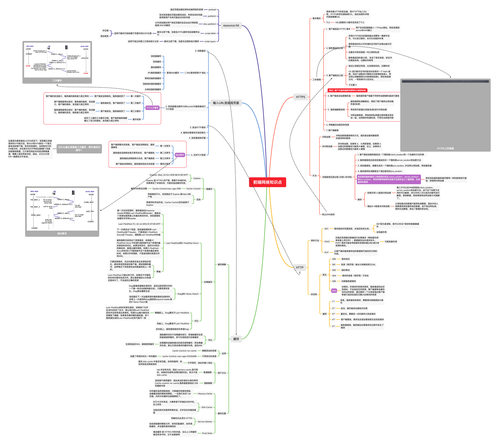

# HTTP协议

:::tip
* HTTP
  * HTTP/1.1
  * HTTP/2
* SSL
* HTTPS
:::




## 理论

* [网络安全](https://www.cloudflare.com/zh-cn/learning/)
* [HTTP 与 HTTPS：有什么区别？](https://www.cloudflare.com/zh-cn/learning/ssl/why-is-http-not-secure/)
* [什么是 HTTPS？](https://www.cloudflare.com/zh-cn/learning/ssl/what-is-https/)
* [什么是 TLS 握手？](https://www.cloudflare.com/zh-cn/learning/ssl/what-happens-in-a-tls-handshake)
* [什么是 IP 和 TCP？](https://www.cloudflare.com/zh-cn/learning/ddos/glossary/tcp-ip)
* [什么是用户数据报协议（UDP / IP）？](https://www.cloudflare.com/zh-cn/learning/ddos/glossary/user-datagram-protocol-udp)
* [什么是网络层？](https://www.cloudflare.com/zh-cn/learning/network-layer/what-is-the-network-layer/)
* [DNS](https://www.cloudflare.com/zh-cn/learning/ddos/glossary/domain-name-system-dns)

1. [Difference between HTTP and HTTPS](https://www.guru99.com/difference-http-vs-https.html)
2. [TCP 3-Way Handshake (SYN, SYN-ACK,ACK)](https://www.guru99.com/tcp-3-way-handshake.html)
3. [TCP/IP Model:Layers & Protocol](https://www.guru99.com/tcp-ip-model.html)

## 实践

**TCP(Transmission Control Protocol)　传输控制协议**

SYN 攻击是一种典型的 DoS/DDoS 攻击

[三次握手和四次挥手](https://juejin.cn/post/6844903958624878606)

> ## 三次握手
>
> 三次握手（Three-way Handshake）其实就是指建立一个TCP连接时，需要客户端和服务器总共发送3个包。进行三次握手的主要作用就是为了确认双方的接收能力和发送能力是否正常、指定自己的初始化序列号为后面的可靠性传送做准备。实质上其实就是连接服务器指定端口，建立TCP连接，并同步连接双方的序列号和确认号，交换`TCP窗口大小`信息。

> ### 挥手为什么需要四次？
>
> 因为当服务端收到客户端的SYN连接请求报文后，可以直接发送SYN+ACK报文。其中**ACK报文是用来应答的，SYN报文是用来同步的**。但是关闭连接时，当服务端收到FIN报文时，很可能并不会立即关闭SOCKET，所以只能先回复一个ACK报文，告诉客户端，"你发的FIN报文我收到了"。只有等到我服务端所有的报文都发送完了，我才能发送FIN报文，因此不能一起发送。故需要四次挥手。


Syntax of an HTTP URL

[](https://www.ibm.com/docs/en/cics-ts/5.3?topic=concepts-components-url#skipd2598e159)http://host nameIP address:80:port/path component?query string

Here is an example of an HTTP URL:

```
http://www.example.com/software/index.html
```


With a port number specified, the URL is:

```
http://www.example.com:1030/software/index.html
```


* [The Internet protocol suite](https://www.khanacademy.org/computing/computers-and-internet/xcae6f4a7ff015e7d:the-internet/xcae6f4a7ff015e7d:the-internet-protocol-suite/a/the-internet-protocols)

  

* [The Internet](https://www.khanacademy.org/computing/computers-and-internet/xcae6f4a7ff015e7d:the-internet)
* 

## 总结

* 在浏览器地址栏输入一个 url，会发生什么？


## 参考文献

* [MDN HTTP教程

* 《TCP/IP详解 卷1:协议》

* [Internet Protocol and Layers](http://www.umass.edu/nfp/guru/handout/ip_layers.html)

* [w3 - The Internet Protocol Stack](https://www.w3.org/People/Frystyk/thesis/TcpIp.html)

* [The components of a URL](https://www.ibm.com/docs/en/cics-ts/5.3?topic=concepts-components-url)

  

* [Khanacademy Computing](https://www.khanacademy.org/computing)

* [Network protocols](https://www.manageengine.com/network-monitoring/network-protocols.html)


https://www.javatpoint.com/computer-network-tcp-ip-model