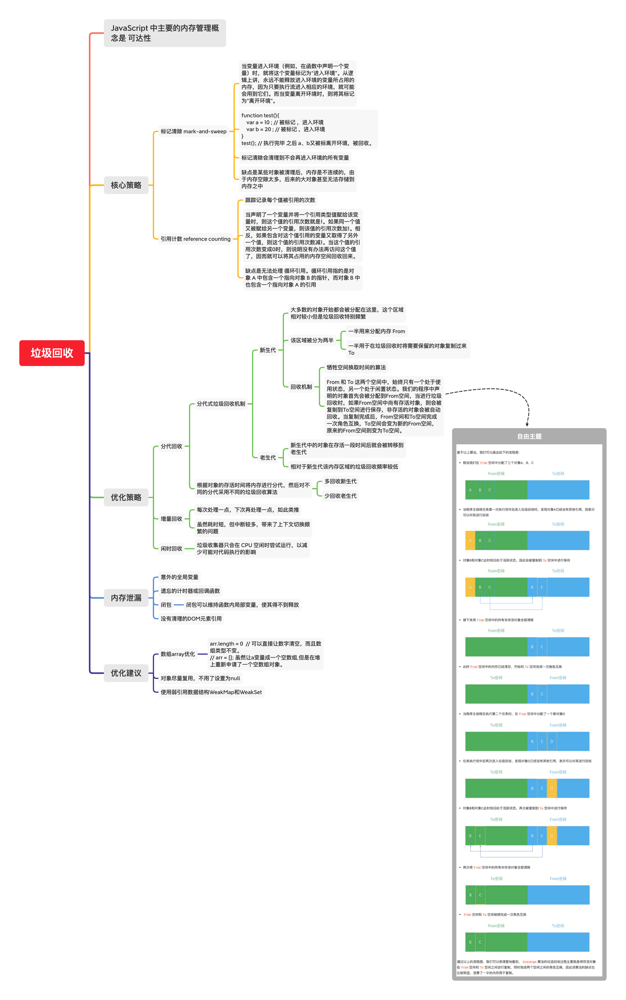

# this
:::tip this指向

this用于访问当前方法所属的对象，即：跟调用有关！

1. 沿着作用域向上找，最近的一个function（不是箭头函数）,看这个function**最终是怎样执行**的；
2. this的指向取决于所属 **function的调用方式**，而不是定义
3. function调用一般分为以下几种情况：
   1. 作为函数函数，即：`fn()`
      1. 非严格模式下，指向全局对象（`window`）
      2. 严格模式（`use strict`）下，指向 `undefined`
   2. 作为方法调用，即：`obj.fn()`
      1. 指向最终调用这个方法的对象
   3. 作为函数函数调用，如： `new Fn()`
      1. 指向一个新对象 `Fn {}`
   4. 特殊调用，即：`fn.call()`、`fn.apply()`、`fn.bind()`
      1. 参数指向成员

:::


```js
// 1. this指向window
console.log(this === window)

// 2. this指向调用它的对象
var obj = {
  name: 'hello',
  fn: function(){
    console.log(this)
  }
}

// 情况一： this指向obj
obj.fn()

// 情况二：this指向window
var newFn = obj.fn
newFn()


// 3. 
function show(){
  console.log(this);
}
show(); // 非 'use strict' 模式下，this最终指向 window；严格模式下，this为undefined

```

## 结果输出

```js
var length = 10;
function fn() { console.log(this.length) }

const obj = {
  length: 5,
  method: function(fn){
    fn()                  // 10
    arguments[0]()        // 3
  }
}

obj.method(fn, 1, 2)
```

当执行 `obj.method()`时，fn作为第一个参数传入，即：`arguments[0] === fn`.

根据我们的经验：函数的this指向与它调用方式有关，即：执行 `fn()`时，`this`指向 `window`，同理 `this.length === window.length`，所以：`fn()` 打印结果为：`10`。

对于`arguments[0]()`我们可以把它理解成：`arguments.0()`，即：由 `arguments`调用它。因此，`arguments[0]()` 打印结果为：`3`。


```js
class Person {
  constructor(name, age) {
    this.name = name;
    this.age = age;
    console.log('this in constructor', this)
  }
  
  test() {
    console.log('this in obj', this)
  }
  
  asyncFn() {
    setTimeout(function() {
      console.log('this in setTimeout', this)
    }, 0)
  }
}

const leon = new Person('leon', 18)
leon.test()
leon.asyncFn()

// output
Person{}
Person {}
window
```

## 垃圾回收机制

> 垃圾回收机制(GC:Garbage Collecation)


### 参考文献
* [3.1.4-闭包和面向对象设计、用闭包实现命令模式](https://www.bilibili.com/video/BV1oE411L7uK?p=5)