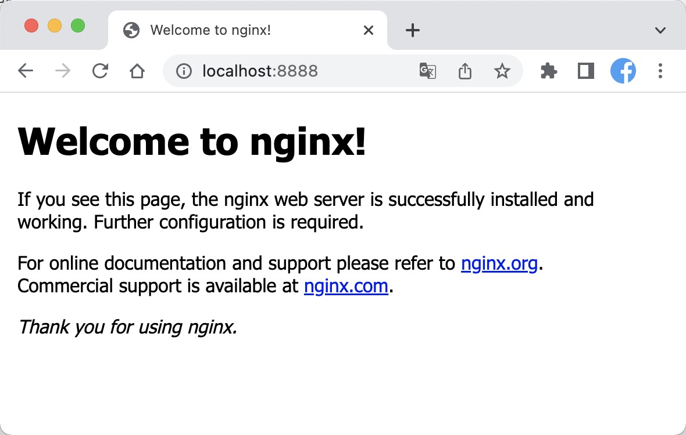

# MNMP

> MNMP，指的是：**M**ac + **N**ginx + **M**ySQL + **P**HP。
>
> 在Mac系统中，我们推荐使用：brew 安装！如安装过程中遇到问题，请参考 [brew](./brew.md)


## 一、Nginx

### 1.1 安装 nginx

* 常用命令

  ```bash
  # brew 安装
  brew install nginx
  
  # 启动nginx（默认 localhost:8080端口）
  sudo nginx
  
  # 重新加载|重启|退出
  sudo nginx -s reload|reopen|quit
  ```

* 安装

```bash
# 查询 nginx
brew search nginx

# 安装 nginx
brew install nginx

# 安装过程中，会出现如下信息：
==> Downloading https://mirrors.ustc.edu.cn/homebrew-bottles/nginx-1.21.1.catalina.bottle.tar.gz
######################################################################## 100.0%
==> Pouring nginx-1.21.1.catalina.bottle.tar.gz
==> Caveats
Docroot is: /usr/local/var/www

The default port has been set in /usr/local/etc/nginx/nginx.conf to 8080 so that
nginx can run without sudo.

nginx will load all files in /usr/local/etc/nginx/servers/.

To have launchd start nginx now and restart at login:
  brew services start nginx
Or, if you don't want/need a background service you can just run:
  nginx
==> Summary
🍺  /usr/local/Cellar/nginx/1.21.1: 25 files, 2.2MB
```


### 1.2 管理nginx

> 通过的上面安装信息，可以获取以下信息：
>
> * 默认端口号：`8080`
>
>   `The default port has been set in /usr/local/etc/nginx/nginx.conf to 8080 so that
>   nginx can run without sudo.`
>
>   我们可以手动修改端口号为 `8888`：
>
>   ```bash
>   server {
>       # 端口号
>       listen       8888;
>       # server_name
>       server_name  localhost;
>           
>       # ...
>   }
>   ```
>
>   
>
> * 加载所有nginx配置：
>
>   `/usr/local/etc/nginx/servers/`
>
> * 启动nginx
>
>   `brew services start nginx`
>
> * 后台服务启动nginx
>
>   `nginx`


## 二、Mysql

> Mac地址通过 `brew` 安装

### 2.1 查询MySql版本

```bash
# 查询
brew search mysql

# 安装指定版本
brew install mysql@5.7

# 安装成功后提示
We've installed your MySQL database without a root password. To secure it run:
    mysql_secure_installation

MySQL is configured to only allow connections from localhost by default

To connect run:
    mysql -uroot

mysql@5.7 is keg-only, which means it was not symlinked into /usr/local,
because this is an alternate version of another formula.

If you need to have mysql@5.7 first in your PATH, run:
  echo 'export PATH="/usr/local/opt/mysql@5.7/bin:$PATH"' >> ~/.zshrc

For compilers to find mysql@5.7 you may need to set:
  export LDFLAGS="-L/usr/local/opt/mysql@5.7/lib"
  export CPPFLAGS="-I/usr/local/opt/mysql@5.7/include"


To have launchd start mysql@5.7 now and restart at login:
  brew services start mysql@5.7
Or, if you don't want/need a background service you can just run:
  /usr/local/opt/mysql@5.7/bin/mysql.server start
```


### 2.2 命令

> ```bash
> mysql.server  {start|stop|restart|reload|force-reload|status}
> ```

* 启动MySQL服务：`mysql.server start`
* 设置密码：`mysql_secure_installation`
* 连接MySQL：`mysql -uroot`


## 三、PHP

> MacOS自带了 Apache 和 PHP
>
> * 查看PHP版本：`php -v 或 php -verseion`

### 3.1 安装 PHP

```bash
# 查询php
brew search php

# 安装指定版本php
brew install php@7.4

# 安装成功，提示信息
To enable PHP in Apache add the following to httpd.conf and restart Apache:
    LoadModule php7_module /usr/local/opt/php@7.4/lib/httpd/modules/libphp7.so

    <FilesMatch \.php$>
        SetHandler application/x-httpd-php
    </FilesMatch>

Finally, check DirectoryIndex includes index.php
    DirectoryIndex index.php index.html

The php.ini and php-fpm.ini file can be found in:
    /usr/local/etc/php/7.4/

php@7.4 is keg-only, which means it was not symlinked into /usr/local,
because this is an alternate version of another formula.

If you need to have php@7.4 first in your PATH, run:
  echo 'export PATH="/usr/local/opt/php@7.4/bin:$PATH"' >> ~/.zshrc
  echo 'export PATH="/usr/local/opt/php@7.4/sbin:$PATH"' >> ~/.zshrc

For compilers to find php@7.4 you may need to set:
  export LDFLAGS="-L/usr/local/opt/php@7.4/lib"
  export CPPFLAGS="-I/usr/local/opt/php@7.4/include"


To start php@7.4:
  brew services start php@7.4
Or, if you don't want/need a background service you can just run:
  /usr/local/opt/php@7.4/sbin/php-fpm --nodaemonize
==> git
The Tcl/Tk GUIs (e.g. gitk, git-gui) are now in the `git-gui` formula.

zsh completions and functions have been installed to:
  /usr/local/share/zsh/site-functions

Emacs Lisp files have been installed to:
  /usr/local/share/emacs/site-lisp/git
```


### 3.2 管理PHP

* 启动：`brew services start php@7.4`


### 3.3 composer

```bash
curl -sS https://getcomposer.org/installer | php

sudo mv composer.phar /usr/local/bin/composer
```

### 3.4 TP6.0

* php 

```bash
$ php think make:command Hello hello

# 报错
 require(vendor/autoload.php): failed to open stream

```

What you're missing is running `composer install`, which will import your packages and create the vendor folder, along with the autoload script.


## 四、Apache

启动、关闭、重启Apache命令如下：

* 开启： `sudo apachectl start`
* 停止： `sudo apachectl stop`
* 重启： `sudo apachectl restart`
* 查看Apache版本：`httpd -v 或 sudo apachectl -v`
* 查找Apache执行文件：`which apachectl`


# 实战

## 一、开启MySQL

```bash
# 启动MySQL
$ mysql.server start

# 登录mysql，输入user和password
$ mysql -u root -p

# 查看所有数据库
$ show databases;

# 创建数据库
$ create database plc_threetowns;
```

创建数据库或数据表，建议使用 `SQLPro Studio`进行可视化管理，效率更高哦！


## 二、开启nginx

### 1. 端口号修改

当您通过命令行：`nginx`， 来启动nginx服务时，可能会出现以下信息：`Address already in use`地址已经被使用了。

```bash
$ nginx
nginx: [emerg] bind() to 0.0.0.0:8080 failed (48: Address already in use)
nginx: [emerg] bind() to 0.0.0.0:80 failed (48: Address already in use)
```

此时，您可以kill掉相关端口；也可以修改 nginx端口

* 打开 `nginx.conf ` 配置

```bash
$ open /usr/local/etc/nginx/nginx.conf
```

* 修改端口号

```diff
 server {
-   listen       8080;
+   listen       8888;
    server_name  localhost;
    

```

* 重启nginx

  ```bash
  sudo nginx -s reload|reopen|quit
  ```

  此时，可以在浏览器中打开：`http://localhost:8888/`，看到下面信息则nginx启动成功

  

  

### . 配置 *.conf

> 在 `nginx.conf ` 配置文件中，我们可以看到  `include servers/*;` 表示配置从此处引入的。

为方便管理，我们把网站nginx配置的引入指向指定目录：

```diff
- include servers/*;
+ include /Users/leon/Home/labs/MNMP/vhost/nginx/*.conf;
```


下面变来配置一个 `plc.conf` 的文件。

```nginx
server
{
    listen 80;
    server_name plc.labs.com;
    index index.php index.html index.htm default.php default.htm default.html;
    root /Users/leon/Home/labs/other/PLC/tp6/public;

    #SSL-START SSL相关配置，请勿删除或修改下一行带注释的404规则
    #error_page 404/404.html;
    #SSL-END

    #ERROR-PAGE-START  错误页配置，可以注释、删除或修改
    #error_page 404 /404.html;
    #error_page 502 /502.html;
    #ERROR-PAGE-END

    #PHP-INFO-START  PHP引用配置，可以注释或修改
    include enable-php-73.conf;
    #PHP-INFO-END

    #REWRITE-START URL重写规则引用,修改后将导致面板设置的伪静态规则失效
    location / {
        if (!-e $request_filename){
            rewrite  ^(.*)$  /index.php?s=$1  last;   break;
        }
    }
    #REWRITE-END

    #禁止访问的文件或目录
    location ~ ^/(\.user.ini|\.htaccess|\.git|\.svn|\.project|LICENSE|README.md)
    {
        return 404;
    }

    #一键申请SSL证书验证目录相关设置
    location ~ \.well-known{
        allow all;
    }

    location ~ .*\.(gif|jpg|jpeg|png|bmp|swf)$
    {
        expires      30d;
        error_log /dev/null;
        access_log /dev/null;
    }

    location ~ .*\.(js|css)?$
    {
        expires      12h;
        error_log /dev/null;
        access_log /dev/null;
    }
    # access_log  /www/wwwlogs/plc.threetowns.cn.log;
    # error_log  /www/wwwlogs/plc.threetowns.cn.error.log;
}
```

### 2. 配置说明

* `server_name`：定义域名

* `root`：定义项目根目录（thinkphp6.x需要指向 public 目录）

* 伪静态规则

  ```nginx
  location / {
      if (!-e $request_filename){
          rewrite  ^(.*)$  /index.php?s=$1  last;   break;
      }
  }
  ```

### 3. 重启nginx

```bash
# 启动
brew services start nginx

# 停止
sudo brew services stop nginx
```


## 3. 配置vhost


**相关推荐：**

1. 「已损坏、身份不明的开发者、无法检查是否含恶意软件」解决：[点我查看](http://www.orsoon.com/news/1087137.html)
2. 「不能安装该软件，因为当前无法从软件更新服务器获得」解决：[点我查看](http://www.orsoon.com/news/1087098.html)
3. 应用运行出现「意外退出」及「崩溃闪退」问题修复方法：[点我查看](http://www.orsoon.com/news/860361.html)
4. macOS 最好的应用深度卸载启动项管理工具下载：[点我查看](https://mac.orsoon.com/Mac/158771.html)
5. MacOS小助手，常用命令行脚本工具：[点我查看](https://mac.orsoon.com/Mac/174262.html)
6. 「如何开启任何来源？」解决：[点我查看](https://mac.orsoon.com/news/369565.html)
7. SIP关闭方法：[点我查看](http://www.orsoon.com/news/334388.html)  [M1点我查看](https://mac.orsoon.com/news/1068815.html)  


更多精品Mac软件请访问：https://mac.orsoon.com/


```diff
  <Directory />
-    AllowOverride none
-    Require all denied
+    Order deny,allow
+    Allow from all
  </Directory>
```

修改目标指向

```diff
- DocumentRoot "/Applications/XAMPP/xamppfiles/htdocs"
- <Directory "/Applications/XAMPP/xamppfiles/htdocs">

+ DocumentRoot "/Users/leon/Home/labs/MNMP/www"
+ <Directory "/Users/leon/Home/labs/MNMP/www">
```

