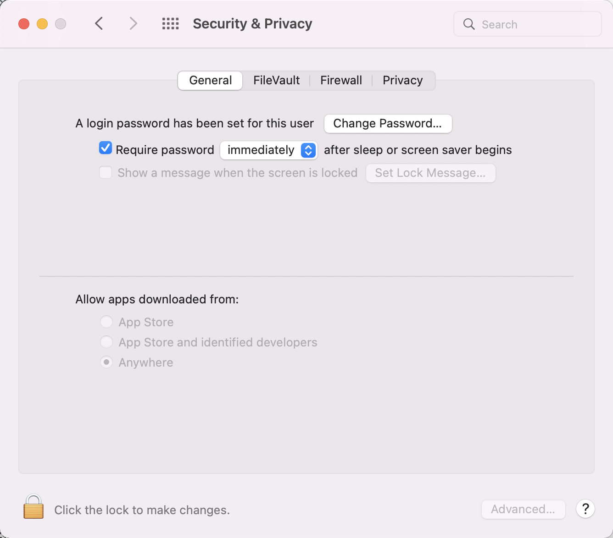

## 安全性与隐私（Security & Privacy）

> 我们在MacOS系统中，打开一些应用文件的时候会失败同时提示该应用文件 **来自身份不明的开发者**，或者**无法识别影像文件**等情况

此时，需要开启 任何来源

* 中文：`系统偏好设置 -> 安全与隐私 -> 通用`，允许从以下位置下载的App：
  * `App Store`
  * `App Store和被认可的开发者`
  * `任何来源`
* 英文：`System Preferences -> Security & Privacy -> Gengral`，Allow apps downloaded from:
  * `App Store`
  * `App Store and identified developers`
  * `Anywhere` 【注：当无此项时，需要在命令行执行：`sudo spctl --master-disable`】

来源：[知乎](https://zhuanlan.zhihu.com/p/51328476)

