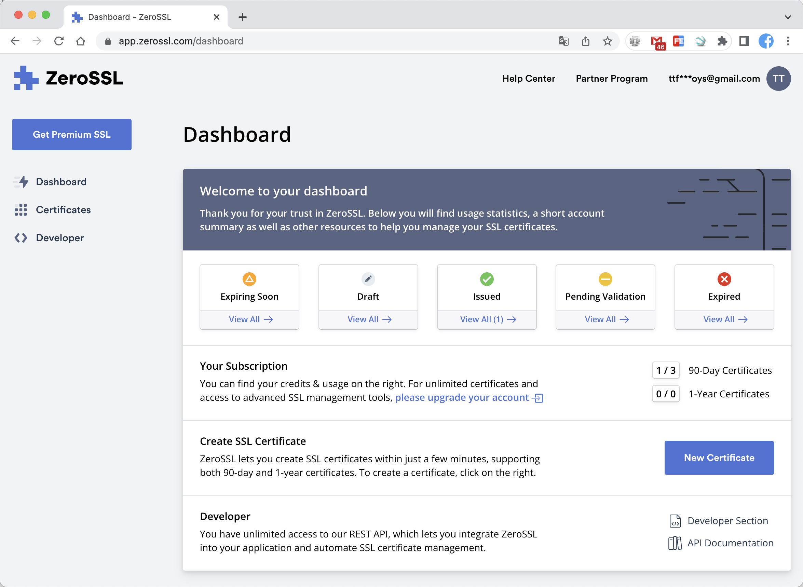
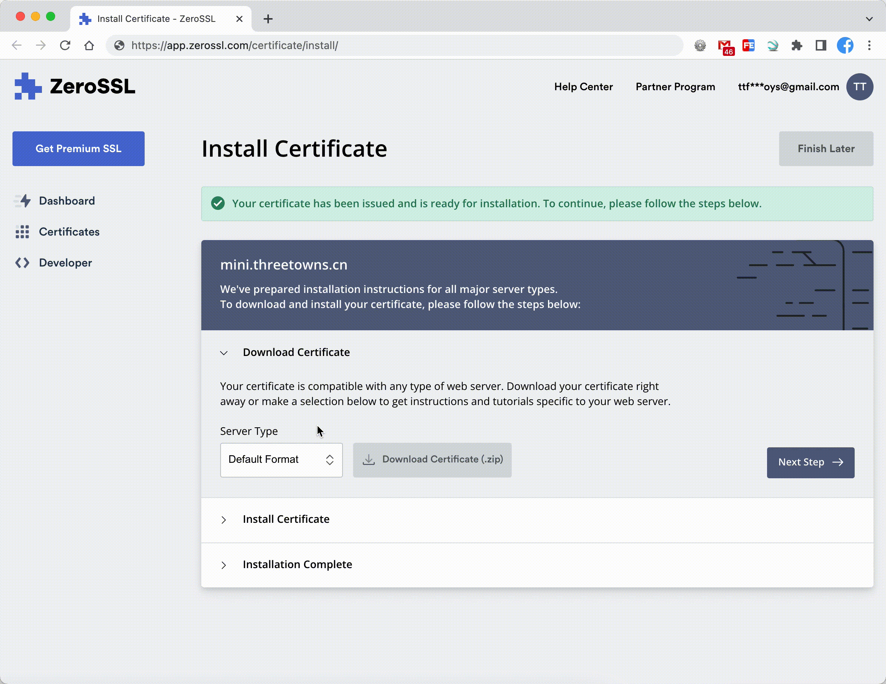
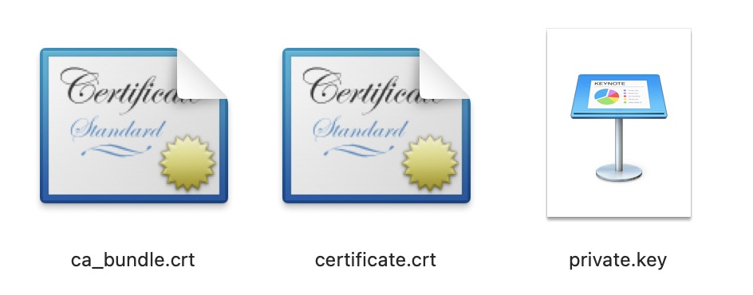
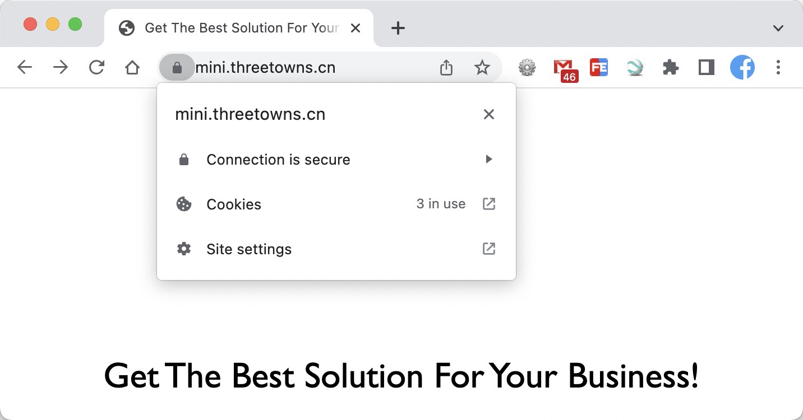
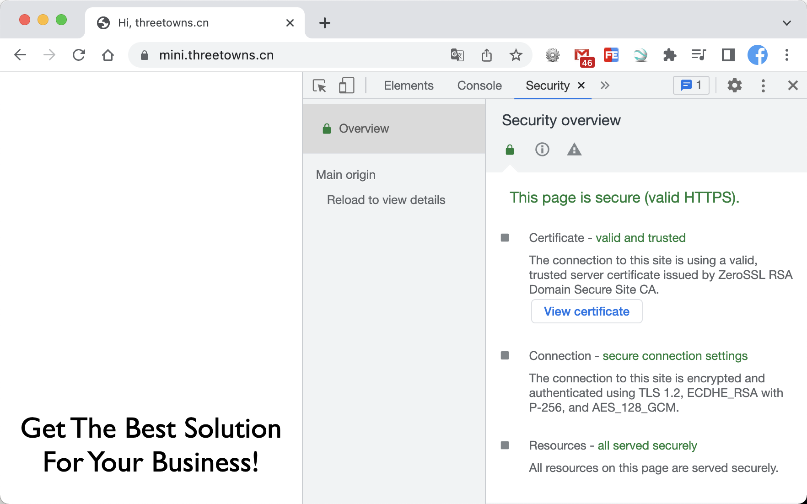
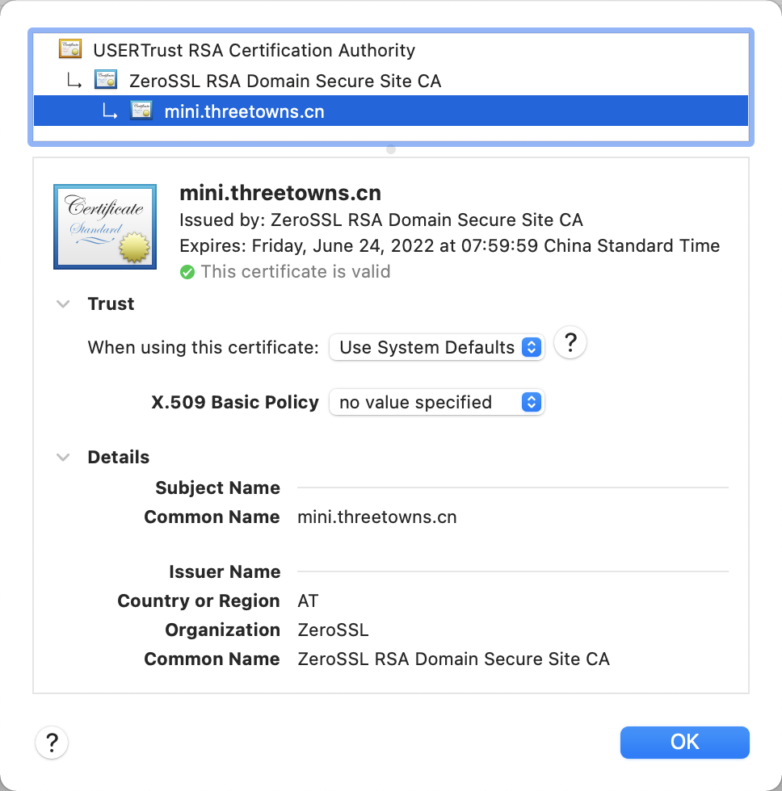
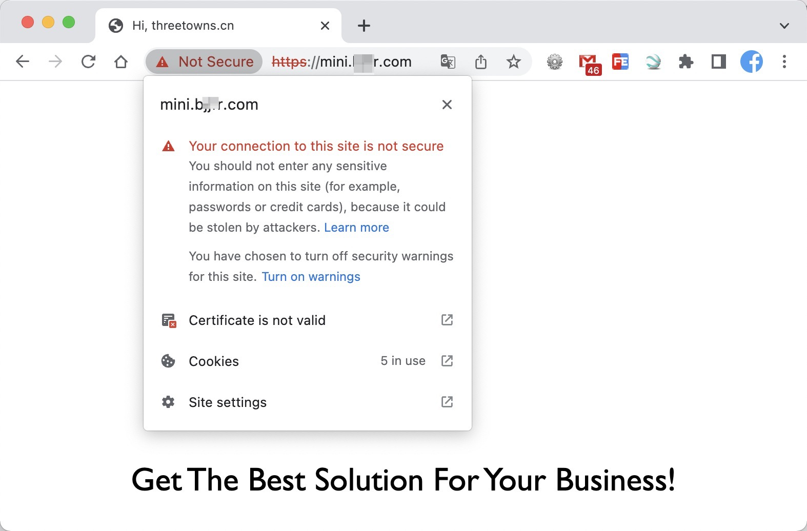
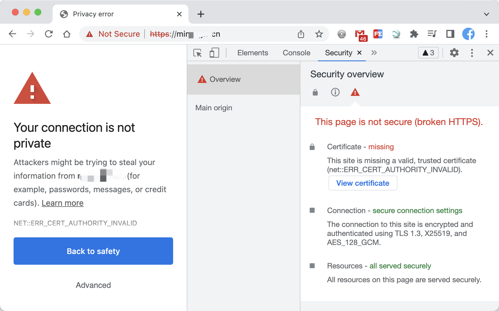

## Create SSL Certificate

### 1. [ZeroSSL](app.zerossl.com) 注册账号




### 2. Create SSL Certificate


### 3. Install Certificate




### 4. Certificate

下载的 ZIP 文件通常包含两个证书文件（`certificate.crt` 和 `ca_bundle.crt`）以及功能解密的私钥（`private.key`）。

​		数字证书是由权威的CA（Certificate Authority，证书权威机构）给服务端进行颁发，CA机构通过服务端提供的相关信息生成证书，证书内容包含了持有人的相关信息，服务器的公钥，签署者签名信息（数字签名）等，最重要的是公钥在数字证书中。



* `certificate.crt` ：数字证书，CA 用自己的私钥对我们申请的公钥和个人信息进行签名后形成的一个数字文件，和公钥一样是公开的。
* `ca_bundle.crt`：存储了该 CA 颁发证的根证书交叉文件，用来表明本网站和 CA 之间的证书链关系
* `private.key`：网站私钥，用来对信息进行加密

可以通过`openssl x509 -text -in certificate.crt -noout`查看！


### 5. 配置SSL

> 需要将证书和 bundle 文件合并：`awk 1 certificate.crt ca_bundle.crt > <your-secure.crt>`

```bash
[root@iZ2ze9w3koqydqvwyy3hosZ ~]$ lnmp ssl add
+-------------------------------------------+
|    Manager for LNMP, Written by Licess    |
+-------------------------------------------+
|              https://lnmp.org             |
+-------------------------------------------+

# 输入域名
Please enter domain(example: www.lnmp.org): ssl.threetowns.cn
 Your domain: ssl.threetowns.cn
# 可以配置多个域名（按回车跳过）
Enter more domain name(example: lnmp.org *.lnmp.org): 

# 输入域名指向的目录
Please enter the directory for domain mini.threetowns.cn: /home/wwwroot/ssl.threetowns.cn

# 网站其它环境配置
Allow Rewrite rule? (y/n) 
You choose rewrite: none
Allow access log? (y/n) 
Disable access log.
Enable PHP Pathinfo? (y/n) 
Disable pathinfo.

# 使用哪种方式配置SSL信息
1: Use your own SSL Certificate and Key
2: Use Let's Encrypt to create SSL Certificate and Key
Enter 1 or 2: 1
# 输入证书文件目录【此处是我们事先通过 awk 1 certificate.crt ca_bundle.crt 命令合并过的证书文件】
Please enter full path to SSL Certificate file: /home/ssl/ssl.threetowns/cerute.crt
# 输入私钥文件目录
Please enter full path to SSL Certificate Key file: /home/ssl/ssl.threetowns/private.key

# 系统会自动构建，并配置Nginx
Create dhparam.pem...
Generating DH parameters, 2048 bit long safe prime, generator 2
This is going to take a long time
..............................................................................................................+.................................................................................................................................++*++*
Test Nginx configure file......
nginx: the configuration file /usr/local/nginx/conf/nginx.conf syntax is ok
nginx: configuration file /usr/local/nginx/conf/nginx.conf test is successful

# 自动重启Nginx
Reload Nginx......
```

* 我们会发现 对应的 `nginx.conf` 多了 `listen 443 ssl http2`的配置信息

```nginx
server
    {
        listen 443 ssl http2;
        #listen [::]:443 ssl http2;
        server_name mini.threetowns.cn ;
        index index.html index.htm index.php default.html default.htm default.php;
        root  /home/wwwroot/web;
        ssl on;
        ssl_certificate /home/wwwroot/ssl/<your-secure.crt>;
        ssl_certificate_key /home/wwwroot/ssl/private.key;
        ssl_session_timeout 5m;
        ssl_protocols TLSv1 TLSv1.1 TLSv1.2;
        ssl_prefer_server_ciphers on;
        ssl_ciphers "EECDH+CHACHA20:EECDH+CHACHA20-draft:EECDH+AES128:RSA+AES128:EECDH+AES256:RSA+AES256:EECDH+3DES:RSA+3DES:!MD5";
        ssl_session_cache builtin:1000 shared:SSL:10m;
        # openssl dhparam -out /usr/local/nginx/conf/ssl/dhparam.pem 2048
        ssl_dhparam /usr/local/nginx/conf/ssl/dhparam.pem;

        include rewrite/none.conf;
        #error_page   404   /404.html;

        # Deny access to PHP files in specific directory
        #location ~ /(wp-content|uploads|wp-includes|images)/.*\.php$ { deny all; }

        include enable-php.conf;

        location ~ .*\.(gif|jpg|jpeg|png|bmp|swf)$
        {
            expires      30d;
        }

        location ~ .*\.(js|css)?$
        {
            expires      12h;
        }
        
        # ....
        
 }
```


### 6. 查看生效

* 可以通过命令查看该 CA 的证书链：`openssl s_client -connect ssl.theetowns.cn:443`

#### 1. 加密




* Security overview



* View certificate

  

#### 2. 未加密



* missing certificate

  