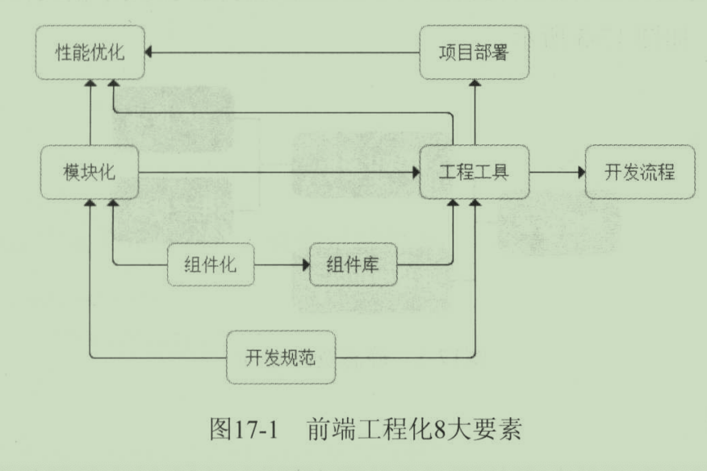

前端工程化，主要考虑或解决的问题，如：如何多人协作开发、组件模块如何复用、如何调试部署、版本如何管理控制、性能如何优化等。因此，想做好前端工程化，需要做好以下几件事：

### 1. 开发规范

制定好开发、部署的目录规范、编码规范。好的目录规范能让项目结构清晰，便于维护和扩展；好的编码规范能让团队内同学的代码风格统一，便于代码审查。

### 2. 模块化

​	针对 JavaScript、CSS，以功能或业务为单元组织代码。JavaScript模块化方案很多，如：`AMD `/ `CommonJS` / `UMD` / `ES6 Module`等。CSS模块化开发基本上都是在 `less`、`sass`、`stylus`等预处理器的 `import`/`mixin`特性支持下实现的。

### 3. 组件化

​		把页面拆分成多个组件（component），每个组件依赖的CSS、JavaScript、模板、图片等资源放在一起开发和维护。组件是资源独立的，组件在系统内部可复用，组件和组件之间可以嵌套。

### 4. 组件库

​		有了组件化，我们还希望把一些非常通用的组件或者 javascript 模块放到一个公共的地方供团队共享，方便新项目的复用，这就形成了组件库。

### 5. 性能优化

通过工程化手段来解决性能优化问题。比如常见的，请求合并、资源压缩、CDN，甚至一些前沿的优化手段如：bigpipe和bigrender，都是通过工程化手段来保证的，而对业务开发者都是透明的。

### 6. 项目部署

项目部署一般包括静态资源缓存、CDN、增量发布等问题。合理的静态资源部署可以为前端性能带来较大的优化空间，而增量发布又为项目的版本控制、A/B Test方案提供了保证。

### 7. 开发流程

完整的开发流程包括本地化开发调试、视觉走查确认、前后端联调、测试、上线等环节，通过一些工具对开发流程进行改善可以大幅度降低研发成本。

### 8. 工程工具

工程工具包括构建与优化工具、开发、调试、部署等流程工具、组件获取和提交工具等。

