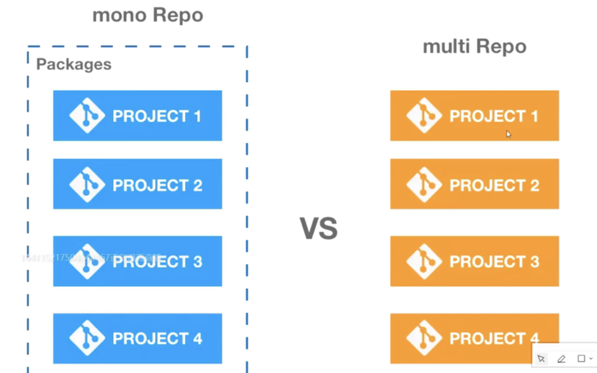
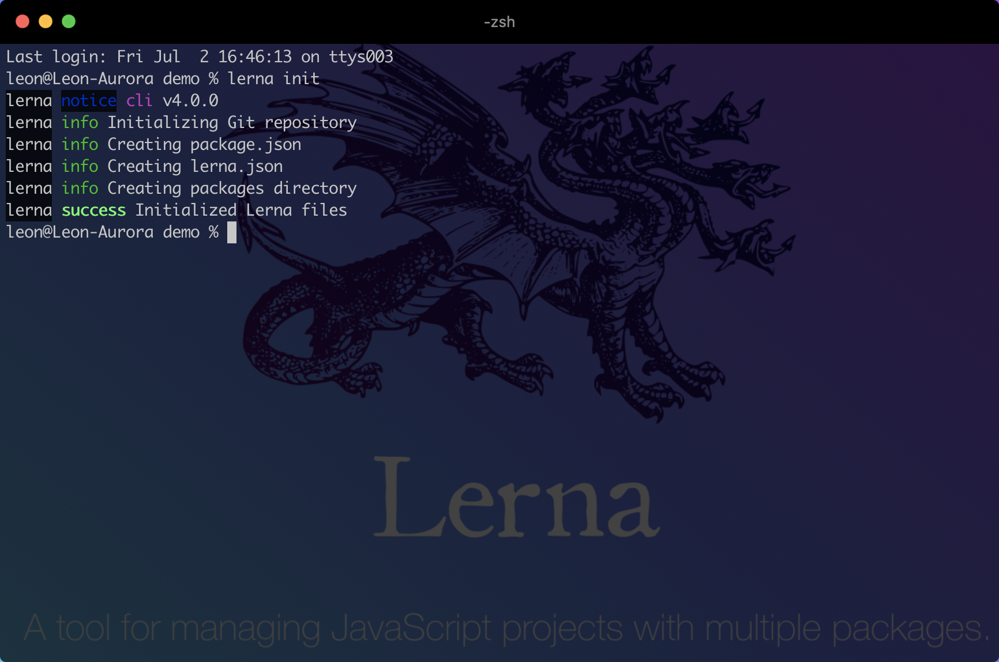

# vue-cli@4.x

## 一、准备工作

### 1.1 monorepo

* monorepo，是将所有的模块统一的放在一个主干分支之中管理
* multirepo，是将项目分化成为多个模块，并针对每一个模块单独的开辟一个repo来进行管理




### 1.2 lerna

[lerna](https://lerna.js.org/)是一个管理多个 npm 模块的工具，优化维护多包的工作流，解决多个包互相依赖，且发布需要手动维护多个包的问题。

#### 1.2.1 安装

```bash
npm i lerna -g
```

#### 1.2.2 初始化

```bash
lerna init
```


Your repository should now look like this:

```
demo/
  packages/
  package.json
  lerna.json
```

| 命令               | 功能                                                     |
| ------------------ | -------------------------------------------------------- |
| `lerna bootstrap ` | 安装依赖                                                 |
| `lerna clean`      | 删除各个包下的node_modules                               |
| `lerna init`       | 创建新的lerna库                                          |
| `lerna list`       | 查看本地包列表                                           |
| `lerna changed`    | 显示自上次 release tag以来有修改的包，选项通 list        |
| `lerna diff`       | 显示自上次release tag以来有修改的包的差异，执行 git diff |
| `lerna exec`       | 在每个包目录下执行任意命令                               |
| `lerna run`        | 执行每个包package.json中的脚本命令                       |
| `lerna add`        | 添加一个包的版本为各个包的依赖                           |
| `lerna import`     | 引入package                                              |
| `lerna link`       | 链接互相引用的库                                         |
| `lerna create`     | 新建package                                              |
| `lerna publish`    | 发布                                                     |


#### 1.2.3 yarn workspace

* `yarn workspace` 允许我们使用 **monorepo** 的形式来管理项目
* 在安装 **node_modules** 的时候它不会安装到每个子项目的 **node_module** 里面，而是直接安装到要目录下面，这样每个子项目都可以读取到根目录的 **node_modules**
* 整个项目只有根目录下面会有一份 `yarn.lock` 文件。子项目也会被 **link** 到 **node_modules** 里面，这样就允许我们可以直接用 `import` 导入对应的项目


##### 1.2.3.1 package.json

```diff
 {
   "name": "root",
   "private": true,
+  "workspaces": [
+    "packages/*"
+  ],
   "devDependencies": {
     "lerna": "^4.0.0"
   }
 }
```


##### 1.2.3.2 learn.json

```diff
 {
   "packages": [
     "packages/*"
   ],
   "version": "0.0.0",
+  "useWorkspaces": true,
+  "npmClient": "yarn"
 }
```


##### 1.2.3.3 添加依赖

* `yarnpak`
* `lerna`

设置加速镜像

```bash
yarn config set registry http://registry.npm.taobao.org
npm config set registry http://registry.npm.taobao.org
```

| 作用                       | 命令                                                         |
| -------------------------- | ------------------------------------------------------------ |
| 查看工作空间信息           | `yarn workspaces info`                                       |
| 给根目录添加依赖           | `yarn add chalk --ignore-workspace-root-check`               |
| 给某个项目添加依赖         | `yarn workspace create-react-app3 add commander`             |
| 删除所有的node_modules     | `lerna clean` 等价于 `yarn workspaces run clean`             |
| 安装和link                 | `yarn install` 等价于 `learn bootstrap --npm-clinet yarn --use-workspaces` |
| 重新获取所有的node_modules | `yarn install --force`                                       |
| 查看缓存目录               | `yarn cache dir`                                             |
| 清除本地缓存               | `yarn cache clean`                                           |


#### 1.2.4 创建子目录

```bahs
lerna create leon-cli
lerna create leon-cli-shared-utils
```

##### 1.2.4.1 leon-cli

`code packages/leon-cli/package.json`

```diff
+ "bin": {
+   "vue-cli": "bin/leon-cli.js"
+ },
```

###### 1.2.4.1.1 bin

`code packages/leon-cli/bin/leon-cli.js`

```js
#!/usr/bin/env node

console.log('hello leon cli');
```


#### 1.2.5 创建软链接

```bash
yarn
cd packages/leon-cli
npm link
npm root -g
leon-cli
```


#### 1.2.6 create命令

`package.json`

```diff
 {
   "name": "root",
   "private": true,
   "workspaces": [
     "packages/*"
   ],
   "devDependencies": {
     "lerna": "^4.0.0"
   },
+  "scripts": {
+    "create": "node ./packages/leon-cli/bin/leon-cli.js create hello"
+  }
 }
```


#### 1.2.7 调试命令

`.vscode/launch.json`

```json
{
  "version": "0.0.0",
  "configurations": [
    {
      "type": "node",
      "request": "launch",
      "name": "leon-cli",
      "cwd": "${workspaceFolder}",
      "runtimeExecutable": "npm",
      "runtimeArgs": [
        "run",
        "create"
      ],
      "prot": 9200,
      "autoAttachChildProcesses": true,
      "stopOnEntry": true,
      "skipFiles": [
        "<node_internals>/**"
      ]
    }
  ]
}
```


### 1.3 安装依赖

* `cd packages/leon-cli-shared-utils`

```bash
yarn workspace leon-cli-shared-utils add chalk execa
```

* `cd packages/leon-cli`

```bash
yarn workspace leon-cli add commander inquirer execa chalk ejs globby fs-extra ora isbinaryfile
```


### 1.4 lerna vs yarn

* 两者功能等价
* `yarn` 用来处理依赖，`lerna` 用来初始化和发布


### 1.5 commander.js

> [commander](https://github.com/tj/commander.js) 是一款强大的命令行框架，提供了用户命令输入和参数解析功能

* `code packages/leon-cli/bin/leon-cli.js`

```js
#!/usr/bin/env node

const program = require('commander')

program
  .version(require('../package').version)
  .usage('<command> [options]')
  .command('init', 'generate a new project from a template')
  .command('list', 'list available official templates')
  .command('build', 'prototype a new project')
  .command('create', '(for v3 warning only)')

program.parse(process.argv)
```


### 1.6 Inquirer.js

> [Inquirer.js](https://github.com/SBoudrias/Inquirer.js) 是一个交互式命令行工具

```js
var inquirer = require('inquirer');
inquirer
  .prompt([
    /* Pass your questions in here */
  ])
  .then((answers) => {
    // Use user feedback for... whatever!!
  })
  .catch((error) => {
    if (error.isTtyError) {
      // Prompt couldn't be rendered in the current environment
    } else {
      // Something else went wrong
    }
  });
```


### 1.7 execa

> [execa](https://github.com/sindresorhus/execa) 是可以调用 shell 和本地外部程序，它会启动子进程执行，是对 `child_process.exec` 的封装

```js
const execa = require('execa')

(async () => {
  const { stdout } = await execa('echo', ['hello']);
  console.log(stdout);
})();
```


### 1.8 chalk

> [chalk](https://github.com/chalk/chalk) 可以修改控制台字符串的样式，包括字体样式、颜色以及背影颜色等

```js
const chalk = require('chalk')
console.log(chalk.blue('hello world!'))
```


### 1.9 ejs

> [ejs](https://github.com/mde/ejs) 是高效的嵌入式 JavaScript 模板引擎
>
> [slash]() 将windows反斜杠路径转换为斜杠路径，如 `foo\bar` -> `foo/bar`
>
> [globby]() 是用于模式匹配目录文件的

```js
<% if (user) { %>
  <h2><%= user.name %></h2>
<% } %>


ejs.render(str, data, options);
```


### 1.10 isbinaryfile

> [isbinaryfile]() 可以检测一个文件是否是二进制文件

```js
const { isBinaryFileSync } = require('isbinaryfile')
```


### 1.11 ora

> [ora]() 用来实现 node.js 命令环境的 loading 效果和显示各种状态的图标等

```js
const ora = require('ora')
const spinner = ora();
```


## 二、核心概念


## 三、参数解析


## 四、获取预设


