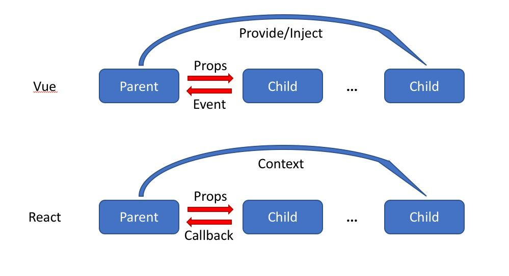
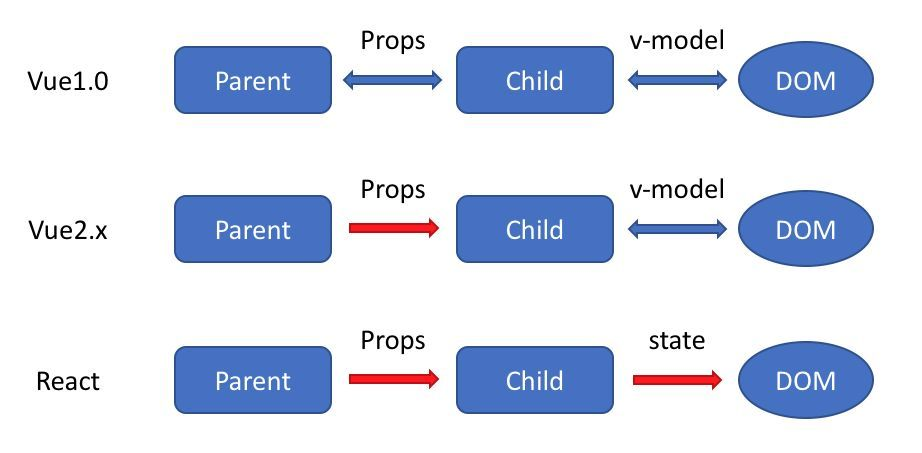

# Vue

> Vue 是一套用于构建用户界面的 渐进式框架 。

## vue history

开篇之前，我们来扒一扒 vue的历史吧！意义是了解一下，如果从一个demo到开源框架的。如果是我们自己，当我们有一个idea时，会考虑哪些因素、如何取舍以及怎么组织。

学习源码的意义在于学习作者的思维！

另外，笔者计划2022年读50本书（技术类、财经类、文学类、心理学等各方面），技术方面会读完 `vue 0.x`、`vue 1.x`、`vue 2.x`、`vue 3.x`源码以及其生态 `vuex`、`vue-router`、`axios、`vue-cli`、`element-ui`、`low code`、`umi`、**物料平台**等。

:::tip 一张图

用一张图表达出 版本节点及版本功能（feat、bug）

:::



| 版本                                                         | 代号               | 描述                                                         | 重要功能                                                     | 发布时间                                                     |
| ------------------------------------------------------------ | ------------------ | ------------------------------------------------------------ | ------------------------------------------------------------ | ------------------------------------------------------------ |
| Seed                                                         |                    | 受angular启发                                                |                                                              |                                                              |
| [Vue 0.6.x](https://github.com/vuejs/vue/releases/tag/0.6.0) |                    | 更名为Vue，版本号是0.6.0                                     | * `v-`指令前缀 * `Vue.element()`创建自定义元素            | 2013.12.08                                                   |
| [Vue 0.8.x]([v0.8.0](https://github.com/vuejs/vue/releases/tag/v0.8.0)) |                    | 正式对外发布，版本号是0.8.0                                  |                                                              | 2014.01.24                                                   |
| Vue 0.9                                                      | Animatrix          |                                                              |                                                              | 2014.02.25                                                   |
| [Vue 0.10.0](http://man.hubwiz.com/docset/VueJS.docset/Contents/Resources/Documents/vuejs.org/2014/03/22/vuejs-010-release/index.html) | Blade Runner       |                                                              |                                                              | 2014.03.22                                                   |
| V0.11.0                                                      | Cowboy Bebop       |                                                              |                                                              | [2014.11.07](https://github.com/vuejs/vue/releases/tag/0.11.0) |
| Vue 0.12.0                                                   | Dragon Ball        | Laravel(PHP框架)社区首次使用vue                              |                                                              | [2015.06.13](https://github.com/vuejs/vue/releases/tag/0.12.0) |
| Vue 1.0.0                                                    | Evangelion         | 居有里程碑意义 `v-repeat`替换为`v-for`渲染性能提升高达100%  `*.vue`单文件组件、组件样式增加`scoped`属性 `vue-loader`和`vueify`升级 `vue-router` | vue-router （2015.08.18）  vuex (2015.11.28)   vue-cli (2015.12.27) | [2015.10.26](http://man.hubwiz.com/docset/VueJS.docset/Contents/Resources/Documents/vuejs.org/2015/10/26/1.0.0-release/index.html) |
| Vue 2.0.0                                                    | Ghost in the Shell | Virtual DOM引入虚拟DOM方案 支持服务端渲染                 |                                                              | [2016.10.01](https://zhuanlan.zhihu.com/p/22722479)          |
| vue 2.6.0                                                    | Macross            |                                                              |                                                              |                                                              |
| Vue 3.x                                                      |                    |                                                              |                                                              |                                                              |
|                                                              |                    |                                                              |                                                              |                                                              |
|                                                              |                    |                                                              |                                                              |                                                              |
|                                                              |                    |                                                              |                                                              |                                                              |

[Vue-cli](http://man.hubwiz.com/docset/VueJS.docset/Contents/Resources/Documents/vuejs.org/2015/12/28/vue-cli/index.html) 2015.12.28 

https://github.com/vuejs/vue/releases/tag/0.6.0

## vue release

参考文档

http://man.hubwiz.com/docset/VueJS.docset/Contents/Resources/Documents/vuejs.org/blog/index.html

https://vuejs.org/2015/06/11/012-release/

https://github.com/vuejs/vue/releases?page=19

https://blog.csdn.net/m0_46864744/article/details/112691337

https://juejin.cn/post/6844903789405683719

[vue.js贡献指南](https://github.com/vuejs/vue/blob/dev/.github/CONTRIBUTING.md)

[vue.js 0.10](http://man.hubwiz.com/docset/VueJS.docset/Contents/Resources/Documents/vuejs.org/2014/03/22/vuejs-010-release/index.html)

[Vue.js 1.0.0 Released](http://man.hubwiz.com/docset/VueJS.docset/Contents/Resources/Documents/vuejs.org/2015/10/26/1.0.0-release/index.html)

* 改进模板语法：v-on和v-bind简写[Full Changelog (from 0.12.16)](https://github.com/vuejs/vue/releases/tag/1.0.0)
* api清理：inherit选项
* 更快的渲染：v-repeat替换成v-for，性能提升高达100%
* 更加大的工具：vue-loader和vueify重大升级
  * 热组件重新加载（热更新时，不需要重新加载页面）
  * scoped范围css
* 接下来：改进vue-router、简化开发人员体验的vue-cli

[vueConf](https://www.yuque.com/vueconf)

## vue diff

