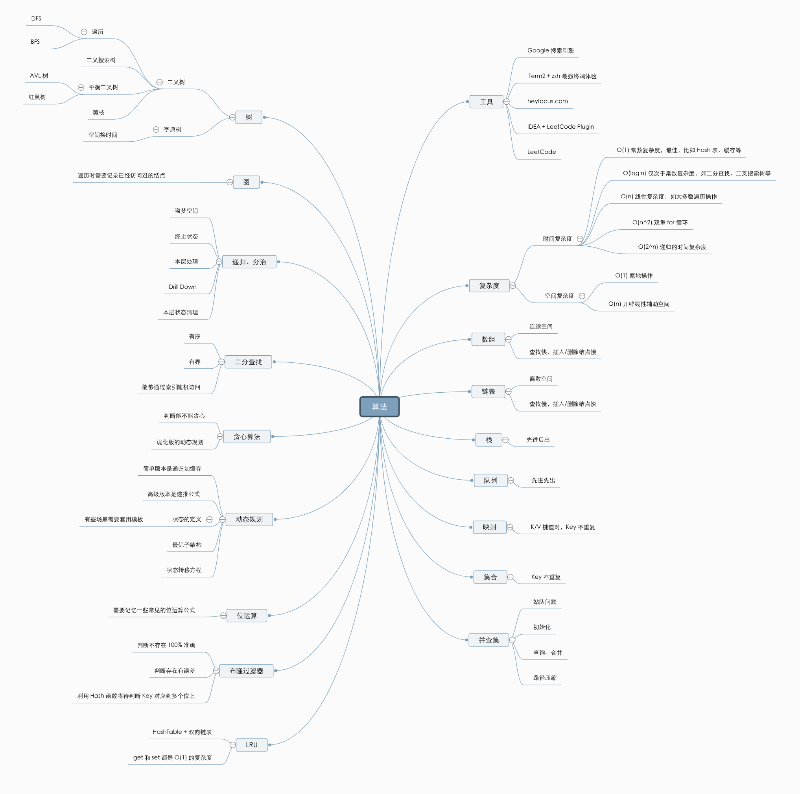

# 算法

js中算法是程序员之前的一道分水岭。

* [数据结构知识图谱](https://fynn90.github.io/2019/10/10/%E6%95%B0%E6%8D%AE%E7%BB%93%E6%9E%84%E7%9F%A5%E8%AF%86%E5%9B%BE%E8%B0%B1/)




## 十大经典排序算法

* [十大经典排序算法(上)](https://fynn90.github.io/2019/09/18/%E5%8D%81%E5%A4%A7%E7%BB%8F%E5%85%B8%E6%8E%92%E5%BA%8F%E7%AE%97%E6%B3%95(%E4%B8%8A)/)
  * 冒泡排序
  * 插入排序
  * 插入排序 - 拆半插入
  * 选择排序
  * 归并排序
  * 快速排序


## 数据结构

* [数据结构知识图谱](https://fynn90.github.io/2019/10/10/%E6%95%B0%E6%8D%AE%E7%BB%93%E6%9E%84%E7%9F%A5%E8%AF%86%E5%9B%BE%E8%B0%B1/)


## 1. js中数据去重

```js
const arr = [1, 2, 3, 5, 3, 2];

// 方法一：
console.log(Array.form(new Set(arr)));

// 方法二：
const newArr = arr.filter((item, idx) => {
  return arr.indexOf(item, 0) === idx
})
console.log(newArr)

// 方法三：
let tempArr = []
arr.map((item, idx) => {
  if(!tempArr.includes(item)){
    tempArr.push(item)
  }
})
console.log(tempArr)

// 方法四：
console.log([...new Set(arr)])
```


```js
// 数组中，根据某一字段去重
unique(arr, field = 'time') {
  const res = new Map()
  return arr.filter(a => !res.has(a[field]) && res.set(a[field], 1))
},
```


