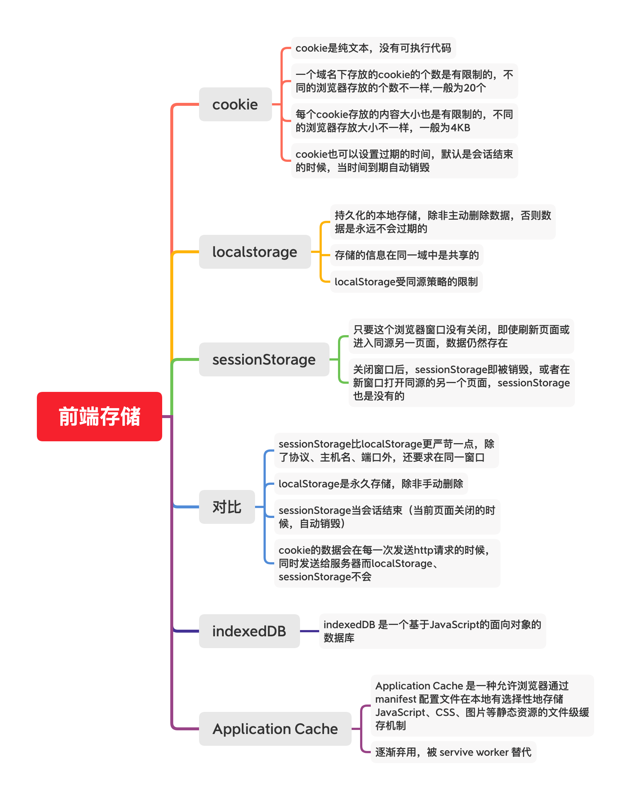

# 浏览器

## 浏览器引擎

## 浏览器中存储数据

* Cookie，document.cookie
* LocalStorage，sessionStorage
* IndexedDB

## 浏览器跨域

> 同源策略

* CORS
* nginx反向代理
* webpack.proxy反向代理
* 子域代理
* jsonp
* postMessage

## hash、history模式