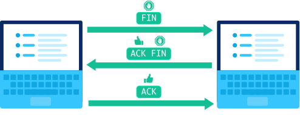

:::tip 译文说明
本文为 [Khan Academy](https://www.khanacademy.org) 美国可汗学院 [Computers and the Internet](https://www.khanacademy.org/computing/computers-and-internet/) 计算机与网络的译文。
:::


## The Internet

:::tip The Internet

The **Internet** is a global network of computing devices communicating with each other in some way, whether they're sending emails, downloading files, or sharing websites.


The Internet is an **open** network: any computing device can join as long as they follow the rules of the game. In networking, the rules are known as **protocols** and they define how each device must communicate with each other. The Internet is powered by many layers of protocols.

:::

要创建全球计算设备网络，我们需要：

:::warning

- 有线和无线(**Wires & wireless**)：设备之间的物理连接，以及将电磁信号转换成二进制数据的协议。
- **IP**：一种使用IP地址唯一地标识设备的协议，并提供路由策略将数据发送到目标IP地址。
- **TCP** / **UDP**：可以将数据包从一个设备传输到另一个设备并在传输过程中检查错误的协议。
- **TLS**：一种安全协议，用于发送加密数据，使攻击者无法查看私人信息。
- **HTTP** & **DNS**：支持万维网的协议，浏览器每次加载网页时使用的协议。

:::


:::tip 计算机网络类型

* 局域网 **Local area network (LAN)**
* 广域网 **Wide Area Network (WAN)**
* 数据中心网络 **Data Center Network (DCN)**

:::


## Internet Protocol

因特网协议**Internet Protocol (IP)** 是因特网各层的核心协议之一，它描述了使用 **IP addresses** 来唯一标识连接到Internet的设备。

### IP addresses

目前使用的互联网协议实际上有两种版本：

- **IPv4** ：是互联网上使用的第一个版本
- **IPv6** ：向后兼容（**backwards-compatible**）的后继者

:::tip dynamic and static IP addresses

* dynamic IP address：动态IP地址
* static IP address：静态IP地址

:::


### Internet routing protocol

在互联网协议（IP）中，计算机将信息分成数据包（packets）,从源路由到目标的的途中会从一个路由器（router）跳到另一个路由器

:::tip router

* **Step 1**：发送数据包到最近的路由器

* **Step 2**：路由器接收数据包（包含了 IP header、IP address等信息）

* **Step 3**：路由器转发数据包（将数据包发送到更接近其最终目的地的路由器）

  路由器有一个转发表(**forwarding table**)，可以帮助它根据目标IP地址选择下一条路径。

  一旦路由器在表中找到目标IP地址的最特定行，它就会沿着该路径发送数据包。

* **Step 4**：最终路由器转发消息

  如果一切顺利，数据包最终应该到达一个路由器，并将消息发送到目标IP地址。

:::


:::warning 冗余和容错(Redundancy and fault tolerance)

* 路由冗余(Redundancy in routing)

  一个包通常有许多可能的路径可以到达相同的目的地，路径（paths）的冗余增加了数据包到达目的地的可能途径。

* 容错(Fault tolerance)

  容错系统是一个可以在其组件中经历故障（或多个故障），但仍能继续正常运行的系统。

:::


### Transporting packets

> Internet协议（IP）描述了如何将消息拆分为多个IP数据包，并通过从一个路由器跳到另一个路由器将数据包路由到目的地。

IP并不能处理数据包的所有后果，如：发送多条消息(**multiple messages**)、故障(**out of order**)、损坏(**corrupted**)、数据包丢失、意外重传(**duplicated**)等。

好在Internet协议栈(**Internet protocol stack**)中，有更高级别的协议可以处理这些问题：

:::tip TCP & UDP

- 传输控制协议（**Transmission Control Protocol ,TCP**）是最常用于IP之上的数据传输协议，它包括数据包排序(*ordering*)、重传(*retransmission*)和数据完整性(*data integrity*)策略。
- 用户数据报协议（**User Datagram Protocol ,UDP**）是一种解决较少问题但提供更快数据传输的替代协议。

:::


#### UDP

用户数据报协议（**User Datagram Protocol ,UDP**）提供了一种检测数据包中损坏数据的机制，但它并不试图解决数据包出现的其他问题，因此有时被称为不可靠数据协议(**Unreliable Data Protocol**)。

它很简单但很快，它通常用于对时间敏感的应用程序（*如实时视频流 real-time video streaming*），其中速度比准确性更重要。


#### TCP

传输控制协议（**Transmission Control Protocol ,TCP**）是一种在IP上使用的传输协议，用于确保数据包的可靠传输。

**TCP**包括解决基于包的消息传递所产生的许多问题的机制，例如丢失的包（*lost packets*）、无序的包（*out of order packets*）、重复的包（*duplicate packets*）和损坏的包（*corrupted packets*）。

由于TCP是IP之上最常用的协议，所以Internet协议栈有时被称为 **TCP/IP**。


:::danger TCP/IP 传输数据包的过程

* Step 1：建立连接

  两台计算机要通过TCP互相发送数据时，它们首先需要使用三次握手(**three-way handshake**)建立连接。

  * SYN，synchronize
  * ACK，acknowledge
  
  
  
* Setp 2：发送数据包

  一旦计算机完成了握手，它们就可以接收包含实际数据的数据包了。当数据包通过TCP发送时，接收者必须始终确认他们收到了什么。*第一台计算机发送包含数据和序列号的数据包。第二台计算机通过设置ACK位并将确认号增加所接收数据的长度来确认(acknowledges)它。*

  

* Step 3：关闭连接

  任何一台计算机都可以在不再需要发送或接收数据时关闭连接。

  

:::


## Web protocols

:::tip WWW

万维网（**World Wide Web** - **WWW**，或简称Web）,它是一个庞大的网页、程序和文件网络，可以通过url访问。

:::

web浏览器使用各种协议加载网页

:::warning web浏览器在Internet协议之上使用这些协议，因此每个HTTP请求也使用TCP和IP

* 域名系统协议（ **[Domain Name System (DNS) protocol](https://www.khanacademy.org/a/domain-name-system-dns-protocol)**），将域名转换为IP地址。

* 超文本传输协议（ **[HyperText Transfer Protocol (HTTP)](https://www.khanacademy.org/a/hypertext-transfer-protocol-http)** ），从该IP地址请求网页内容。
* 传输层安全协议（**[Transport Layer Security (TLS) protocol](https://www.khanacademy.org/a/transport-layer-security-protocol-tls)**），通过安全、加密的连接为网站提供服务。

:::

Web只是建立在Internet协议之上的应用程序之一，但它是迄今为止最流行的。


### DNS

:::tip Domain Name System

IP地址(如：`74.125.20.113`) ，是计算机识别Internet上其他计算机的方式。它并不是特别人性化，谁想记住像 `74.125.20.113` 这样的地址？

域名系统（**Domain Name System (DNS)** ），给我们人类提供了一种简单的方法来识别我们想在互联网上去哪里。

:::


每个域名由以下部分组成：

:::warning Anatomy of a domain name

每个域名由以下部分组成：

```bash
[third-level-domain].[second-level-domain].[top-level-domain]
```

* <u>顶级域名</u>（**top level domains, TLDs**）数量有限，许多网站使用最常见的**TLDs**，`.com`、`.org` 和 `.edu`。

* <u>二级域名</u>（**second-level-domain**）对于注册它的公司或组织是唯一的，比如：`wikipedia` 或 `threetowns`。

* <u>三级域名</u>（**third-level-domain**）也称为子域（**subdomain**），因为它属于同一个组，并且该URL通常会将您指向网站的一个子集，如 `m.wikipedia.org` 或 `es.khanacademy.org`。

:::


当我们在浏览器的地址栏中键入一个URL时，计算机必须找出它的IP地址。


每个域名映射(*maps*)到一个IP地址，下面来看一下如何通过域名访问到IP的：

:::danger Domains ↔ IP addresses

* Step 1：Check the local cache(检查本地缓存)

  如果你曾经访问过一个网站，计算机会保留自己的本地缓存域名到IP的映射【但，它会踢出你已经有一段时间没有访问过的域或发送过期日期的域】

* Step 2：询问ISP缓存(Ask the ISP cache)

  每个**ISP**（**Internet Service Provider**，Internet服务提供商）都提供域名解析服务并保留自己的缓存。

  ISP可以从他们的访问中查找域名映射，如果它不在ISP的缓存中，那么它将被关闭，进入下一步。

* Step 3：询问服务器的名称(Ask the name servers)

  服务器按层次结构(`hierarchy`)排序：

  ```tex
  Root name servers → TLD name servers → Host name servers
  ```

  * ISP会首先询问根名称服务器（*Root name servers*），如：“hey, which name server knows about `.org` domains?”

    

    

  * 接着，ISP询问TLD name servers，如：“so, who knows about `wikipedia` domains?”

    

    

  * 最后，ISP问 Host name servers，如：“okay, so where's `www.wikipedia.org`?”

    


ISP将IP地址发送回请求的计算机，现在我们的计算机可以成功地连接到为该域供电的计算机。


**这样听起来像是一个 process过程。但别担心，不是经常这么做，因为一路上缓存了很多信息，所以很少有DNS查找需要这么多步骤。**

:::


### HTTP

:::tip HTTP

每当您访问网页时，您的计算机都会使用超文本传输协议（**[Hypertext Transfer Protocol](https://www.khanacademy.org/computing/ap-computer-science-principles/the-internet/x2d2f703b37b450a3:web-protocols/a/hypertext-transfer-protocol-http) ,HTTP**）从Internet上的其他计算机下载该网页。

:::

让我们逐步完成这个过程


:::warning 浏览网页

* Step 1: 将浏览器直接指向URL

  当我们想浏览网页时，可以在浏览器(**browser**)中键入URL（**Uniform Resource Locator, 统一资源定位器**），也可以从已打开的页面中跟踪链接：

  

  **请注意这个URL：它以`http` 开头。这是向浏览器发出的一个信号，它需要使用HTTP来获取该URL的文档。**

  

  

  

* Step 2: 浏览器查找IP

  我们通常在浏览器中输入友好的URL，比如 ： `wikipedia.org`。这些域名映射到IP地址，即域计算机的真实位置。由[DNS](https://www.khanacademy.org/a/domain-name-system-dns)处理.

  

  

* Step 3: 浏览器发送HTTP请求

  一旦浏览器识别出承载请求的URL的计算机的IP地址，它就会发送一个HTTP请求

  

  

* Step 4：主机发回HTTP响应

  一旦主机接收到HTTP请求，它就会发回一个包含内容(*content*)和元数据(*metadata*)的响应。

  


* Step 5：浏览器呈现响应

  浏览器现在拥有呈现所请求文档所需的所有信息

  

:::


#### HTTP & TPC/IP

**HTTP** 是建立在 **TCP/IP** 协议之上的协议。

![Diagram with laptop on left and server on right. Laptop has browser window with "http://www.example.com/index.html" in address bar. Server is labeled with "www.example.com" and its IP address "93.184.216.34".  4 arrows are shown:  * First arrow goes from laptop to server and displays packet with HTTP request inside. * Second arrow goes from server to laptop and displays packet with "ACK" inside. * Third arrow goes from server to laptop and displays packet with HTTP response inside. * Fourth arrow goes from laptop to server and displays packet with "ACK" inside.](./img/620dfdaef4da77689540ae2155fd6e173605f4e3.svg)

:::tip 其它协议

在**TCP/IP**之上还有许多其他协议，比如发送电子邮件的协议（**SMTP**、**POP**、**IMAP**）和上传文件的协议（**FTP**）。

:::


## The Internet protocol suite

互联网协议的各层(**The layers of Internet protocols**)通常在如下图表中显示：


## 参考文献

* [Introducing the Internet Protocol Suite](https://docs.oracle.com/cd/E19455-01/806-0916/6ja85398m/index.html)
* [Network protocols](https://www.manageengine.com/network-monitoring/network-protocols.html)
* [Internet Protocol and Layers](http://www.umass.edu/nfp/guru/handout/ip_layers.html)

