# 互联网介绍

:::tip The Internet

原文：[The Internet](https://www.khanacademy.org/computing/ap-computer-science-principles/the-internet)

:::


## 互联网组成

> 原文：[The ingredients of the Internet](https://www.khanacademy.org/computing/ap-computer-science-principles/the-internet/introducing-the-internet/a/the-ingredients-of-the-internet)

互联网(**Internet**)是一个全球性的计算设备网络，它们以某种方式相互通信，无论是发送电子邮件、下载文件还是共享网站。

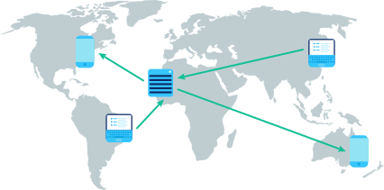


互联网是一个开放的网络：任何计算设备只要遵循游戏规则就可以加入。在网络中，这些规则被称为协议(**protocols**)，它们定义了每个设备必须如何相互通信。互联网是由许多层协议驱动的。

要创建全球计算设备网络，我们需要：

* 有线和无线(**Wires & wireless**)：设备之间的物理连接，以及将电磁信号转换成二进制数据的协议。

* IP：一种使用IP地址唯一地标识设备的协议，并提供路由策略将数据发送到目标IP地址。

* TCP/UDP：可以将数据包从一个设备传输到另一个设备并在传输过程中检查错误的协议。

* TLS：一种安全协议，用于发送加密数据，使攻击者无法查看私人信息。

* HTTP&DNS：支持万维网的协议，浏览器每次加载网页时使用的协议。

你可能每天都在使用互联网，但你可能对这些缩略语还不熟悉。在本单元中，我们将进一步了解互联网的每一项技术。

# Connecting networks

:::tip Computer networks

因特网是世界上最大的计算机网络。我们来分解[break down]一下：

:::

## 计算机网络

计算机网络(**computer network**)是能够发送或接收数据的任何一组相互连接的计算设备。计算设备(**computing device**)不仅仅是一台计算机，它是任何可以运行程序的设备，比如平板电脑、手机或智能传感器。

### 构建网络

最简单的计算机网络是两个设备：


像这样的网络只需要担心一些事情，比如如何物理连接两个设备，以及如何以他们都能理解的格式通过物理连接发送数据。


让我们再添加一个设备：

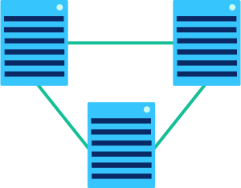

现在有了额外的复杂性。每个设备如何知道传入的数据是针对他们还是针对他们的邻居？这个简单的网络需要一个寻址方案(**addressing scheme**)。


让我们跳到六个设备。实际上，我们可以通过多种方式将六个设备连接到一个计算机网络中：

> 下图分别显示了：环形拓扑(ring topology)、网格拓扑(mesh topology)、星形拓扑(star topology)、总线拓扑(bus topology)和树拓扑(tree topology)。

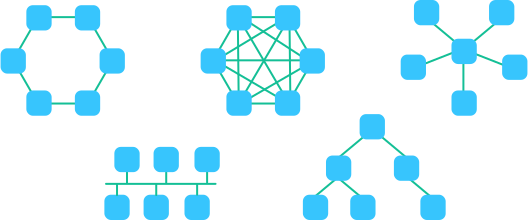


想象一下一段数据通过其中一个更大的网络的过程。它将走什么路？当有多条路径时，它如何知道哪条路径是最好的？


一旦网络变得更大，路由策略(**routing strategies**)就变得更重要。在一条小路上，两站和三站之间的差别不大，但是20站和300站之间的差别很大。


### 网络类型

我们根据网络的大小和特点使用不同的术语来指代网络。让我们在这里谈几点。

最常见的网络类型是局域网 **Local area network (LAN)**，一种覆盖像房子或学校这样的有限区域的网络。

> A LAN connected using a bus topology. The devices are connected with an Ethernet cable.


最大的网络类型是广域网 **Wide Area Network (WAN)**，一个扩展到一个大的地理区域并由许多局域网组成的网络。通常，广域网中的网络只能通过租用不同公司的电信线路来连接，因为没有一家公司拥有整个广域网的所有基础设施。

> A WAN covering the country of Australia and connecting three LANs with long-distance connections.

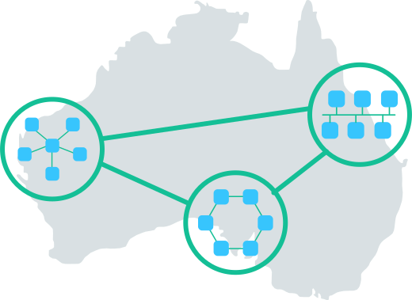


另一种类型的网络是数据中心网络 **Data Center Network (DCN)**，这是一种用于数据中心的网络，在这种网络中，数据必须以很小的延迟进行交换。


### 网络协议

当计算设备在网络中连接在一起时，它们需要协议来相互通信。

如果设备想通过因特网进行通信，就必须使用因特网网络协议。有许多没有连接到因特网的网络也使用因特网协议，这是因为它们的网络设计得很好。


然而，有些网络使用的其他协议更适合他们的任务。数据中心网络通常选择使用网络协议，这些协议利用了数据中心极其紧密的体系结构。这使得数据中心能够更有效地运行密集型算法，比如训练深度学习网络(deep learning network)。

在本单元中，我们将特别关注为大多数计算机网络供电的互联网协议。在未来，网络可能会使用尚未发明的协议。幸运的是，因特网协议的基本概念与所有联网系统都相关。


## 物理网络连接

:::tip Physical network connections

因特网是一个相互连接的计算机网络。但是每个物理连接看起来是什么样的呢？这取决于连接的需要和网络的大小。

:::


### 铜缆（Copper cables）
由于固定电话系统最初使用铜线，第一批互联网连接重新使用了这项技术，许多人至今仍在使用这项技术。

如果您在计算机实验室或调制解调器附近，您可能会发现类似的电缆：


那是一根CAT5电缆，一种双绞线电缆(**twisted pair cable**)，是为计算机网络设计的。


如果你往电缆里面看，你会发现四对铜线：


双绞线通过传输代表二进制数据的电脉冲通过网络发送数据：


为了确保电缆以接收者能够理解的方式传输信息，它们遵循以太网(**Ethernet**)标准。这就是为什么双绞线电缆通常被称为以太网电缆。

它们既可用于小到公司办公室的网络 (a LAN)，也可用于整个国家的网络 (a WAN)。


### 光纤电缆(Fiber-optic cables)

光纤电缆包含一根可以传输光（而不是电）的光纤。这种纤维涂有塑料层，并套在保护管中，以保护其免受环境影响。


光纤电缆通过发送代表二进制数据的光脉冲进行通信：


它们通常也遵循以太网标准，以确保它们以网络中任何接收者都能理解的方式发送数据。

光纤电缆每秒传输的数据比铜缆多得多。它们经常被用来连接跨海洋的网络，以便数据可以快速地在世界各地传播。


随着光纤电缆越来越便宜，它们在城市网络中也越来越普遍。


### 无线(Wireless)

无线连接根本不涉及任何布线，至少一开始是这样。电脑内的无线网卡(wireless card)将二进制数据(binary data)转换成无线电波(radio waves)，并通过空气传输：

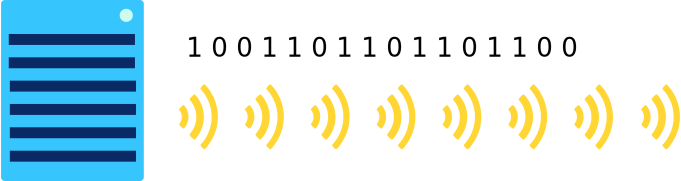


这些无线电波不能传播很远：75-100英尺的地方，比如充满各种障碍物的办公楼，或者1000英尺的开阔地。

无线接入点有希望接收到这些电波，并将它们从无线电波转换回二进制数据。无线接入点使用物理布线（如铜缆或光缆）连接到网络的其余部分。


无线连接的覆盖范围有限，但由于便携式计算设备的普遍使用，无线连接越来越普遍。


### All together now

在任何时候，我们的互联网连接都可能使用这些技术的组合。也许我们用WiFi连接到我们的家庭路由器，我们的家庭路由器用双绞线铜缆连接到城域网，这些电缆通过光纤与海外数据中心进行通信。

每种技术都有优点和缺点，所以我们使用最适合工作的技术。

| 类型                       | Sends       | Distance | Bandwidth | Issues   |
| :------------------------- | :---------- | :------- | :-------- | :------- |
| Wireless                   | Radio       | 100 ft   | 1.3 Gbps  | 慢       |
| Twisted pair copper cables | Electricity | 330 ft   | 1 Gbps    | 易受干扰 |
| Fiber-optic cable          | Light       | 50 miles | 26 Tbps   | 昂贵     |

该表中的数据是截至2020年初的最新数据。工程师们不断发现改善网络连接的新方法，尤其是在增加带宽方面。


## 比特率、带宽和延迟

:::tip Bit rate, bandwidth, and latency

互联网上所有的计算设备都是二进制的。无论它们是通过有线还是无线连接，它们都在发送表示1和0流的电磁信号。

:::

**Let's explore how those bits are sent and how *quickly* they can be sent.**

### Sending streams of 1s and 0s
当计算机需要在内部表示数字5（二进制中为101）时，它们可以使用三根导线来表示三位：一根导线接通(one wire on )，一根导线断开(one wire off)，一根导线接通(one wire on)。


如果一台电脑想把555号发到另一台电脑上，他们就不能用他们想要的那么多电线。事实上，他们可能只有一根电线可以传送信息。相反，他们可以在三个时间段内发送555号：首先发送一个接通脉冲（等待），然后不发送任何信号（等待），然后发送接通脉冲。


只要两台计算机在时间段上一致，那么它们就可以互相传递信息，把二进制数据转换成信号，把信号转换回二进制数据。


在电气连接（如以太网）中，信号是电压或电流。在光连接（如光缆）中，信号是光的强度。

将二进制数据转换为基于时间的信号的过程称为行编码(**line coding**)。根据连接的需要，可以使用各种线路编码方案。


### 比特率(bit rate)

网络连接可以非常快地发送比特。我们用比特率(**bit rate**)，即每秒发送的数据比特(**bits**)数来衡量速度。

最早的互联网连接只有7575 bps (bits per second)。现在，连接的测量单位更多的是Mbps (megabits per second)。

兆比特是巨大的：1.11亿比特！10Mbps连接以每秒10位的速度传输数据。


我们也用更小的单位来测量比特率，比如千比特（1 thousand bits），或者更大的单位，比如千兆比特（1 billion bits），甚至千兆比特（1 quadrillion bits）。


| Unit    | Number of bits |               |      |
| :------ | :------------- | :------------ | :--- |
| kilobit | 1000           | 1 thousand    |      |
| megabit | 1000^2         | 1 million     |      |
| gigabit | 1000^3         | 1 billion     |      |
| terabit | 1000^4         | 1 trillion    |      |
| petabit | 1000^5         | 1 quadrillion |      |


### 带宽(bandwidth)

我们使用术语带宽(bandwidth)来描述系统的最大比特率。如果一个网络连接的带宽是100Mbps，那就意味着它的传输速率不能超过100Mbps。幸运的是，这仍然是很多！


听说过“宽带互联网(**broadband Internet**)”这个词吗？指的是最小带宽为256Kbps（**kilobits per second**，千比特每秒）的连接。这些带宽足以满足基本的互联网使用，如查看电子邮件和阅读网站，但不足以观看在线视频。


### 延迟(Latency)

另一种测量计算机网络速度的方法是延迟(**latency**)。你可能会从这个词本身猜出它的意思：延迟度量比特到达的时间有多晚(**late**)。更正式地说：延迟是从发送(**sending**)数据消息到接收(**receiving**）该消息之间的时间，以毫秒(**milliseconds**)为单位。


我们通常测量请求的“往返（**round-trip**）”延迟。让我们通过一个真实的例子来了解这意味着什么。


我的电脑向Google服务器发送信息。30毫秒后，Google收到了这条消息。40毫秒后，我的电脑收到了Google的确认(**acknowledgement**)，它收到了这条信息。

总的往返延迟为70 ms。延迟取决于许多物理因素：从我的计算机到Google的连接类型，从我的计算机到Google服务器的距离，以及网络拥塞（这可能意味着我的请求必须排队等待）。

延迟有一个主要的限制因素：光速(**the speed of light**)。没有什么能比光速更快，即使是我们非常重要的互联网请求。光速为每纳秒1英尺(**1 foot per nanosecond**)，这意味着从洛杉矶到东京的行程长度至少为30ms。我们不能对光速做太多的改变，但是我们可以通过减少拥塞和改善我们的物理连接来减少延迟。


### 网速(Internet speed)

速度是带宽(bandwidth)和延迟(latency)的组合。计算机将信息分成多个数据包，在收到(received)第一个数据包之前不能再发送(send)另一条信息。即使计算机处于高带宽的连接上，其发送和接收消息的速度仍然会受到连接延迟的限制。

您可以使用Internet速度测试来测量网络的当前速度：一个下载和上载数据的网站，同时跟踪(tracking)数据传输的速度。


以下是我家笔记本电脑的网速测试结果：


延迟（也叫 **ping rate**）只有18毫秒，这对于大多数多人在线游戏来说已经足够快了。

下载比特率为39 Mbps，上传比特率为5.85 Mbps，明显更低。实际上，这是意料之中的。互联网提供商通常支持比上传速度快得多的下载速度，因为互联网用户下载数据（阅读文章、看电影）的时间要比上传数据（写博客文章、提交表格）的时间长得多。


# Addressing the Internet

:::tip Addressing the Internet

[Addressing the Internet](https://www.khanacademy.org/computing/ap-computer-science-principles/the-internet#x2d2f703b37b450a3:addressing-the-internet)

:::

## IP地址

:::tip Internet Protocol

The **Internet Protocol (IP)** is one of the core protocols in the layers of the Internet

:::

因特网协议**Internet Protocol (IP)** 是因特网各层的核心协议之一，你可能从它的名字猜到了。它在所有的互联网通信中都被用来处理寻址和路由。

该协议描述了使用IP地址来唯一标识连接到Internet的设备。就像家庭需要邮件地址来接收邮件一样，连接互联网的设备也需要IP地址来接收邮件。

当一台计算机向另一台计算机发送消息时，它必须指定收件人的IP地址，还必须包括自己的IP地址，以便第二台计算机可以答复。

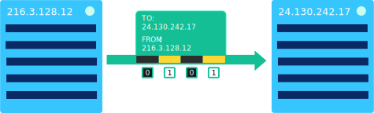


### IPv4 addresses

目前使用的互联网协议实际上有两种版本：

* **IPv4** ：是互联网上使用的第一个版本

* **IPv6** ：向后兼容（**backwards-compatible**）的后继者

在IPv4协议中，IP地址如下所示：

```tex
74.125.20.113
```

每个IP地址分为4个数字，每个数字的范围从0到255：

```tex
 [0-255].[0-255].[0-255].[0-255]
```

我们用十进制写这些数字，但是计算机用二进制存储它们，就像这样：

```tex
01010101 01010101 01010101 01010101
```

由于有8位，每个数字可以代表2^8个值。这也是为什么我们经常称它们为“八位字节(**octets**)”

总的来说，这是2^32个可能的值：4,294,967,296个可能的IPv4地址。

太多了！但请记住，在一开始，我们说过有超过40亿台设备连接到互联网？我们已经到了IP地址的极限了。B计划的时间到了。


### IP v6 addresses

回到互联网协议最初发明的时候，创造者没有预料到它会变得多么流行，最终会有超过2^32台设备想要连接到互联网。

上世纪90年代，当IPv4地址明显耗尽时，IPv6协议被提出了一个更长的寻址方案(**addressing scheme**)。


**Here's an IPv6 address:**

```tex
2001:0db8:0000:0042:0000:8a2e:0370:7334
```

注意那些数字中的字母，比如 `0db8` 中的 `d` 和 `b`？这些是十六进制数，这意味着IPv6地址比看上去要长得多。让我们算一下，看看到底还要多久。

有8个十六进制数，每个数有4位数长。每个数字的最大值是FFFF，因为F是十六进制中的最高数字。因此，最高地址如下所示：

```tex
FFFF:FFFF:FFFF:FFFF:FFFF:FFFF:FFFF:FFFF
```

小数点后FFFF是多少？

| F    | F    | F    | F    |
| :--- | :--- | :--- | :--- |
| 16^3 | 16^2 | 16^1 | 16^0 |
| 4096 | 256  | 16   | 1    |

每一个F代表十进制的15，`(15×4096)+(15×256)+(15×16)+(15×1)`：总计：65,535

我们也可以根据 `FFFF` 的二进制表示来计算。每个十六进制数字 `F` 对应于二进制中的1111，因此得到以下16位：

```tex
1111 1111 1111 1111
```

正如我们在二进制数中所讨论的，用n二进制数字表示的最高数是2^n-1，也就是说上面的二进制数是2^16−12，再次等于65,535。


每一个4位的十六进制数字可以在0到65,535之间，所以每个数字可以代表65,535，唯一的值--有8个！

总共，每个IP v6地址由128位表示，因此有2^128位可能的IP v6地址。那是340个未确定的：`340,282,366,920,938,000,000,000,000,000,000,000,000`


你的IP地址是什么？

找到电脑IP地址的一种方法是在谷歌上搜索“IP地址”。谷歌知道你的IP地址，因为你的电脑一加载Google.com就会向谷歌电脑发送信息。

你的IP地址明天可能会和今天不一样。每个ISP都有一系列可以分配的地址，每次他们看到您的计算机在网络上弹出时，可能会给您一个不同的地址。这叫做动态IP地址(**dynamic IP address**)。

切换到不同的Wi-Fi网络肯定会给你一个新的IP地址，因为每个Wi-Fi提供商都有自己的地址范围。

充当服务器的计算机，比如为Google.com供电的计算机，通常都有静态IP地址(**static IP addresses**)。这使得计算机更容易快速地向Google服务器发送搜索请求。如果你尝试了上面的IP地址，你很有希望在谷歌主页上找到自己。


## IP地址层次结构(IP address hierarchy)

互联网协议（IP）描述了使用IP地址来识别互联网连接的设备。IP地址有一个层次结构(**hierarchy**)，使得在Internet上路由数据更容易。

许多寻址方案是分层的。考虑一个美国电话号码：

```tex
+1 (541) 754-3010
```

我们可以把它分成四部分：

| +1           | 541       | 754            | 3010           |
| :----------- | :-------- | :------------- | :------------- |
| Country code | Area code | Local exchange | Specific phone |

层次结构使电话系统更容易有效地将电话发送到正确的线路。

### IPv4 address hierarchy

IPv4和IPv6地址都是分层的。为了简单起见，让我们检查ipv4地址的层次结构。

考虑此IP地址：`24.147.242.217`

第一个位序列标识网络，最后一个位标识网络中的单个节点。IP地址可以分解为以下几个部分：

| 24.147          | 242.217         |
| :-------------- | :-------------- |
| Comcast network | A home computer |

前两个八位字节（16 bits）标识由电信管理的网络。最后两个八位字节（the final 16 bits）表示电信网络 上的家庭计算机。


如果最后两个八位字节不同，那么IP地址将指向电信网络上的另一台计算机。如果前两个八位字节不同，则IP地址可能属于完全不同的网络管理员。

因特网协议使用这种分层寻址方案，使消息从源路由到目的地更容易。一旦消息到达网络，网络路由器就可以负责将其发送到各个节点。


### 子网(Subnets)

网络管理员可以根据需要将IP地址分成更多的子网（subnets），从这个IP地址开始：

```tex
141.213.127.13
```

可以分为三部分：

| 141.213       | 127                 | 13           |
| ------------- | ------------------- | ------------ |
| UMich network | Medicine department | Lab computer |

前两个八位字节表示 `the University of Michigan` 的整个网络，第三个八位字节表示UMich Medicine的网络，第四个八位字节表示该系网络中的单个实验室计算机。

向地址层次结构添加更多级别可以提高网络内路由的效率。


### 分割八位字节(Splitting octets)

实际上，IP地址通常被分割在八位字节的中间。为了理解它是如何工作的，让我们用二进制表示以前的IP地址：

| 141      | 213      | 127      | 13       |
| :------- | :------- | :------- | :------- |
| 10001101 | 11010101 | 01111111 | 00001101 |

总的来说，这可以转化为以下32位：

```tex
10001101110101010111111100001101
```

前16位可以路由到所有UMich，后2位可以路由到特定的UMich部门，最后14位可以路由到各个计算机。

| 1000110111010101 | 01                  | 11111100001101 |
| :--------------- | :------------------ | :------------- |
| UMich network    | Medicine department | Lab computer   |

此层次结构使UMich能够区分每个部门内的2^2（4）个部门和2^14（16384）台计算机。

分割八位字节一开始可能看起来很混乱，但是计算机以二进制形式存储IP地址，所以对它们来说都是一样的。

正如我们刚才看到的，在IP地址的任何一点创建层次结构的能力允许层次结构的每个级别的大小具有更大的灵活性。


## Routing with redundancy

### IP数据包(IP packets)

在被称为Internet的大规模网络上，计算设备向其他计算设备发送各种消息。一条消息可能是一个小ping来检查另一个设备是否在线，或者一条消息可能是一个完整的网页。

但是消息的大小是有限制的，因为通过设备之间的物理网络连接一次可以合理传输的数据量是有限制的。

这就是为什么许多网络协议将每条消息分成多个小数据包(**packets**)。因特网协议（Internet Protocol，IP）描述了在因特网上飞来飞去的数据包的结构。

每个IP包都包含一个报头（20 or 24 tytes long）和数据（variable length）。标头包括源和目标的IP地址，以及帮助路由数据包的其他字段。数据是实际的内容，例如一串字母或网页的一部分。


你可以把IP数据包想象成邮政信件：邮件头(header)是包含邮局所需的所有路由信息的信封，有效负载(payload)是收件人只能阅读的信件。


就像邮政系统在世界各地传送信件一样，因特网协议在因特网上传送IP包。


### 因特网路由协议(Internet routing protocol)

在互联网协议（IP）中，计算机将信息分成数据包，这些数据包在到达目的地的途中从一个路由器跳到另一个路由器（**router**）：


让我们逐步完成将数据包从源路由到目标的过程。


#### Step 1: 发送数据包到路由器

计算机将第一个数据包发送到最近的路由器。路由器是计算机网络中使用的一种计算设备，可以帮助移动数据包。


你可能有一个路由器在你的家或教室现在，这是第一站为您当前的计算机的数据包。


#### Stpe 2: 路由器接收数据包

当路由器收到一个数据包时，它会查看它的IP报头(**header**)。最重要的字段是目的地IP地址(**address**)，它告诉路由器数据包要在哪里结束。

**IP header**

| Field                      | Content            |
| :------------------------- | :----------------- |
| Source IP Address          | 216.3.192.1        |
| **Destination IP Address** | **91.198.174.192** |
| Version                    | 4                  |
| ... plus 10 more fields!   | 64                 |
| Time to Live               |                    |


#### Step 4:  路由器转发数据包

路由器有多条路径可以发送数据包，其目标是将数据包发送到更接近其最终目的地的路由器。

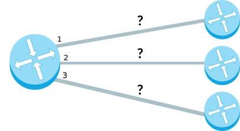


它是如何决定的？路由器有一个转发表(**forwarding table**)，可以帮助它根据目标IP地址选择下一条路径。该表并不是每个可能的IP地址都有一行；有2^32个可能的IP地址，存储起来太多了。相反，表中有IP地址前缀行(*prefixes*)。

| IP address prefix | path |
| :---------------- | :--- |
| `91.112`          | #1   |
| `91.198`          | #2   |
| `192.92`          | #3   |
| ...               |      |

IP地址是分层的(*hierarchical*)。当两个IP地址以相同的前缀开头时，通常意味着它们位于同一个大型网络上，如电信网络。路由器转发表利用了这一事实，因此它们可以存储少得多的信息。

一旦路由器在表中找到目标IP地址的最特定行，它就会沿着该路径发送数据包。


#### Step 4：最终路由器转发消息

如果一切顺利，数据包最终应该到达一个路由器，它确切地知道把它发送到哪里。

| IP address prefix | path   |
| :---------------- | :----- |
| `91.112`          | #1     |
| `91.198.174.192`  | Direct |
| `192.92`          | #2     |
| ...               |        |

路由器现在可以将消息发送到目标IP地址，该地址可以是个人计算机或服务器。


### 冗余和容错(Redundancy and fault tolerance)

在互联网协议（IP）中，计算机将信息分成数据包，这些数据包在到达目的地的途中从一个路由器跳到另一个路由器：


如果一个网络路径不再可用，比如由于自然灾害物理破坏或网络犯罪劫持，会发生什么？数据包注定永远达不到目的地吗？

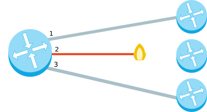


#### 路由冗余(Redundancy in routing)

幸运的是，一个包通常有许多可能的路径可以到达相同的目的地。多条路径的可用性增加了网络的冗余。

考虑一下这个连接四大城市路由器的简化网络：


从Oakland路由器到New York路由器有多条路径。


第一条也是最短的路径是从Oakland到Austin再到纽约：


从Oakland到Austin再到Tampa再到New York，有一条稍长的路：


为什么冗余如此重要？如果Austin和New York路由器之间的连接不再可用，那么数据包还有另一种到达目的地的方式。


网络中路径的冗余增加了数据包到达目的地的可能途径。


#### 容错(Fault tolerance)

容错(**fault-tolerant**)系统是一个可以在其组件中经历故障（或多个故障），但仍能继续正常运行的系统。

互联网是一个庞大而复杂的系统，有数以百万计的组件随时可能损坏，其中许多组件确实会损坏。但到了2020年，还没有人能打破整个互联网。网络路由路径中的冗余是导致互联网容错的一个重要因素。

考虑连接美国东部和欧洲西部的海底电缆的数量：


如果其中一条电缆受损，那么还有多条其他电缆可以在大西洋上传输互联网流量。

或者，换一种说法，海岸之间没有单一的故障点。单点故障(**single point of failure**)是系统中的一个组件，如果发生故障，它将导致整个系统瘫痪。当我们试图确保一个系统是容错的时，我们会寻找单点故障，并找到在这些故障点添加冗余的方法。


现在考虑一下南太平洋波利尼西亚群岛之间海底电缆数量稀少的问题：


如果Cook Islands和French Polynesia之间的电缆被切断，这将如何影响这些岛屿上的互联网？

在某些情况下，一条电缆的切断会导致整个国家的崩溃。2019年，一艘船锚在海底拖曳，切断了通往Tonga的电缆，并切断了他们11天的互联网接入。

据网络分析师斯蒂芬·贝克特（Stephan Beckert）说，电缆切断的频率相对较高——“大约每3天一次”。大多数时候，普通的互联网用户甚至不会注意到什么时候会发生割伤，电缆会被许多电缆修理船中的一艘修理好。

当我们注意到电缆被切断时，通常意味着只有一个故障点，是时候给系统增加冗余了。

我们何不从到处裁员(**redundancy**)开始呢？你可能猜到了，它很贵。连接Tonga和Fiji的海底电缆估计要花费3000万美元，这是一条相对较短的电缆。当谷歌在美国和东京之间安装高速光缆时，它耗资3亿美元.


当复制资源的成本太高时，有可能找到方法让系统在出现故障时正常降级。在Tonga停电期间，卫星服务提供商争相提供互联网接入。


## 传输数据包(Transporting packets)

### 数据包的问题(The problems with packets)

Internet协议（IP）描述了如何将消息拆分为多个IP数据包，并通过从一个路由器跳到另一个路由器将数据包路由到目的地。


然而，IP并不能处理数据包的所有后果。例如：

* 一台计算机可能会向一个目的地发送多条消息(**multiple messages**)，目的地需要确定哪些数据包属于哪个消息。
* 数据包可能会出现故障(**out of order**)。尤其是当两个包沿着不同的路径到达目的地时，这种情况会发生。

* 数据包可能会损坏(**corrupted**)，这意味着由于某种原因，接收到的数据与最初发送的数据不再匹配。

* 由于物理层或路由器转发表中的问题，数据包可能会丢失。即使一条消息的一个包丢失了，也不可能用一种合理的方式将消息放回一起。
* 类似地，由于相同分组的意外重传(**duplicated**)，分组可能被复制。


幸运的是，Internet协议栈(**Internet protocol stack**)中有更高级别的协议可以处理这些问题。

* 传输控制协议（**Transmission Control Protocol ,TCP**）是最常用于IP之上的数据传输协议，它包括数据包排序(*ordering*)、重传(*retransmission*)和数据完整性(*data integrity*)策略。
* 用户数据报协议（**User Datagram Protocol ,UDP**）是一种解决较少问题但提供更快数据传输的替代协议。


Internet应用程序可以选择对其应用程序最有意义的数据传输协议。


### UDP

:::tip UDP

用户数据报协议，User Datagram Protocol

:::

用户数据报协议（**User Datagram Protocol ,UDP**）是一种工作在IP之上的轻量级数据传输协议。

**UDP**提供了一种检测数据包中损坏数据的机制，但它并不试图解决数据包出现的其他问题，例如丢失或无序(*lost or out of order*)的数据包。这就是UDP有时被称为不可靠数据协议(***Unreliable* Data Protocol**)的原因。

UDP很简单但很快，至少与其他通过IP工作的协议相比是这样。它通常用于对时间敏感的应用程序（*如实时视频流 real-time video streaming*），其中速度比准确性更重要。

#### 数据包格式(Packet format)

使用UDP over IP发送数据包时，每个IP数据包的数据部分被格式化为UDP段。


每个UDP段(*segment*)包含一个8-byte的头(*header*)和可变长度的数据。


#### 端口号(Port numbers)

UDP报头(**header**)的前四个字节存储源和目标的端口号。

一个联网的设备可以在不同的虚拟端口上接收消息，就像海港可以在不同的端口接收船只一样。不同的端口有助于区分不同类型的网络流量。以下是我笔记本电脑上UDP使用的一些端口的列表：

![A command line terminal with the command "sudo lsof -i -n -P | grep UDP". The command outputs the following table:  Process | Process ID | Type | Port - | - | - launchd | 1 | IPv4 | UDP *:137 launchd | 1 | IPv4 | UDP *:138 syslogd | 45 | IPv4  | UDP *:54465 mDNSResponder | 186 | IPv4 | UDP *:5353 mDNSResponder | 186 | IPv6 | UDP *:5353 mDNSResponder | 186 | IPv4 | UDP *:65327 mDNSResponder | 186 | IPv6 | UDP *:65327 mDNSResponder | 186 | IPv4 | UDP *:55657 mDNSResponder | 186 | IPv6 | UDP *:55657 Google | 12306 | IPv6 | UDP *:5353](./img/edbdf593300fc4a51c60a97998c4d01a51ccd3b1.png)

每行以使用端口的进程(*process*)的名称开始，以协议(*protocol*)和端口号(*port*)结束。

🔍 这些进程处理什么类型的网络流量？如果您在web上搜索进程名和端口号，您可能会找到它。你甚至可以在你现在用的电脑上试试。


#### 节段长度(Segment Length)

UDP报头的下两个字节存储段（包括报头,*including the header*）的长度（以字节为单位,*in bytes*）。

两个字节是16位，所以长度可以和这个二进制数一样高：

`1111111111111111`

在十进制中，是（2^16−1）或者 65,535。因此，UDP段的最大长度是65535字节。


#### 校验和(Checksum)

UDP报头的最后两个字节是校验和(*Checksum*)，发送方和接收方使用该字段检查数据是否损坏。


在发送段(*sending off the segment*)之前，发送方(*sender*)：

* 根据段中的数据计算校验和。

* 将计算出的校验和存储在字段中。


收到该段(*receiving the segment*)后，接收者(*recipient*)：

* 基于接收的段计算校验和。

* 相互比较校验和。如果校验和不相等，它就知道数据已损坏。


为了理解校验和如何检测损坏的数据，让我们按照下面的过程来计算一个非常短的数据字符串的校验和：“Hola”。

首先，发送者会以某种方式将“Hola”编码成二进制(**binary somehow**)。以下编码使用ASCII/UTF-8编码：

| H        | o        | l        | a        |
| :------- | :------- | :------- | :------- |
| 01001000 | 01101111 | 01101100 | 01100001 |

这种编码产生4字节：

```tex
01001000 01101111 01101100 01100001
```

接下来，发送器将字节分段为2字节（16位,*16-bit*）二进制数：

```tex
0100100001101111
0110110001100001
```

为了计算校验和，发送方将16位二进制数相加：

```tex
0100100001101111 + 0110110001100001 = 1011010011010000
```

计算机现在可以发送一个UDP段，其中编码的“Hola”作为数据，`1011010011010000`作为校验和。

整个UDP段可以如下所示：

| Field                   | Value                                 |
| :---------------------- | :------------------------------------ |
| Source port number      | `00010101 00001001`                   |
| Destination port number | `0001010 100001001`                   |
| Length                  | `00000000 00000100`                   |
| Checksum                | `10110100 11010000`                   |
| Data                    | `01001000 01101111 01101100 01100001` |


如果数据在途中从“Hola”到“Mola”被破坏了呢？首先让我们看看二进制文件中损坏的数据是什么样子。

“Mola”编码成二进制...

| M        | o        | l        | a        |
| :------- | :------- | :------- | :------- |
| 01001101 | 01101111 | 01101100 | 01100001 |

…然后分割成16位数字：

```tex
0100110101101111
0110110001100001
```

现在让我们看看收件人将计算什么校验和：

```tex
0100110101101111 + 0110110001100001 = 1011100111010000
```

收件人现在可以通过编程方式将在UDP段中收到的校验和与刚刚计算的校验和进行比较：

- **Received**: `1011010011010000`
- **Computed**: `1011100111010000`


当接收者发现两个校验和不同时，它就知道数据是在某种程度上被破坏的。不幸的是，接收者不能使用计算出的校验和来重建原始数据，所以它很可能会完全丢弃数据包。

实际的UDP校验和计算过程包含的步骤比这里显示的要多，但这是如何使用校验和检测损坏数据的一般过程。


### TCP

:::tip TCP

传输控制协议，Transmission Control Protocol 

:::

传输控制协议（**Transmission Control Protocol ,TCP**）是一种在IP上使用的传输协议，用于确保数据包的可靠传输。

**TCP**包括解决基于包的消息传递所产生的许多问题的机制，例如丢失的包（*lost packets*）、无序的包（*out of order packets*）、重复的包（*duplicate packets*）和损坏的包（*corrupted packets*）。

由于TCP是IP之上最常用的协议，所以Internet协议栈有时被称为 **TCP/IP**。


#### 数据包格式(Packet format)

使用TCP/IP发送数据包时，每个IP数据包的数据部分被格式化为TCP段。


每个**TCP**段都包含一个标头(*header*)和数据(*data*)。TCP报头包含的字段比**UDP**报头多得多，根据`options`字段的大小，其大小可以从20 tytes到60 bytes不等。

TCP报头与UDP报头共享一些字段：源端口号(*source port number*)、目标端口号(*destination port number*)和校验和(*checksum*)。要记住这些是如何使用的，请查看[UDP文章](./internet/)。


#### 从头到尾(From start to finish)

让我们逐步了解使用TCP/IP传输数据包的过程。

##### Step 1: 建立联系(Establish connection)

当两台计算机要通过TCP互相发送数据时，它们首先需要使用三次握手(**three-way handshake**)建立连接。


第一台计算机发送一个SYN位设置为1的数据包（**SYN = "synchronize?"**）。第二台计算机发回ACK位设置为1的数据包（**ACK="acknowledge！"**）加上SYN位设为1。第一台计算机回复一个ACK。


SYN和ACK位都是TCP报头的一部分：

![A diagram of the TCP header with rows of fields. Each row is 32 bits long. The first row contains a 16-bit source port number and 16-bit destination port number. The second row contains a 32-bit sequence number. The third row contains a 32-bit acknowledgement number. The fourth row contains a 4-bit data offset number, 6 bits that are marked as reserved, 6 control bits (URG, ACK, PSH, RST, SYN, and FIN), and a 16-bit window size number. The fifth row contains a 16-bit checksum and 16-bit urgent pointer. The header ends with options and padding which can be of variable length.](./img/9a4a79816965be53e1071cf6b0e2991cb4d170ca.svg)

事实上，三方握手中涉及的三个包通常不包括任何数据。一旦计算机完成了握手，它们就可以接收包含实际数据的数据包了。


##### Setp 2：Send packets of data(发送数据包)

当数据包通过TCP发送时，接收者必须始终确认他们收到了什么。


 第一台计算机发送包含数据和序列号的数据包。第二台计算机通过设置ACK位并将确认号增加所接收数据的长度来确认(*acknowledges*)它。


序列号(*sequence*)和确认号(*acknowledgement numbers*)是TCP报头的一部分：*The 32-bit sequence and acknowledgement numbers are highlighted.*

![A diagram of the TCP header with rows of fields. Each row is 32 bits long. The first row contains a 16-bit source port number and 16-bit destination port number. The second row contains a 32-bit sequence number. The third row contains a 32-bit acknowledgement number. The fourth row contains a 4-bit data offset number, 6 bits that are marked as reserved, 6 control bits (URG, ACK, PSH, RST, SYN, and FIN), and a 16-bit window size number. The fifth row contains a 16-bit checksum and 16-bit urgent pointer. The header ends with options and padding which can be of variable length.](./img/ec71832edb1f2ff1d2ad12da494033ce2b25aafa.svg)

这两个数字有助于计算机跟踪哪些数据成功接收，哪些数据丢失，哪些数据意外发送了两次。


##### Step 3: 关闭连接(Close the connection)

任何一台计算机都可以在不再需要发送或接收数据时关闭连接。


计算机通过发送FIN位设置为1（**FIN=finish**）的数据包来关闭连接。另一台计算机用一个ACK和另一个FIN来回复。在初始化计算机再次确认后，连接关闭。


#### 检测丢失的数据包(Detecting lost packets)

TCP连接可以使用超时来检测丢失的数据包。


在发送一个数据包之后，发送方启动一个计时器并将数据包放入重传队列。如果计时器用完并且发送方还没有从接收方接收到ACK，则发送方会再次发送数据包。

如果数据包实际上没有丢失，但是到达或被确认的速度非常慢，那么重传可能导致接收者接收到重复的数据包。如果是这样，接收者可以简单地丢弃重复的数据包。有两次数据总比没有好！


#### 处理无序数据包(Handling out of order packets)

TCP连接可以通过使用序列号和确认号来检测无序数据包。


当接收者看到一个比他们目前确认的序列号更高的序列号时，他们知道他们在这两者之间至少丢失了一个数据包。在上图所示的情况下，收件人看到的序列号是**#73**，但预期的序列号是**#37**。收件人通过发送一个确认号设置为预期序列号的数据包，让发件人知道有问题。


有时丢失的数据包只是在互联网上走一条比较慢的路线，很快就会到达。

![Diagram of TCP packets arriving out of order. Two computers are shown with arrows going back and forth, with their vertical location indicating the time of sending and arrival:  * An arrow labeled "Seq #1" starts from Computer 1 and ends soon after at Computer 2. * An arrow labeled "Ack #37" starts from Computer 2 and ends soon after at Computer 1. * An arrow labeled "Seq #37" starts from Computer 1 and doesn't end until much later at Computer 2.  * An arrow labeled "Seq #73" starts from Computer 1 and ends soon after at Computer 2 (before the arrow for "Seq #37"). * An arrow labeled "Ack #37" starts from Computer 2 and ends soon after at Computer 1 (before the arrow for "Seq #37").](./img/c96ec5ae0784f98e14d7a1c45b0dc65203b6bf48.svg)


其他时候，丢失的包实际上可能是丢失的包，发送方必须重新传输该包。

![Diagram of TCP packets arriving out of order. Two computers are shown with arrows going back and forth, with their vertical location indicating the time of sending and arrival:  * An arrow labeled "Seq #1" starts from Computer 1 and ends soon after at Computer 2. * An arrow labeled "Ack #37" starts from Computer 2 and ends soon after at Computer 1. * An arrow labeled "Seq #37" starts from Computer 1 and ends before reaching Computer 2, with an X indicating it was lost.  * An arrow labeled "Seq #73" starts from Computer 1 and ends soon after at Computer 2. * An arrow labeled "Ack #37" starts from Computer 2 and ends soon after at Computer 1. * An arrow labeled "Seq #37" starts from Computer 1 and ends soon after at Computer 2.](./img/bdeaf7f92aa9f48d5d103888a63a34704b755104.svg)


在这两种情况下，收件人都必须处理无序的数据包。幸运的是，接收者可以使用序列号以正确的顺序重新组装包数据。


## Web protocols

### 万维网(The World Wide Web)

当我们大多数人谈论使用“互联网(*Internet*)”时，我们通常谈论的是互联网的一个特定部分：万维网（**World Wide Web** - **WWW**，或简称Web）。

Web是一个庞大的网页、程序和文件网络，可以通过url访问。

我们称之为网络是因为它有着巨大的互联性。从一个URL开始，例如`http://wikipedia.org`，我们可以通过链接最终访问全球数百万个网页。

以下是2004年网络的一小部分：


### Powered by protocols

web浏览器使用各种协议加载网页：

1. 它使用域名系统协议（ **[Domain Name System (DNS) protocol](https://www.khanacademy.org/a/domain-name-system-dns-protocol)**）将域名转换为IP地址。
2. 它使用超文本传输协议（ **[HyperText Transfer Protocol (HTTP)](https://www.khanacademy.org/a/hypertext-transfer-protocol-http)** ）从该IP地址请求网页内容。

它还可以使用传输层安全（**[Transport Layer Security (TLS) protocol](https://www.khanacademy.org/a/transport-layer-security-protocol-tls)**）协议通过安全、加密的连接为网站提供服务。

web浏览器在Internet协议之上使用这些协议，因此每个HTTP请求也使用TCP和IP。

Web只是建立在Internet协议之上的应用程序之一，但它是迄今为止最流行的。


### Domain Name System (DNS)

IP地址是计算机识别Internet上其他计算机的方式。不过，IP地址并不是特别人性化。谁想记住像 `74.125.20.113` 这样的地址？或者更长的 **IP v6** 地址？


域名系统（**Domain Name System (DNS)** ）给我们人类提供了一种简单的方法来识别我们想在互联网上去哪里。

我们只需键入一个域名，如 `www.wikipedia.org`，我们的计算机将我们连接到为维基百科供电的计算机：


**域名(domain name)是一个人性化的网站地址，我们很容易记住和输入。**


#### 域名剖析(Anatomy of a domain name)

每个域名由以下部分组成：

```bash
[三级域].[二级域].[顶级域]
# or
[third-level-domain].[second-level-domain].[top-level-domain]
```

* <u>顶级域名</u>（**top level domains, TLDs**）数量有限，许多网站使用最常见的**TLDs**，`.com`、`.org` 和 `.edu`。

* <u>二级域名</u>（**second-level-domain**）对于注册它的公司或组织是唯一的，比如：`wikipedia` 或 `threetowns`。

* <u>三级域名</u>（**third-level-domain**）也称为子域（**subdomain**），因为它属于同一个组，并且该URL通常会将您指向网站的一个子集，如 `m.wikipedia.org` 或 `es.khanacademy.org`。


#### Domains ↔ IP addresses

在幕后(*Behind the scenes*)，每个域名映射(*maps*)到一个IP地址。当我们在浏览器的地址栏中键入一个URL时，计算机必须找出它的IP地址。


这台计算机无法在本地存储超过3亿个域名的数据库，因此需要经过多个步骤(*multi-step*)才能找到IP地址。


##### Step 1：Check the local cache(检查本地缓存)

如果你曾经访问过一个网站，你很有可能再次访问它。这就是为什么计算机保留自己的本地缓存域名到IP的映射。缓存保持很小，因为它会踢出你已经有一段时间没有访问过的域或发送过期日期的域。

🔍 在Chrome浏览器中，您可以自己查看数据库。“只需键入`chrome://net-internals/#dns`在地址栏。

以下是我的浏览器缓存中的一个片段：


##### Step 2:  询问ISP缓存(Ask the ISP cache)

每个**ISP**（**Internet Service Provider**，Internet服务提供商）都提供域名解析服务并保留自己的缓存。也许你从未访问过某个特定的网站，但你的邻居刚刚访问过，所以ISP可以从他们的访问中查找域名映射。

如果它不在ISP的缓存中，那么它将被关闭，进入下一步。


##### Step 3：询问服务器的名称(Ask the name servers)

分布在全球各地的域名服务器负责跟踪数百万域名中的一个子集。服务器按层次结构(`hierarchy`)排序：

```tex
Root name servers → TLD name servers → Host name servers.
```

ISP首先询问根名称服务器：“hey，哪个名称服务器知道.org域？”根名称服务器(*root name server*)用跟踪.org域的TLD名称服务器的IP地址进行响应。


接下来，ISP询问TLD名称服务器：“so，谁知道wikipedia域呢？”。**TLD** 名称服务器用包含“wikipedia”记录的主机名服务器的IP地址进行响应。


最后，ISP问主机名服务器：“好的，那服务器在哪里？`www.wikipedia.org`?“ 主机名服务器用确切的IP地址进行响应。


ISP将IP地址发送回请求的计算机，现在我们的计算机可以成功地连接到为该域供电的计算机。


如果这听起来像是一个过程(*process*)：是的！但别担心，不是经常这么做的。一路上缓存了很多信息，所以很少有DNS查找需要经过这么多步骤。

当一个查找确实要经过所有步骤时，有多个名称服务器可以回答每个问题，因此计算机不必等待响应太长时间，也不必担心名称服务器出现故障。

我们从1985年就开始使用域名系统了，由于它的层次结构(*hierarchy*)、冗余(*redundancy*)和缓存(*caching*)，它的扩展速度令人印象深刻，以适应互联网的发展。


### HTTP

:::tip HTTP

超文本传输协议，[Hypertext Transfer Protocol](https://www.khanacademy.org/computing/ap-computer-science-principles/the-internet/x2d2f703b37b450a3:web-protocols/a/hypertext-transfer-protocol-http)

:::


每当您访问网页时，您的计算机都会使用超文本传输协议（**Hypertext Transfer Protocol ,HTTP**）从Internet上的其他计算机下载该网页。


让我们逐步完成这个过程。

#### Step 1: 将浏览器直接指向URL(Direct browser to URL)

当我们想浏览网页时，我们可以使用多种类型的电脑（如笔记本电脑、台式机和电话），只要电脑安装了浏览器(**browser**)应用程序。

用户可以在浏览器中键入统一资源定位器（**Uniform Resource Locator,URL**），也可以从已打开的页面中跟踪链接：


请注意这个URL：它以`http` 开头。这是向浏览器发出的一个信号，它需要使用HTTP来获取该URL的文档。


#### Step 2: 浏览器查找IP(Browser looks up IP)

我们通常在浏览器中输入友好的URL，比如 `khanacademy.org` 和 `wikipedia.org`。这些域名映射到IP地址，即域计算机的真实位置。由[DNS](https://www.khanacademy.org/a/domain-name-system-dns)处理.

浏览器使用DNS解析程序将域映射到IP地址：


#### Step 3: 浏览器发送HTTP请求(Browser sends HTTP request)

一旦浏览器识别出承载请求的URL的计算机的IP地址，它就会发送一个HTTP请求(**HTTP request**)。

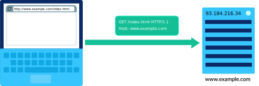

HTTP请求可以短至两行文本：

```bash
GET /index.html HTTP/1.1
Host: www.example.com
```

* 第一个单词是HTTP动词：**GET**。在web上还有其他动作的动词，比如提交表单数据（**POST**）。

* 下一部分指定路径：**/index.html**。主机存储整个网站的内容，因此浏览器需要指定要加载的页面。

* 第一行的最后一部分指定了协议和协议的版本：**HTTP/1.1**。

* 第二行指定请求的URL的域，这对于主机（*Host*）存储多个网站的内容很有帮助。


#### Step 4：主机发回HTTP响应(Host sends back HTTP response)

一旦主机接收到HTTP请求，它就会发回一个包含内容(*content*)和元数据(*metadata*)的响应。

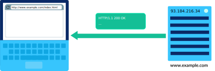


HTTP响应的启动方式与请求类似：

```bash
HTTP/1.1 200 OK
```

* 响应以协议(*protocol*)和版本(*version*) **HTTP/1.1** 开始。

* 下一个数字是非常重要的HTTP状态代码(**HTTP status code**)，在本例中是 `200`。该代码表示成功检索文档（**OK**）。

  > 如果服务器检索文档失败，状态代码将提供更多信息。
  >
  >   * 例如，失败是由于用户错误还是服务器错误造成的。
  >   * 例如，最广为人知的状态码是404 ( **File not found**)。每当您访问服务器上与任何文档都不对应的路径时，就会发生这种情况。由于用户有一个错误输入网址的习惯，404经常发生，所以网站往往有乐趣404网页。尝试键入一个无意义的网址，看看会发生什么！

* HTTP响应的下一部分是头(**headers**)。它们为浏览器提供额外的细节，并帮助浏览器呈现内容。

这两个标头对于大多数请求都很常见：

```bash
Content-Type: text/html; charset=UTF-8
Content-Length: 208
```

内容类型告诉浏览器要发送回哪种类型的文档。web上的一个常见类型是“**text/html**”，因为所有网页都是html文本文件。其他类型也是可能的，比如图像（“**image/png**”）、视频（“**video/mpeg**”）、脚本（“**application/javascript**”）以及其他任何可以加载到浏览器中的内容。

**content-length** 以字节为单位给出文档的长度，这有助于浏览器了解下载文件需要多长时间。

最后，HTTP响应写出请求的实际文档。此页面是一个简单的HTML文件：

```html
<!DOCTYPE html>
<html>
  <head>
    <title>Example Domain</title>
  </head>
  <body>
    <h1>Example Domain</h1>
    <p>This domain is to be used for illustrative examples in documents.</p>
  </body>
</html>
```

#### Step 5: 浏览器呈现响应(The browser renders the response)

浏览器现在拥有呈现所请求文档所需的所有信息。


**See for yourself**

许多浏览器都包含调试工具，允许您在浏览web时查看HTTP请求(*HTTP requests*)及其响应（*responses*）。让我们用Chrome试试。

1. 首先，我们需要打开Chrome开发者工具(*developer tools*)。一种方法是打开“视图(*view*)”菜单，然后选择：**开发人员(*Developer*)**”→ **开发人员工具(*Developer Tools*)**。打开后，选择**网络（Network）**选项卡。

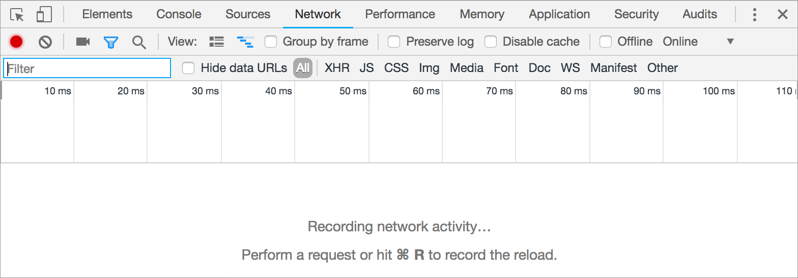

2. 接下来，在浏览器栏中键入URL，如 `http://www.example.com/index.html`. 控制台中将显示一个HTTP请求，浏览器将呈现该页面。

   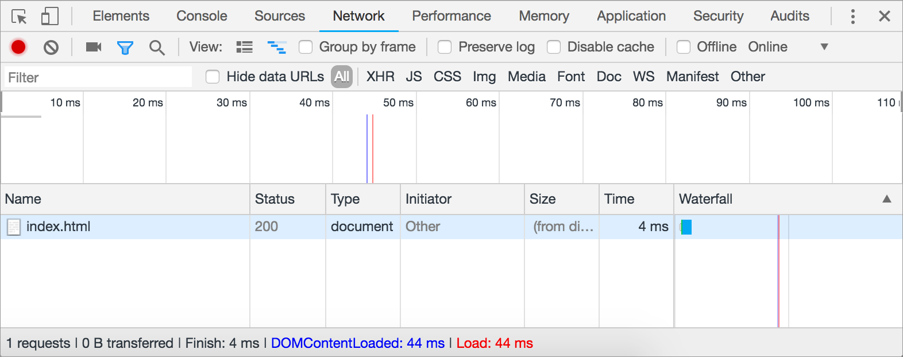

   

   如果我们愿意的话，我们可以深入研究这个请求，看看有趣的细节。单击 **名称(Name)** 列下的 **index.html**。弹出一个选项卡式界面，默认为 **Headers** 选项卡。

   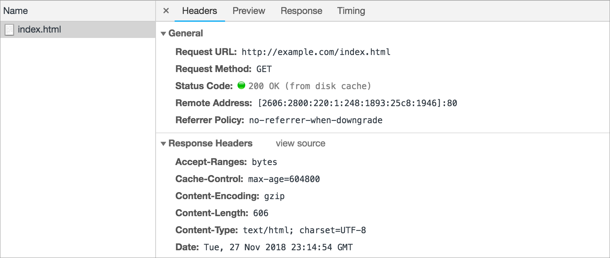

   

   **响应头(Response headers)** 包括上面讨论的头(*headers*)，比如：**Content-Type**和 **Content-Length**，以及许多其他有趣的头。

   响应的实际HTML内容是另一个选项卡 **Response**。

   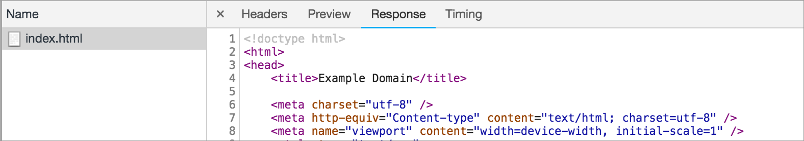


#### HTTP and TCP/IP

**HTTP** 是建立在 **TCP/IP** 协议之上的协议。

每个HTTP请求都在一个IP包(*packet*)内，每个HTTP响应都在另一个IP包内——或者更典型地说，多个包内，因为响应数据可能非常大。

![Diagram with laptop on left and server on right. Laptop has browser window with "http://www.example.com/index.html" in address bar. Server is labeled with "www.example.com" and its IP address "93.184.216.34".  4 arrows are shown:  * First arrow goes from laptop to server and displays packet with HTTP request inside. * Second arrow goes from server to laptop and displays packet with "ACK" inside. * Third arrow goes from server to laptop and displays packet with HTTP response inside. * Fourth arrow goes from laptop to server and displays packet with "ACK" inside.](./img/620dfdaef4da77689540ae2155fd6e173605f4e3.svg)


在**TCP/IP**之上还有许多其他协议，比如发送电子邮件的协议（**SMTP**、**POP**、**IMAP**）和上传文件的协议（**FTP**）。

所有这些协议都使我们能够利用因特网以有用的方式与其他计算机连接，并进行远距离通信和协作。


## 可扩展系统

:::tip Scalable systems

[可扩展系统](https://www.khanacademy.org/computing/ap-computer-science-principles/the-internet/x2d2f703b37b450a3:scalable-systems/a/scalable-systems)

:::

互联网最初是一个连接大学和研究中心的网络。一旦它成为可用的和负担得起的消费者，它迅速流行起来，现在估计有45亿人使用。


幸运的是，为互联网和网络提供动力的协议是为可伸缩性(*scalability*)而设计的。一个可扩展(***scalable***)的系统是一个即使在经历更高的使用率时也能继续正常工作的系统。


## The Internet protocol suite

:::tip The Internet protocol suite

Internet协议套件

:::

正如我们在本单元中所看到的，有许多协议为互联网提供动力。每个协议在不同的层上运行，在它下面的层上构建功能。

互联网协议的各层(**The layers of Internet protocols**)通常在如下图表中显示：


那张图决不完整。Internet协议套件(*suite—especially*)中有更多的协议，特别是在应用层(**application layer**)，例如用于发送电子邮件的**SMTP**和用于上载文件的**FTP**。

让我们回顾一下每一层的协议及其对互联网的贡献。


### Layer by layer

在底层，两个计算设备需要一个**物理机制**(*physical mechanism*)来相互发送数字数据。它们通过**有线或无线**连接( [wired or wireless connection](https://www.khanacademy.org/a/physical-network-connections) )发送电磁信号，并将信号解释为位。物理连接的类型会影响**比特率和带宽**([bit rate and bandwidth](https://www.khanacademy.org/a/bit-rate-bandwidth-and-latency))。


一旦一个网络大于两台计算机，我们就需要寻址协议来唯一地识别谁在发送数据，谁应该接收数据。互联网上的每个节点都有一个**IP地址**([IP address](https://www.khanacademy.org/a/ip-v4-v6-addresses))。


互联网上任何两台计算机之间的路径不仅仅是从 A 到 B 的一条直线。数据必须从一个路由器传递到另一个路由器，直到它最终到达目的地，这一策略来自**互联网路由协议**([Internet routing protocol](https://www.khanacademy.org/a/internet-routing))。

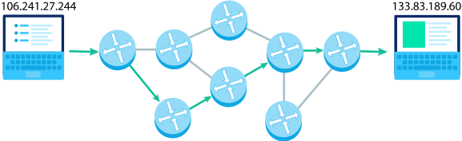

数据需要分解成小数据包，然后在目的地重新组装。**传输控制协议**（ [Transmission Control Protocol,TCP](https://www.khanacademy.org/a/transmission-control-protocol--tcp)）用于确保这些数据包的可靠传输，包括排序(*sequencing*)、确认(*acknowledgement*)和重试(*retries*)。一个更快但不太可靠的传输协议是**用户数据报协议**（ [User Datagram Protocol (UDP)](https://www.khanacademy.org/a/user-datagram-protocol-udp)）。


在互联网上流动的数据有很多用途，例如发送电子邮件、上传文件或在线聊天。互联网最常见的用途是**万维网**([World Wide Web](https://www.khanacademy.org/a/the-world-wide-web))，它有数百万个可公开查看的网站，所有这些都是由于**超文本传输协议**（ [HyperText Transfer Protocol (HTTP)](https://www.khanacademy.org/a/hypertext-transfer-protocol-http)）而成为可能的。我们可以通过在浏览器地址栏中键入域名来访问网站，因为浏览器知道如何使用**域名系统**（[Domain Name System (DNS)](https://www.khanacademy.org/a/domain-name-system-dns-protocol)）将域转换为IP地址。


当数据包含私人信息时，需要将其从发送方安全地传输到目的地。**传输层安全协议**（ [Transport Layer Security (TLS) protocol](https://www.khanacademy.org/a/transport-layer-security-protocol-tls) ）使用算法加密数据(*encrypt the data*)，而证书颁发机构( [certificate authorities](https://www.khanacademy.org/a/digital-public-key-certificates) )帮助用户信任加密。


### 协议栈(A protocol stack)

当一条消息通过互联网发送时，它并不使用套件中的所有协议。不过，它确实使用了每层至少一个协议。

当您从您的浏览器以前从未访问过的域加载网页时，您的浏览器可能需要发出DNS请求([DNS request](https://www.khanacademy.org/a/domain-name-system-dns-protocol))。当通过Internet发送DNS请求时，将使用此协议堆栈：


然后你的浏览器会发出一个HTTP请求([HTTP request](https://www.khanacademy.org/a/hypertext-transfer-protocol-http))来获取网页。通过Internet发送HTTP请求时使用此协议堆栈：


如果网页是通过 **[HTTPS](https://www.khanacademy.org/a/http-secure-https)** 提供的，那么堆栈在应用层包括多个协议（**HTTP**和**TLS**）


## Open protocol developemet

:::tip Open protocol developement

开放协议开发

为互联网提供动力的许多协议都是标准化(**standardized**)和开放(**open**)的。但这到底意味着什么，为什么这么重要？

:::

### 标准化的必要性(The need for standardization)

网络协议描述了计算机如何相互通信。让我们想象一个在互联网协议存在之前的世界，一台计算机想要向另一台计算机发送消息的世界。

计算机 **A** 发送这个2字节的信息：

```bash
01001000 01101001
```

该消息表示使用[UTF-8](https://www.khanacademy.org/a/storing-text-in-binary)标准编码成二进制的两个字母“Hi”。

不幸的是，计算机B认为它正在接收一个数字，并将消息解释为十进制数字18537。


每台计算机可能都遵循一个关于如何通信的协议，但它们遵循的协议不同，因此它们的通信尝试失败。🙁

这就是为什么标准化(**standardization**)对于推动互联网的技术如此重要。当计算机就彼此发送信息的方式达成一致时，它们就可以理解接收到的信息。

例如，这两台计算机可以同意遵循一个简单的协议，其中第一个字节([byte](https://www.khanacademy.org/a/byte-sized-bits))表示正在发送的数据类型。`00000000`的第一个字节表示数字，`00000001`的第一个字节表示字母串。

计算机A现在可以发送以下消息：

```bash
00000001 01001000 01101001
```

计算机B接收到消息，检查第一个字节以发现消息中的数据类型，然后成功解码消息的其余部分。

计算机通讯成功！😀


一旦这个协议被写进一个文档，并且其他网络管理员同意它是一个合理的协议，这个协议就被认为是一个标准(**standard**)。任何两台计算机都可以按照这个标准相互通信，而不仅仅是原来的两台计算机。

当然，互联网协议比简单的协议要复杂得多，因为在不同类型的设备之间，复杂的通信过程有很多细节需要记录。


### 开放标准规范

:::tip

Open standard specifications

:::

对于每一个标准化和开放的协议，都有一个描述该协议的可公开查看的文档（通常称为“规范(*specification*)”）。

🔍 访问这个88页长的HTTP规范([HTTP specification](https://tools.ietf.org/html/rfc7230))，浏览几个部分。


这个规格对你和对我来说都是压倒性的吗？规范不是为普通的web用户编写的。它们甚至不是为普通软件开发人员编写的。它们是为那些正在开发基于协议之上的新应用程序的工程师而编写的，他们需要深入了解应该如何工作。

规格会随着时间的推移而改变。有时需要修复一些小错误，但有时需要进行大的更新来进一步阐明行为或描述新特性。官方的TCP规范( [TCP specification](https://www.rfc-editor.org/info/std7) )编写于1981年，至今已经积累了39个修正和4个多页规范来澄清协议。


现在，因特网协议的规范由**因特网工程任务组**（**Internet Engineering Task Force , IETF**）维护。**IETF**是一个开放标准委员会，负责对现有协议进行改进，并提出全新的协议。该委员会由互联网行业的代表组成，任何对互联网应该如何运作有意见的人都可以参加。

万维网的语言也是具有在线规范的开放标准。 [HTML living standard](https://html.spec.whatwg.org/multipage/) 由**WhatWG**社区维持，CSS有许多规范](https://www.w3.org/Style/CSS/current-work)由W3C维护。JavaScript基于[ECMAScript standard](https://www.ecma-international.org/ecma-262/10.0/index.html)。

互联网标准社区的目标是创建反映在互联网上运行的应用程序的不同需求的标准，并以清晰的规范记录这些标准，允许任何计算设备在线通信和协作


## 全球数字差异

:::tip The global digital divide

全球数字差异

:::


许多人认为，上网应该是一项基本人权(*human right*)：人人都应该有平等的机会从联网的计算机上获得信息和机会。

不幸的是，在计算机设备和互联网的接入上存在着不均衡的分布。有些人根本没有计算设备，有些人在他们家的电脑上有高速互联网，很多人在中间。这种获取的差异被称为数字鸿沟(**the digital divide**)，通常是由于社会经济、地理或人口因素造成的。