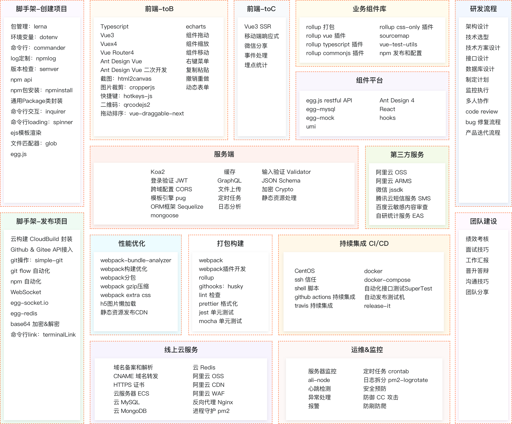

# 前端架构师之路

> * 工程化

## 工程化

> * vue源码
> * vue-cli
> * vue-router源码
> * vuex源码
> * axios源码
> * 封装vue组件库

* vue源码（2.x and 3.x）
  * rollup配置
  * [手写Vue源码-这可能是你目前见过最完整的](https://www.bilibili.com/video/BV1qt4y1y7e8?p=6)
  * 表单生成器（若依）
* CLI 脚手架
  * vue-cli
    * vue-cli@3.x 使用 `lerna`
    * 基础：[脚手架的工作原理](https://www.bilibili.com/video/BV1ih411a7B8?p=15)
  * create-react-app
    * 入门：[从零实现React官方脚手架create-react-app](https://www.bilibili.com/video/BV1xa4y1n7EM)
  * umi及区块
* npm依赖
  * commander
  * inquirer
* vscode插件
* source-map
 * [An Introduction to Source Maps](https://blog.teamtreehouse.com/introduction-source-maps)

## UglifyJS
* [UglifyJS](http://lisperator.net/uglifyjs/)
* [Source Maps Revision 3 Proposal](https://docs.google.com/document/d/1U1RGAehQwRypUTovF1KRlpiOFze0b-_2gc6fAH0KY0k/edit)
* [Source Maps Demo](http://demos.mattwest.io/source-maps/)

http://rapheal.sinaapp.com/category/js/uglify%E6%BA%90%E7%A0%81/

## jQuery源码

* [jQuery源码剖析](http://rapheal.sinaapp.com/2013/01/17/jquery-src-util/)

## 大神

* [拉风的博客](http://rapheal.sinaapp.com/)

