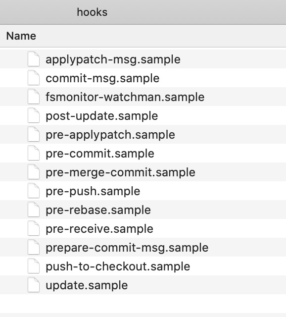

#  git提交规范

本文将从以下三个维度剖析git提交规范，并拓展git原理

> * 使用工具生成message —— `commitizen`
> * 代码提交时检查 —— `husky` （或  `yorkie` ）和 `lint-staged`
> * 发布新版本时，自动生成changelog —— `conventional-changelog`


## 一、为什么？

> 在多人协作项目中，如果代码风格统一、代码提交信息的说明准确，那么在后期协作以及Bug处理时，会更加方便。

1. 制定规范后，可能会引起一些不适，诸如：

   * 用户推送的提交遭到拒绝后无法避免的抱怨
   * 辛辛苦苦写成的代码在最后时刻惨遭拒绝是十分让人沮丧且具有迷惑性的

2. 规范（时机、方案）

   * `pre-commit`，从**暂存区获取被修改文件**列表：

     ```bash
     files_modified = `git diff-index --cached --name-only HEAD`
     ```

   * 每次提交前，核查你的提交信息：`commit-msg` Hooks，脚本位于`.git/hooks/commit-msg`


## 二、生成message

### 2.1 项目中commitizen

在仓库中使用 [`commitizen`](https://github.com/commitizen/cz-cli)命令行，在commit时系统会提示您填写任何必填字段，并且您的提交信息将根据项目维护者定义的标准进行格式化。

1. 安装 **commitizen** 工具

   ```bash
   # 在本地安装和运行 commitizen 可以确保开发人员在每台机器上运行完全相同版本的commitize
   yarn add commitizen -D
   ```

2. 初始化项目使用 **cz-conventional-changelog**

   ```bash
   commitizen init cz-conventional-changelog --save-dev --save-exact
   ```

   或使用 `yarn`

   ```bash
   commitizen init cz-conventional-changelog --yarn --dev --exact
   ```

   **注意：** 如果已经安装过 `cz-conventional-changelog`，可以使用 `--force` 参数！【`--exact`，表示确保不会安装任何滑动版本（带有**〜**或^）】

   上面的命令，为您做了两件事：

   1. 安装`commitizen`、 `cz-conventional-changelog` 的npm模块，并将其保存在 `dependencies` 或 `devDependencies`中

   2. 将 `config.commitizen` 添加到 **package.json** 根目录中

      ```diff
        "devDependencies": {
      +   "commitizen": "^4.2.4"
      +   "cz-conventional-changelog": "3.3.0"
        },
      + "config": {
      +   "commitizen": {
      +     "path": "./node_modules/cz-conventional-changelog"
      +   }
      + }
      ```

3. 提交时只需要使用 `git cz` 或 `cz` 代替 `git commit`，作为npm脚本：

   ```diff
     "scripts": {
   +   "commit": "git cz"
     }
   ```


### 2.2 全局 commitizen

我们也可以把 `commitizen` 作为全局程序。

```sh
npm install -g commitizen
```

`commitizen`例如，全局安装您的首选适配器[`cz-conventional-changelog`](https://www.npmjs.com/package/cz-conventional-changelog)

```sh
npm install -g cz-conventional-changelog
```

`.czrc`在您的`home`目录中创建一个文件，并`path`引用首选的、全局安装的`commitizen`适配器

```sh
echo '{ "path": "cz-conventional-changelog" }' > ~/.czrc
```

你都准备好了！现在`cd`进入任何`git`存储库并使用`git cz`代替，`git commit`您将找到`commitizen`提示。


### 2.3 配置commitizen类型

在源码 [`cz-cli/src/commitizen/configLoader.js`](https://github.com/commitizen/cz-cli/blob/master/src/commitizen/configLoader.js) 中发现，**Commitizen** 默认加载根目录下的配置文件：

```js
// Configuration sources in priority order.
var configs = ['.czrc', '.cz.json', 'package.json'];
```


## 三、commit提交校验

我们已经可以通过工具格式化git commit信息了。但每次提交commit时，我们需要做一些校验【通过触发**git hooks**钩子】，我们有以下方案：

* `husky`
* `yorkie`
* `lint-staged`——检测暂存区的代码是否符合规范。


### 3.1 git hooks

gitHooks是用来控制git的工作流程。我们期望在 commit时，能对我们的message进行校验或者做一些其它的事，可以通过 gitHooks来触发。更多见[Git 内部原理](https://git-scm.com/book/zh/v2/ch00/ch10-git-internals)

#### 3.1.1 安装

```bash
$ git init
```

仓库 `git init` 初始化时，产生 **.git** 文件夹。

#### 3.1.2 .git目录结构

下面是一个全新的`git init`版本库，你可以看到默认结构。

```bash
.git
├── config                         # 包含项目特有的配置选项
├── description                    # 仅供 GitWeb 程序使用，无需关心
├── HEAD                           # 【重要】指向目前被检出的分支（如：ref: refs/heads/master）
├── hooks/                         # 包含客户端或服务端的钩子脚本（hook scripts）
│   ├── applypatch-msg.sample
│   ├── commit-msg.sample
│   ├── fsmonitor-watchman.sample
│   ├── post-update.sample
│   ├── pre-applypatch.sample
│   ├── pre-commit.sample
│   ├── pre-merge-commit.sample
│   ├── pre-push.sample
│   ├── pre-rebase.sample
│   ├── pre-receive.sample
│   ├── prepare-commit-msg.sample
│   ├── push-to-checkout.sample
│   └── update.sample
├── info/                         # 用来放置不希望被记录在 .gitignore文件的忽略模式
│   └── exclude                   # 包含一个全局排除（global exclude）文件，
├── objects/                      # 【重要】存储所有数据内容
│   ├── info/
│   └── pack/
└── refs/                         # 【重要】存储指向数据（分支、远程仓库和标签等）的提交对象的指针
    ├── heads/
    └── tags/
```

接下来，我们创建文件并将改动后的**把文件添加到暂存区**

```bash
$ touch README.md
$ git add .
```

相比之前，多了index

```diff
+ index
```

接着，把暂存区（stage）保存到本地，并生成一个HASH，保存在 `refs/heads/master`  中

```bash
$ git commit -m ":tada: init project"
```

当我们切换分支时，**HEAD** 会指向当前分支，如：`ref: refs/heads/dev`，如果是新建分支，则在 **refs/heads/**下会生成一个该**分支同名**的文件

```diff
  .git
+ ├── COMMIT_EDITMSG
  ├── config
  ├── description
  ├── HEAD
  ├── hooks/
  │   └── ...
  ├── info/
  │   └── exclude
+ ├── logs/
+ │   ├── HEAD
+ │   └── refs
  ├── objects/
  │   ├── info/
  │   └── pack/
  └── refs/
      ├── heads/
      └── tags/
```

#### 3.1.3 git工作流

>  工作区、暂存区（Index）、HEAD


#### 3.1.4 hooks文件

在 `.git/hooks` 目录生成一系列的hooks脚本，用来控制git工作的流程。

> * hooks文件中的 `.sample` 结尾的**示例脚本**默认不会执行，只要把它正确命令（不带 `.sample` 放到 `.git/hooks` 中，才会激活该钩子脚本）
> * git的hooks钩子脚本可以为分：客户端hooks和服务端hooks。需要重点了解`pre-commit`和`commit-msg`



#### 3.1.5 本地hooks

* **缺陷**：由于 `.git` 文件夹是不会被git跟踪的，所以 `.git/hooks` 目录下的hooks钩子无法提交，因为无法和他人共享hooks脚本。
* **解决方案**：我们想共享hooks脚本，有两种解决方案：`husky`、`yorkie`


### 3.2 husky

:::tip husky

[husky](https://github.com/typicode/husky)（发音：哈士奇:dog:）,Modern native Git hooks made easy

:::

#### 3.2.1 安装

```bash
yarn add husky lint-staged -D
```

**package.json**中配置：

```diff
 {
+  "husky": {
+    "hooks": {
+      "pre-commit": "lint-staged"
+    }
+  },
+  "lint-staged": {
+    "*.js": "eslint --fix"
+  }
 }
```


### 3.3 yorkie

> [yorkie](https://github.com/yyx990803/yorkie)，fork of [husky](https://github.com/typicode/husky).

#### 3.3.1 安装

```bash
yarn add yorkie --dev
```

#### 3.3.2 配置

在**package.json**中配置信息如下：(配合 `lint-staged` 使用)

```diff
+ "gitHooks": {
+   "pre-commit": "lint-staged",
+   "commit-msg": "node scripts/verify-commit-msg.js"
+ },
+ "lint-staged": {
+   "*.js": [
+     "eslint --fix",
+     "git add"
+   ]
+ },
```


## 四、生成changelog

[conventional-changelog](https://github.com/conventional-changelog/conventional-changelog)，如果你的所有commit都符合 [`Angular commit规范`](https://www.conventionalcommits.org/)，那么发布新版本时，就可以通过脚本自动生成changelog。

### 4.1 changelog文档

**生成的changelog文档包括以下几个部分：**

- **Features**（对应type: feat）
- **Bug Fixes**（对应type: fix）
- **Code Refactoring** (对应type: refactor且breaking changes为y)
- **Performance Improvements**（对应type: perf）
- **Reverts** (对应type: revert)
- **BREAKING CHANGES** (显示body中为BREAKING CHANGES的内容)

*每个部分都会罗列相关的 commit ，并且有指向这些 commit 的链接。当然，生成的文档允许手动修改，所以发布前，你还可以添加其他内容。*


### 4.2 生成changelog

使用下述命令可生成changelog：

```bash
conventional-changelog -p angular -i CHANGELOG.md -s
```

上面命令不会覆盖以前的 Change log，只会在CHANGELOG.md的头部加上自从上次发布以来的变动。

如果你想生成所有发布的 Change log，需要运行下面的命令：

```bash
conventional-changelog -p angular -i CHANGELOG.md -s -r 0
```

为了方便使用，可以将其写入`package.json`的`scripts`字段。

```bash
{
  "scripts": {
    "changelog": "conventional-changelog -p angular -i CHANGELOG.md -s -r 0"
  }
}
```

以后，直接运行下面的命令即可。

```bash
npm run changelog
```


## 总结

* [commitlint](https://commitlint.js.org)，是一个校验信息的工具，可以结合husky实现对 `commit-msg` 的检测。
* [lint-staged]()，只检测暂存区（staged）的文件
* 项目总结：[git-hooks](https://gitlab.com/ttflowerboys/git-hooks)
* [Git 提交规范、发布及生成 CHANGELOG](https://itxiaohao.github.io/passages/git-commit/)
* [Conventional Commits](https://www.conventionalcommits.org/en/v1.0.0/#specification)


## 知识拓展

* [Commit message 和 Change log 编写指南](http://www.ruanyifeng.com/blog/2016/01/commit_message_change_log.html)
* [详解如何使得代码提交更规范（lint-staged、commitlint、commitizen、conventional-changelog-cli）](https://juejin.cn/post/6976891381914533918)


