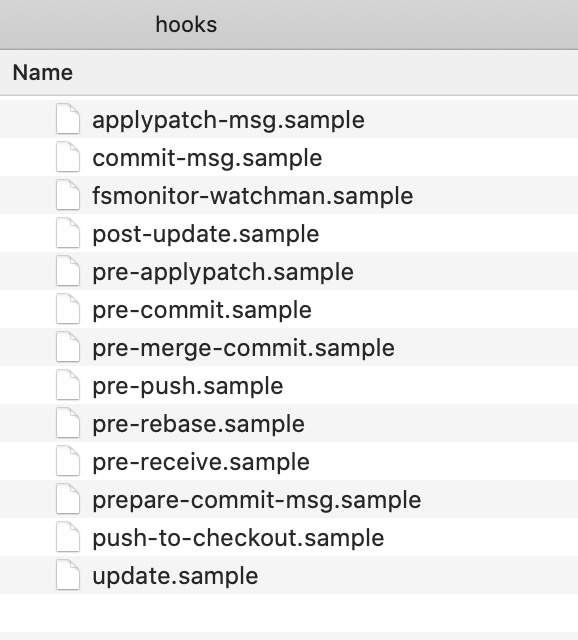

# git内部原理

> * Git 是一个内容寻址文件系统（content-addressable filesystem）
> * Git 的核心部分是一个简单的键值对数据库（key-value data store）。 你可以向 Git 仓库中插入任意类型的内容，它会返回一个唯一的键，通过该键可以在任意时刻再次取回该内容。
> * 它会输出一个长度为 40 个字符的校验和。 这是一个 SHA-1 哈希值——一个将待存储的数据外加一个头部信息（header）一起做 SHA-1 校验运算而得的校验和。

## git init

在执行 `git init` 进行初始化时，会在 `.git/hooks` 目录生成一系列的hooks脚本，用来控制git工作的流程。

## 自定义Git

[钩子](https://git-scm.com/book/zh/v2/自定义-Git-Git-钩子)都被存储在 Git 目录下的 `hooks` 子目录中。 也即绝大部分项目中的 `.git/hooks` 。 当你用 `git init` 初始化一个新版本库时，Git 默认会在这个目录中放置一些示例脚本。

### 客户端钩子

- `pre-commit`：在键入提交信息前运行。可以用`git commit --no-verify` 来绕过这个环节
- `prepare-commit-msg`
- `commit-msg`：接收一个参数，此参数即上文提到的，存有当前提交信息的临时文件的路径。 
- `post-commit` 钩子在整个提交过程完成后运行。
- `pre-rebase` 钩子运行于变基之前，以非零值退出可以中止变基的过程。 
- `post-rewrite` 钩子被那些会替换提交记录的命令调用，比如 `git commit --amend` 和 `git rebase`（不过不包括 `git filter-branch`）。 
- 在 `git checkout` 成功运行后，`post-checkout` 钩子会被调用。
- 在 `git merge` 成功运行后，`post-merge` 钩子会被调用。 
- `pre-push` 钩子会在 `git push` 运行期间， 更新了远程引用但尚未传送对象时被调用。

### 服务端钩子

- #### `pre-receive`

- #### `update`

- #### `post-receive`

## 参考文献

* [Git 内部原理](https://git-scm.com/book/zh/v2/ch00/ch10-git-internals)

