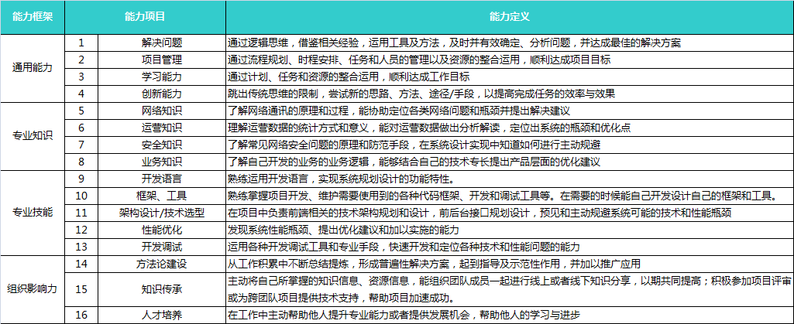

# 能力框架

## A、通用能力

### 1. 解决问题

通过逻辑思维，借鉴相关经验，运用工具及方法，及时并有效确定，分析问题，并达成最佳的解决方案

* Level 1 ~ level 3
  * 关键词：解决例行及局部问题
  * 行为标准：
    * 能在指导下处理和解决专业领域例行的问题
    * 在工作中遇到的局部性问题上，能通过独立思考和推导，正确评估利弊做出决断
* Level 4 ~ level 6
  * 关键词：独立解决，通过经验评估方案
  * 行为标准：
    * 独立处理和解决专业问题
    * 能有效收集信息和数据资料，以解决在自己工作范围内所遇到的问题
    * 能汲取过往经验，有效评估不同解决方案所需要的资料和资源
* Level 7
  * 关键词：理清因果，将复杂问题进行分解
  * 行为标准：

### 2. 项目管理

通过流程规划，时程安排，任务和人员的管理以及资源的整合运用，顺利达成项目目标

* Level 1 ~ level 3
  * 关键词：指导下进行计划跟踪和监控
  * 行为标准：
    * 熟悉项目管理基础知识
    * 能在指导下，对已制定好的项目计划进行现理和监控
    * 在计划执行中参与一些辅助性的工作，协助解决问题
* Level 4 ~ level 6
  * 关键词：组织实施小型项日
  * 行为标准：
    * 组织实施小型项目，合理进行任务分解和进度安排
    * 能够按照总体计划制定的段性计划及监控点，并按实际执行情况及时修正项目计划
    * 在项目进行中能及时发现并反馈问题，判断问题的重要程度并解决一般难度的问题
* Level 7
  * 关键词：组织实施小型项日
  * 行为标准：

### 3. 学习能力

通过计划，任务和资源的整合运用，顺利达成工作目标

* Level 1 ~ level 3
  * 关键词：指导下进行学习
  * 行为标准：
    * 有学习愿望，能够在指导或者要求下进行学习
    * 能够通过指定的学习资源，掌理做好自身岗位工作所需要的知识、技能、工具和信息等
* Level 4 ~ level 6
  * 关键词：寻找学习机会，学以致用
  * 行为标准：
    * 积极和善于寻找学习机会，关注培训机会，结合成长规划，适时地为自己安排培训和学习，保持专业知识技能的更新
    * 积极地学习态度并且注意学以致用，不断探索改善和提高自身的工作效事
    * 在工作中和平时的学习积累过程中，找寻有价值的信息
*  level 6
  * 关键词：
  * 行为标准：

### 4. 创新能力

跳出传统思维的限制，尝试新的思路、方法、途径/手段，以提高完成任务的效率与效果

* Level 1 ~ level 3
  * 关键词：有创新意识
  * 行为标准：
    * 有创新意识，工作中对常规工作方法提出疑问和挑战，提出合理化建议
* Level 4 ~ level 6
  * 关键词：以创新的角度思考问题，灵活变通
  * 行为标准：
    * 能恰当地质疑已存在的解决问题模式，以创新的角度进行思考，对当前业务
      领域的技术或方式提出创新的方法或思路
    * 在一些问题上能灵活变通，积极响应创新
* Level 7
  * 关键词：
  * 行为标准：

## B、专业知识

### 5. 网络知识

了解网络通讯的原理和过程，能协助定位各类网络问题和瓶颈并提出解决建议

* Level 1 ~ level 3
  * 关键词：了解、掌握
  * 行为标准：
    * 了解httpt议、cockie的使用、session的原理，能定位常见的http级故障
* Level 4 ~ level 6
  * 关键词：分析、定位
  * 行为标准：
    * 了解TCP/IP协议，能定位常见的网络故障和瓶颈
    * 【全端开发方向】了解udp，secket等常见的网络协议，能够定位故障和问题

### 6. 运营知识

理解运营数据的统计方式和意义，能对运营数据做出分析解读，定位出系统的瓶颈和优化点

* Level 1 ~ level 3
  * 关键词：了解、掌握
  * 行为标准：
    * 了解名种运营数据和他们背后的含义
* Level 4 ~ level 6
  * 关键词：关注
  * 行为标准：
    * 能评估新应用对服务器产生的压力情况，在紧急情况下能定位压力造成的服务器问题并提出解决方案建议
    * 监控用户测的脚本执行性能和用户感受，定位到主要瓶颈进行针对性优化
    * 【全端开发方向】熟悉网络服务主机相关参数，如机器机型、硬盘容量、最高并发量等
    * 【全端开发方向】熟悉如何监控服务主机质量，如DC上报、服务器日志等，并能设置相应的异常告警
    * 【全端开发方向】能够通过监控识别服务器压力和瓶颈，并通过对机器进行扩容等解决方案缓解服务器访问压力
    * 【全端开发方向】能够合理评估和预估服务器压力，提前做好机器和带宽成本预算，并申请资源满足业务需求
* Level 7
  * 关键词：优化
  * 行为标准：

### 7. 安全知识

了解常见网络安全问题的原理和防范手段，在系统设计实现中知道如何进行主动规避

* Level 1 ~ level 3
  * 关键词：了解、关注；基础防御
  * 行为标准：
    * 了解名种运营数据和他们背后的含义
* Level 4 ~ level 6
  * 关键词：主动防御
  * 行为标准：
    * 了解一般网络攻击的方法，如sql注入，跨站请求、跨站脚本执行，协议漏洞，浏览器漏洞。关注业界安全动态。
    * 【全端开发方向】了解服务端防止xss/csrf的解决方室和机制，如 token 校验生成机制等
    * 【全端开发方向】了解网络服务安全规范，如密码规范，端口规范，路径规范等
    * 【全端开发方向】了解一般服务器网络攻击方法，如 DDoS攻击，中间人攻击，关注业界安全动态，主动关注并升级主机相关模块
    * 【全端开发方向】了解并使用平台级网络安全服务，比如门神系统，通过技术手段协助防御
* Level 7 ~ level 6
  * 关键词：深入了解
  * 行为标准：
    * 了解一般网络攻击的方法，如sql注入，跨站请求、跨站脚本执行，协议漏洞，浏览器漏洞。关注业界安全动态。
    * 【全端开发方向】了解服务端防止xss/csrf的解决方室和机制，如 token 校验生成机制等
    * 【全端开发方向】了解网络服务安全规范，如密码规范，端口规范，路径规范等
    * 【全端开发方向】了解一般服务器网络攻击方法，如 DDoS攻击，中间人攻击，关注业界安全动态，主动关注并升级主机相关模块
    * 【全端开发方向】了解并使用平台级网络安全服务，比如门神系统，通过技术手段协助防御

### 8. 业务知识

了解自己开发的业务的业务逻辑，能够结合自己的技术专长提出产品层面的优化建议

## C、专业技能

### 9. 开发语言

熟结运用开发语言，实现系统规划设计的功能特性。

* Level 1 ~ level 3

  * 关键词：了解、掌握
  * 行为标准：

* Level 3 ~ level 6

  * 关键词：熟练运用

  * 行为标准：

    * 在开发过程中，熟练使用xml和ison等数据生成动态页面，熟练使用xml、json等数据描述方式设计前后台接口。

    * 熟练运用多种技术手段快速定位常见的脚本故障，熟练使用ajax、ison设计同步和异步web应用

    * 按照标准设计跨浏览器的页面，熟练定位常见的页面问题和找到解决方案

    * 了解基于页面的常用web优化手段，在开发工作中能自觉进行优化设计

    * 能熟练使用各种交互手段与用户进行交互

    * 能运用异步化技术获取数据动态生成页面片段

    * 对函数式编程和面向对象的脚本开发有基础的了解

    * 【全端开发方向】了解服务端语言的使用场景，以及在前端开发和优化中的意义，如Node/PHP等

    * 【全端开发方向】熟悉正则表达式的编写
      * 【前端体验方向】熟悉HTML语义化，包括微格式、微数据等，以及对SEO的价值;清楚的HTML标签层级;熟悉HTML与JS之间的关联合作，以及HTML5的各项API接口;

    * 【前端体验方向】能够发现极大部分浏览器对CSS支持的缺陷，以及不同浏览器对不同CSS语句的实用技巧:熟来开使用最新的CSS版本语法，能以灰度升级的方式应用千项目中;
      * 【前端体验方向】熟悉脚本开发和面向对象的知识，能对业务当中的交互操作进行实现，有组件开发的能力。

    * 【前端体验方向】掌握PC端和移动端常用的SEO优化方法，并应用到项目中。

* Level 4 ~ level 6

  * 关键词：专业
  * 行为标准：
    * 项目开发过程熟练使用html、css、xml、javascript/actionscript/c#等多种语言设计过复杂的用户交互和前后台交互逻辑，使用各种数据描述方式设计前后台接口，充分考虑接口设计的灵活性和轻便性。
    * 编写轻快的代码，避免各种常见的脚本性能瓶颈和臃肿的代码。
    * 熟悉常见的前端交互模式的实现手段，并能针对具体场景进行适当选型
    * 能在各种技术手段中权衡，综合考虑，选择最优的用户交互设计。
    * 【全端开发方向】熟练运用服务端语言进行应用场景开发，如使用Node/PHP进行网络服务开发，效率工具开发 
    * 【前端体验方向】能进行具备一定业界影响力的HTML5新尝试:
    * 【前端体验方向】能系统化的整理CSS技巧或代码片断:
    * 【前端体验方向】能完成基于脚本的前台交互功能开发;
    * 【前端体验方向】掌握多终端的SEO实现原理和方法，能够给出单个产品网站的整体SEO解决方案。
    * 【移动客户端开发方向】了解包涵但不限于一种或多种移动开发语言，熟悉移动开发的一种或多种体系及技术细节，熟来移动客户端研发流程，
    * 【移动客户端开发方向】精通移动端Web组件，能熟练编写或推动编写Hybrid API，供Web使用。

* Level 8

  * 关键词：精通
  * 行为标准：
    * 能熟练使用函数式得和面向对象的编程风格，并在不同的编程风格中间进行合理的权衡和引导团队形成一致的编程风格
    * 能识别和解决代码中各种潜在的内存泄露和堆栈溢出的危险
    * 项目开发过程中针对各种复杂情况设计过灵活健壮的前端架构和前后台接口，能在各种极端条件下保持给用户合理的降级体验和柔性服务。 
    * 【前端体验方向】能指导团队进行具备一定业界影响力的 HTML5新尝试
    * 【前端体验方向】能指导团队系统化的整理CSS技巧或代码片断
    * 【前端体验方向】能指导团队成员完成基于脚本的前台交互功能开发
    * 【前端体验方向】熟悉多终端的SEO原理和方法，能够给出多个产品网站的整体SEO解决方案。

* Level 9

  * 关键词：超越技术的思考
  * 行为标准：
    * 在项目中创造性的综合使用各种前沿技术，给产品提供前所未有的能力和体验，并形成自己的设计模式。
    * 能分级别分层次的选择对用户展示不同数据的时机，用最小的代价让用户获得最优的交互感受
    * 【前端体验方向】对HTML相关版本(HTML 4.01/XHTML 1.1/HTML5)有深入的研究
    * 【前端体验方向】对项目中CSS预研方案能够组织团队成员进行系统化、标准化的设定，并实践至项目
    * 【前端体验方向】精通面向对象的脚本编写，并能指导团队为业务进行类库的编写，并进行推广
    * 【前端体验方向】精通SEO的原理和方法，能够基于用户体验，提供多产品网站整体SEO解决方案，总结形成在业界具备影响力和普遍应用性的SEO整体解决方案
    * 【前端体验方向】关注W3C标准

* Level 10 - level 12

  * 关键词：创新、突破
  * 行为标准：
    * 提出创新的技术手段，突破原有的语言技术限制，进行创新的技术实践
    * 【前端体验方向】能指导团队进行极具业界影响力的应用创新、突破开发
    * 【前端体验方向】熟悉多终端的SEM原理和方法，能够给出多个产品网站的整体SEM解决方案
    * 【前端体验方向】参与或保持跟进W3C标准的制订，并能有一定的贡献和影响

* Level 13及以上

  * 关键词：业界标杆，引领技术
  * 行为标准：
    * 语言层面的突破性创新成为了业界标准

### 10. 框架、工具

熟练掌握项目开发、维护需要使用到的各种代码框架、开发和调试工具等。在需要的时候能自己开发设计自己的框架和工具

* Level 1 - level 3
  * 关键词：了解、掌握
  * 行为标准：
    * 了解业界流行的web前后端开发框架
    * 了解团队和项目已有的代码库并恰当的使用
* Level 4 - level 6
  * 关键词：熟练使用
  * 行为标准：
    * 研究和和了解业界主流开发框架，了解它们的优劣，把他们的长处借鉴应用在自己的项目目中，高效的解决问题，提升开发效率
    * 熟练使用常用的问题定位工具、自动化测试化工具等，提高工作效率
* **level 7**
  * 关键词：DIY
  * 行为标准：
    * 针对自己的项目和遇到的问题开发合适的工具，提升团队工作效率
    * 【移动客户端开发方向】了解和使用过一些常见的开源框架，熟悉其中的技术细节，并能在此基础上提炼出自己的优化或者更优的实现，或者贡献属于自己的代码。
* **level 8**
  * 关键词： 通用化
  * 行为标准：
    * 开发适用于多种场景的通用工具，在多个团队中应用 
* **level 9**
  * 关键词： 专业化
  * 行为标准：
    *  持续开发和优化通用工具，形成比较稳定的工具类产品
* **level 10**
  * 关键词： 有影响力的通用工具
  * 行为标准：
    * 编写出有影响力的通用工具，在业界被广泛应用，有较大的社会效益和业界影响力

### 11. 架构设计/技术选型

在项目中负责前端相关的技术架构规划和设计，前后台接口规划设计，预见和主动规避系统可能的技术和性能瓶颈

* **level 1 ~ level 3**
  * 关键词： 了解
  * 行为标准：
    * 了解自己开发的项目的技术架构
* **level 4 ~ level 6**
  * 关键词： 会用
  * 行为标准：
    * 能对承担小项目的前端架构设计，或者在中大型项目的前端架构设计中提现出充分的影响力，或者承担中大型项目中独立模块的前端架构设计。

### 12. 性能优化

发现系统性能瓶颈、提出优化建议和加以实施的能力

### 13. 开发调试

运用各种开发调试工具和专业手段，快速开发和定位各种技术和性能问题的能力

## D、组织影响力

### 14. 方法论建设

从工作和累中不断总结提性，形成普遍性解决方案，起到指导及示范性作用，并加以推广应用

### 15. 知识传承

主动将自己所掌握的知识信息，资源信息，能组织团队成员一起进行线上或者线下知识分享，以期共同提高;积极参加项目评审或为跨团队项目提供技术支持，帮助项目加速成功。

### 16. 人才培养

在工作中主动帮助他人提升专业能力或者提供发展机会，帮助他人的学习与进步

