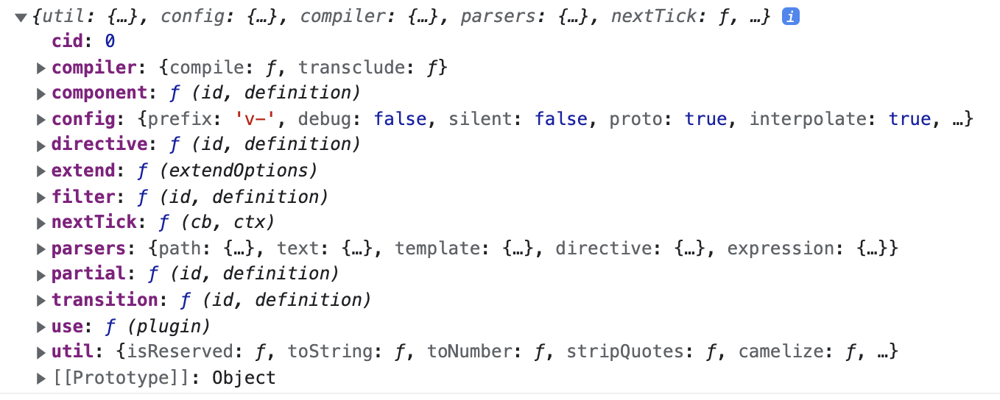

## 入口文件

从项目根目录的 `package.json` 文件的 **main** 字段，可以找到入口文件为：[src/vue.js](https://github.com/vuejs/vue/blob/0.11/src/vue.js)。


### vue构造函数

**Vue** 的初始化工作，主要是给`Vue`的构造函数和原型挂载方法和属性。我们先来看下面一段代码：

```js
/**
 * 暴露 Vue构造函数
 *
 * API 协议:
 * - 公共API，方法/属性的前缀为：`$`
 * - 内部API，方法/属性的前缀为：`_`
 * - 没有前缀的属性，为代理用户数据。
 *
 * @constructor
 * @param {Object} [options]
 * @public
 */

function Vue (options) {
  this._init(options)
}
```

`Vue()` 构造函数中，只做了一件事，就是执行 `this._init()` 方法。_init方法来自 [src/instance/init.js](https://github.com/vuejs/vue/blob/0.11/src/instance/init.js)，下一章节会分析。

接下来，继续往下看代码！


### 添加静态方法

```js
/**
 * 混入全局 API
 */

extend(Vue, require('./api/global'))
```

打印 `require('./api/global')` 内容如下：



这里的 **extend** 是来自 [util/lang.js](https://github.com/vuejs/vue/blob/0.11/src/util/lang.js#L131-L143)，对对象做了一个浅拷贝。

```js
/**
 * Mix properties into target object.
 *
 * @param {Object} to
 * @param {Object} from
 */

exports.extend = function (to, from) {
  for (var key in from) {
    to[key] = from[key]
  }
  return to
}
```


### 添加静态属性

```js
/**
 * Vue和每个扩展的Vue的构造函数，都有一个关联的 options 对象。
 * 在编译步骤中，可以访问该对象，如：`this.constructor.options`
 *
 * 这些可以看作是每个Vue实例的默认options。
 */

Vue.options = {
  directives  : require('./directives'),
  filters     : require('./filters'),
  partials    : {},
  transitions : {},
  components  : {}
}
```


## 添加原型方法

```js
/**
 * Build up the prototype
 */

var p = Vue.prototype

/**
 * Mixin internal instance methods
 * 混入内部实例方法
 */

extend(p, require('./instance/init'))
extend(p, require('./instance/events'))
extend(p, require('./instance/scope'))
extend(p, require('./instance/compile'))

/**
 * Mixin public API methods
 * 混入公共API方法
 */

extend(p, require('./api/data'))
extend(p, require('./api/dom'))
extend(p, require('./api/events'))
extend(p, require('./api/child'))
extend(p, require('./api/lifecycle'))
```


### 实例代理data属性

```js
/**
 * $data has a setter which does a bunch of
 * teardown/setup work
 * $data有一个setter，它执行一系列拆卸/设置工作
 */

Object.defineProperty(p, '$data', {
  get: function () {
    return this._data
  },
  set: function (newData) {
    this._setData(newData)
  }
})
```

[_setData](https://github.com/vuejs/vue/blob/0.11/src/instance/scope.js#L40-L74)


## 总结

* 入口文件 `src/vue.js`，通过创建一个 `Vue()` 构造函数，并调用了  `this._init(options)`  方法
* _setData，TODO待补充

