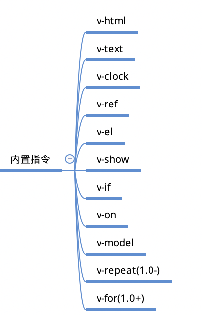
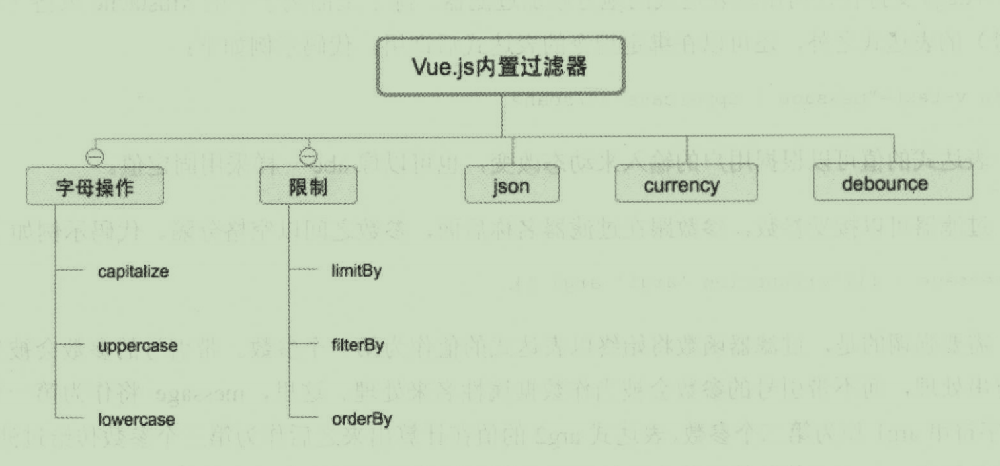
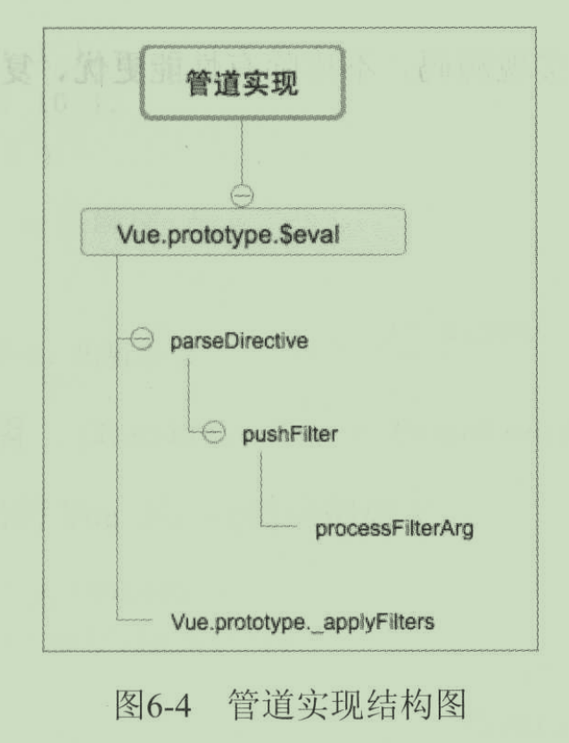
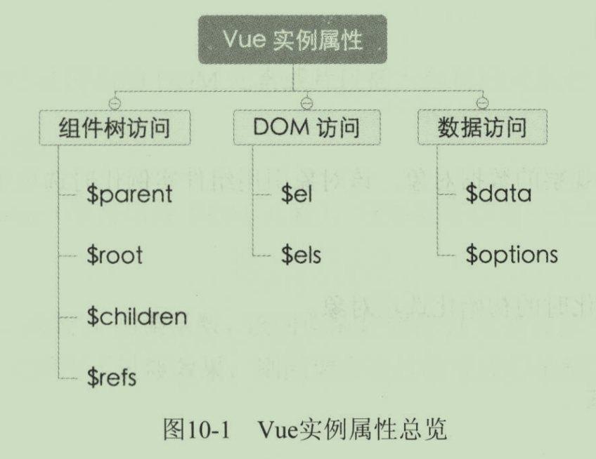
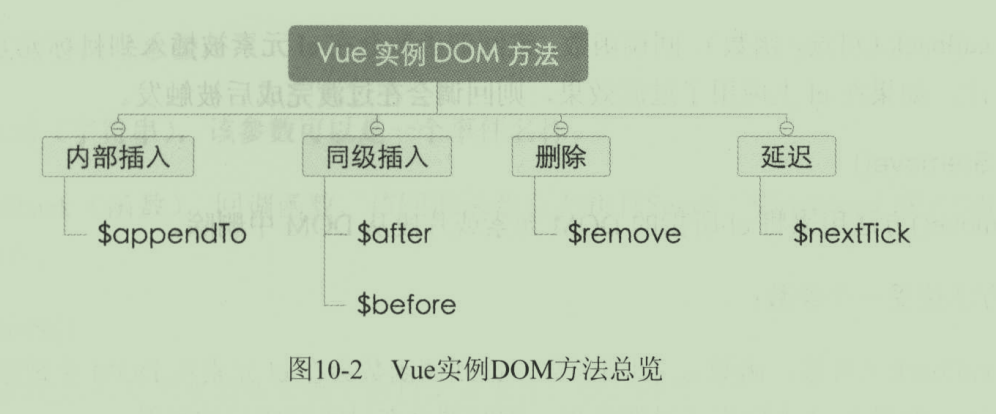
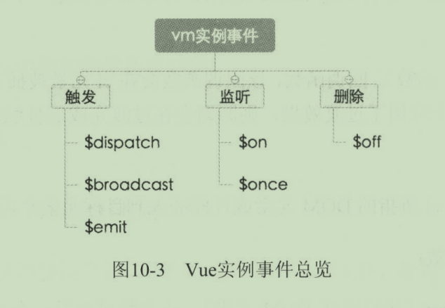

## 一、数据绑定

数据绑定，是将数据和视图相关联。当数据发生变化时，可以自动更新视图。


### 一、语法

#### 1. 插值

文本插值最基本的形式是，使用双大括号`{{}}` 类型于 Mustache。


#### 2. 指令

带有`v-` 前缀的特殊特性，其值限定为绑定表达式。


## 二、指令

## 2.1 内部指令




### 1. v-if

v-if会根据表达式的值，在DOM中生成或移除一个元素。

#### 1. demo

```html
<template>
  <div>
    <p v-if="isOk">okk</p>
    <p v-else>onn</p>
  </div>
</template>
```

#### 2. 实现原理

通过对DOM节点进行 `insertBefore`、`appendChild`、`removeChild`、`replaceChild` 操作。

```js
/**
 * Insert el before target
 *
 * @param {Element} el
 * @param {Element} target
 */

export function before (el, target) {
  target.parentNode.insertBefore(el, target)
}

/**
 * Insert el after target
 *
 * @param {Element} el
 * @param {Element} target
 */

export function after (el, target) {
  if (target.nextSibling) {
    before(el, target.nextSibling)
  } else {
    target.parentNode.appendChild(el)
  }
}

/**
 * Remove el from DOM
 *
 * @param {Element} el
 */

export function remove (el) {
  el.parentNode.removeChild(el)
}

/**
 * Prepend el to target
 *
 * @param {Element} el
 * @param {Element} target
 */

export function prepend (el, target) {
  if (target.firstChild) {
    before(el, target.firstChild)
  } else {
    target.appendChild(el)
  }
}

/**
 * Replace target with el
 *
 * @param {Element} target
 * @param {Element} el
 */

export function replace (target, el) {
  var parent = target.parentNode
  if (parent) {
    parent.replaceChild(el, target)
  }
}
```


### 2. v-show

#### 1. demo

```html
<p v-show="isOk">okk</p>
```


#### 2. 原理

通过改变元素的 `display` 属性，为 `none` 或清空来完成

```js
import { getAttr, inDoc } from '../../util/index'
import { applyTransition } from '../../transition/index'

export default {

  bind () {
    // check else block
    var next = this.el.nextElementSibling
    if (next && getAttr(next, 'v-else') !== null) {
      this.elseEl = next
    }
  },

  update (value) {
    this.apply(this.el, value)
    if (this.elseEl) {
      this.apply(this.elseEl, !value)
    }
  },

  apply (el, value) {
    if (inDoc(el)) {
      applyTransition(el, value ? 1 : -1, toggle, this.vm)
    } else {
      toggle()
    }
    function toggle () {
      el.style.display = value ? '' : 'none'
    }
  }
}

```

通过查看 `v-if`和`v-show`的源码，不难发现，`v-if` 有更高的切换消耗，而 `v-show`有更高的初始渲染消耗。


### 3. v-else

`v-else` 需要跟着 `v-else` 或 `v-show`使用。


### 4. v-model

`v-model`指令用来在 `input`、`select`、`text`、`checkbox`、`radio`等表单控件元素上创建双向数据绑定。

```js
export default {

  priority: MODEL,
  twoWay: true,
  handlers: handlers,
  params: ['lazy', 'number', 'debounce'],

  /**
   * Possible elements:
   *   <select>
   *   <textarea>
   *   <input type="*">
   *     - text
   *     - checkbox
   *     - radio
   *     - number
   */
}
```


除了使用`v-model`外，还可以添加多个参数：`number`、`lazy`、`debounce`

1. number，将输入办的为Number类型（如果原来的值转换结果为NaN，则返回原值）

   * 使用方法：

   ```html
   <input v-model="msg" number />
   ```

   * 源码：

   ```js
   // src/directives/public/model/text.js
   import {
     toNumber
   } from '../../../util/index'
   
   var number = this.params.number
   
   var val = number || isRange
           ? toNumber(el.value)
           : el.value
   ```

2. lazy，默认情况下`v-model`在 `input` 事件中同步输入框的值与数据，`lazy`会将数据改到`change`事件中发生。

   * 使用方法：

   ```html
   <input v-model="msg" lazy />
   ```

   * 源码：

   ```js
   // src/directives/public/model/text.js
   this.on('change', this.rawListener)
   if (!lazy) {
     this.on('input', this.listener)
   }
   ```

3. debounce，设置一个最小的延时。

   * 使用方法：

   ```html
   <input v-model="msg" debounce="5000" />
   ```

   * 源码：

     ```js
     // src/directives/public/model/text.js
     import {
       debounce as _debounce
     } from '../../../util/index'
     
     export default {
       bind () {
         var debounce = this.params.debounce
     		if (debounce) {
     			// 调用的是`src/util/lang.js` 下的 `debounce` 函数
       		this.listener = _debounce(this.listener, debounce)
     		}
       }
     }
     ```

### 5. v-for

在 **1.0** 版本中使用的是 `v-repeat`，从 1.1之后，使用 `v-for`。

支持语法：`item in/of items`

在 1.x版本中，文本的创建使用的是 `createDocumentFragment`文档碎片的方式。

使用了`diff`算法，通过比较两级新旧数据：

```js
/**
   * Diff, based on new data and old data, determine the
   * minimum amount of DOM manipulations needed to make the
   * DOM reflect the new data Array.
   *
   * The algorithm diffs the new data Array by storing a
   * hidden reference to an owner vm instance on previously
   * seen data. This allows us to achieve O(n) which is
   * better than a levenshtein distance based algorithm,
   * which is O(m * n).
   *
   * @param {Array} data
   */

  diff (data) {
    
  }
```


### 6. v-text

更新元素的textContent。在vue内部，`{{}}`插值会被编译为textNode的一个 `v-text` 指令。


### 7. v-html

更新元素的innerHTML


### 8. v-bind

用于响应更新HTML特性，将一个或多个attribute或一个组件prop动态绑定到表达式。


### 9. v-on

用于绑定事件监听器。还可以增加修饰符：`.stop`、`.prevent`、`.capture`、`.self`。


### 10. v-ref

在组件上注册一个子组件的索引，便于直接访问。


### 11. v-cloak

保持在元素上直到关联实例结束编译。


## 2.2 自定义指令

### 1. 钩子函数

在vue中，提供了 `Vue.directive(id, definition)`方法注册一个全局自定义指令。它提供了几个钩子函数：

* `bind`：只调用一次，在指令第一次绑定到元素上时调用。
* `update`：在`bind`之后立即以初始值为参数第一次调用，之后每当绑定值变化时调用，参数为新值与旧值。
* `unbind`：只调用一次，在指令从元素上解绑时调用。

```js
Vue.directive('my-direcitive', {
  bind: function() {
    
  },
  update: function() {
    
  },
  unbind: function() {
    
  }
})
```

调用方式（需要加`v-`前缀）：

```html
<div v-my-direcitive="something"></div>
```


### 2. 指令实例属性

所有的钩子函数，都将被复制到实际的指令对象中，在钩子内`this`指向这个指令对象。这个对象暴露了一些有用的属性：

* `el`：指令绑定的元素
* `vm`：拥有该指令的上下文**ViewModel**
* `expression`：指令的表达式，不包括参数和过滤器
* `arg`：指令的参数
* `name`：指令的名字，不包含前缀
* `modifiers`：一个对象，包含指令的修饰符
* `descriptor`：一个对象，包含指令的解析结果


### 3. 对象字面量

```html
<div v-demo="{ color: 'white', text: 'hello' }"></div>

<script>
Vue.directive('demo', function(value) {
  console.log(value.color); // 'white'
  console.log(value.text);  // 'hello'
})
</script>
```


### 4. 字面修饰符

当指令使用了字面修饰符时，它的值将按普通字符串处理并传递给 `update`方法。`update` 方法将只调用一次，因为普通字符串不能响应数据变化。


### 5. 元素指令

有时我们想以**自定义元素**的形式使用指令，而不是以**属性**的形式。

```html
<my-directive class="hello" name="hi"></my-directive>

<script>
  Vue.elementDirective('my-directive', {
    bind: function() {
      console.info(this.el.className)
      console.info(this.el.getAttribute('name'))
    }
  })
</script>
```


### 6. deep

如果自定义指令使用在一个对象上，当对象内部属性变化时要触发`update`，则在指令定义对象中指定 `deep: true`。


### 7. twoWay

如果指令想向 Vue 实例写回数据，则在指令定义对象中指定 `twoWay: true`。该选项允许在指令中使用 `this.set(value)`。


### 8. acceptStatement

传入 `acceptStatement` 可以让自定义指令接受内联语句，就像`v-on`那样。


## 三、计算属性

计算属性就是，当其依赖属性的值发生变化时，这个属性的值会自动更新，与之相关的DOM部分也会同步自动更新。


## 四、过滤器

过滤器本质上是函数，其作用在于用户输入数据后，它能够进行处理，并返回一个数据结果。使用管道符（`|`）进行连接。

### 4.1 内置过滤器




### 4.2 自定义过滤器

vue.js提供了过滤器语法：`Vue.filter(ID, function() { })`

#### 1. 单个参数

注册一个名为 `reverse` 的过滤器，作用是将字符串反转输出。

```vue
<script>
  Vue.filter('reverse', function(value) {
    return value.split('').reverse().join('')
  })
</script>

<span v-text="message | reverse"></span>
```

#### 2. 多个参数

过滤器函数坠子以值为参数外，还支持接受任意数量的参数，参数之间以空格分隔。

```html
<script>
  Vue.filter('wrap', function(value, begin, end) {
    return begin + value + end;
  })
</script>

<span v-text="message | warp 'befor' 'after'"></span>
```


### 4.3 实现原理

`Vue.prototype.$eval`接受类型为 `String` 的后跟过滤器及其参数的表达式，运用正则表达式检测传入的字符串是否存在管道符。如果存在，则调用`parseDirective`函数将传入的字符串整理输出为一个对象。

例如，如果传入的表达式为：`a + 1 | uppercase`，经过 `parseDirective` 处理后将输出为如下形式：

```json
{
  expression: 'a + 1',
  filters: [
    { name: 'uppercase', args: null }
  ]
}
```

其中， `parseDirective` 调用了`pushFilter`和`processFilterArg`两个函数。前者的作用是，将一个过滤器函数加入对象内的 `filters` 数组中；后者的作用是，检查一个参数是否为动态参数。

在得到  `parseDirective`  处理好的对象之后，`Vue.prototype.$eval` 将调用 `Vue.prototype._applyFilters`函数，该函数将表达式的值作为参数输入并依次调用`filters`数组中的过滤器函数，最后输出经过所有过滤器处理的数据结果，达到链式调用过滤器的效果。




## 五、CSS过渡

`transition`内置三个类名：`.t-transition`、`.t-enter`、`.t-leave`。


## 六、Method

Vue.js的事件监听，一般都通过 `v-on` 指令配置在HTML中。

* `methods`中定义的方法内的 `this` 始终指向创建的Vue实例。
* 与事件绑定的方法支持参数`event`，即：原生DOM事件的传入。

### 1. 修饰符

`.prevent`：调用`event.preventDefault()`来阻止事件的默认行为；

`.stop`：调用`event.stopPropagation()`来阻止事件冒泡；

`.capture`：表示添加事件侦听器时采用`capture`即捕获模式；

`.self`：表示只当事件在该元素本身触发时触发回调。

### 2. 按键

监听键盘事件经常需要检测`keyCode`。Vue.js可以为`v-on`添加键盘修饰符：

* `enter`
* `tab`
* `delete`
* `esc`
* `space`
* `up`
* `down`
* `left`
* `right`


## 七、Vue实例方法

Vue实例提供的一些有用的属性和方法，这些属性和方法名都以前缀`$`开头。

## 一、实例属性




### 1. 组件树访问

* `$parent`：用来访问当前组件实例的父实例。
* `$root`：用来访问当前组件树的根实例，如果当前组件没有父实例，`$root`表示当前组件实例本身。
* `$children`：用来访问当前组件实例的直接子组件实例。
* `$refs`：用来访问使用了 `v-ref` 指令的子组件。

### 2. DOM访问

* `$el`：用来访问挂载当前组件实例的DOM元素。
* `$els`：用来访问 `$el` 元素中使用了 `v-el` 指令的DOM元素。

### 3. 数据访问

* `$data`：用来访问组件实例观察的数据对象，该对象引用组件实例化时选项中的`data`属性。
* `$options`：用来访问组件实例化时的初始化选项对象。

### 二、实例方法

### 2.1 实例DOM方法的使用



* `$appendTo()`：该方法用来将el所指的DOM元素或片段插入到目标元素中。接受两个参数：
  * `elementOrSelect`（字符串或DOM元素），该参数可以是一个选择器字符串或DOM元素。
  * `callback`（可选，函数）,该回调函数在el元素被插入到目标元素后被触发。
* `$before()`：该方法用来将el所指的DOM元素或片段插入到目标元素之前。接受两个参数：
  * `elementOrSelect`（字符串或DOM元素），该参数可以是一个选择器字符串或DOM元素。
  * `callback`（可选，函数）,该回调函数在el元素被插入到目标元素后被触发。
* `$after`：用来将el所指的DOM元素或片段插入到目标元素之后。
  * `elementOrSelect`（字符串或DOM元素），该参数可以是一个选择器字符串或DOM元素。
  * `callback`（可选，函数）,该回调函数在el元素被插入到目标元素后被触发。

* `$remove()`：将el所指的DOM元素或片段从DOM中删除。只接受一个参数：
  * `callback`（可选，函数）,该回调函数在el元素中被删除后被触发。

* `$nextTick()`：用来在下次DOM更新循环后执行指定的回调函数，使用该方法可以保证DOM中的内容已经与最新数据保持同步。
  * `callback`（可选，函数）,该函数会在下次DOM更新循环后被执行。

### 2.2 实例Event方法的使用



* `$on`：用来监听实例上的自定义事件，它接受两个参数：
  * `event`：接受一个字符串类型的事件名称。
  * `callback`：该回调函数会在执行`$emit`、`$broadcast`或`$dispatch`后触发。
* `$once`：用来监听实例上的自定义事件，但只触发一次，它接受两个参数：
  * `event`：接受一个字符串类型的事件名称。
  * `callback`：该回调函数会在执行`$emit`、`$broadcast`或`$dispatch`后触发。

* `$emit`：用来触发事件，它接收两个参数：
  * `event`：接受一个字符串类型的事件名称。
  * `args`：传递给监听函数的参数。【可选】

* `$dispatch`：用来派发事件，即先在当前实例触发，再沿着父链一层一层向上，如果对应的监听函数返回false就停止。它接收两个参数：
  * `event`：接受一个字符串类型的事件名称。
  * `args`：传递给监听函数的参数。【可选】

* `$broadcast()`：用来广播事件，即遍历当前实例的`$children`，如果对应的监听函数返回false就停止。

  它接收两个参数：

  * `event`：接受一个字符串类型的事件名称。
  * `args`：传递给监听函数的参数。【可选】

* `$off()`：用来删除事件监听器，它接收两个参数：
  * `event`：接受一个字符串类型的事件名称。
  * `callback`：对应的回调函数。【可选】


## 八、组件

(image 0126)

vue组件核心有以下几点：

* 模板（template）：模板声明了数据和最终展现给用户的DOM之间的映射关系。
* 初始数据（data）：一个组件的初始数据状态。
* 接受的外部参数（props）：组件之间通过参数来进行数据的传递和共享。参数默认是单向绑定（由上至下），但也可以显式声明为双向绑定。
* 方法（methods）：对数据的改动操作一般都在组件的方法内进行。通过 `v-on` 指令将用户输入事件和组件方法进行绑定。
* 生命周期钩子函数（lifecycle hooks）：一个组件会触发多个生命周期钩子函数，比如：created、attached、destoryed等。在这些钩子函数中，我们可以封装一些自定义的逻辑。

### 1. 注册组件

#### 1.1 全局注册

```vue
Vue.component('your-component', YourComponent)
```

#### 1.2 局部注册


### 2. 数据传递

Vue.js组件之间有三种数据传递方式：

* props

  * 字面量语法
  * 动态语法
  * 绑定修饰符
    * `.sync`，双向绑定
    * `.once`，单次绑定
  * prop验证
    * type可以是原生构造器：String、Number、Boolean、Object、Function、Array

* 组件通信

  ​		尽管子组件可以用 `this.$parent`访问它的父组件，父组件有一个数组`this.$children`，包含它所有的子元素，根实例的后代可以用`this.$root`访问根实例。

  ​		不过子组件应当避免直接依赖父组件的数据，**尽量显式地使用props传递数据**。

​		如果要通知整个事件系统，就要向下广播。每个Vue实例都是一个事件触发器。

​		`$on()`：监听事件;

​		`$emit`：把事件沿着作用域链向上派送

​		`$dispatch()`：派发事件，事件沿着父链冒泡

​		`$broadcast()`：广播事件，事件向下传导给所有的后代。

* slot

  源码：

  ```js
  {
  
    priority: SLOT,
    params: ['name'],
  
    bind () {
      // this was resolved during component transclusion
      var name = this.params.name || 'default'
      var content = this.vm._slotContents && this.vm._slotContents[name]
      if (!content || !content.hasChildNodes()) {
        this.fallback()
      } else {
        this.compile(content.cloneNode(true), this.vm._context, this.vm)
      }
    },
  ```


### 3. 混合

​		当混合对象与组件包含同名选项时，这些选项将以适当的策略合并。

`Vue.extend()`


### 4. 动态组件

#### 1. Keep-alive

如果把切换出去的组件保留在内存中，则可以保留它的状态或避免重新渲染。为此，可以添加一个`keep-alive`指令参数。

* 源码

```js
// src/directives/internal/component.js  
bind () {
    if (!this.el.__vue__) {
      // keep-alive cache
      this.keepAlive = this.params.keepAlive
      if (this.keepAlive) {
        this.cache = {}
      }
      // ...
    }
}
```

### 2. activate钩子

在切换组件时，切入组件在切入前可能需要进行一些异步操作。为了控制组件切换时长，给切入组件添加`activate`钩子函数。

注：`activate` 钩子只作用于动态组件切换或静态组件初始化渲染的过程中，不作用于使用实例方法手工插入的过程中。


### 3. transition-mode

`transition-mode`特性用于指定两个动态组件之间如何过渡。默认情况下，进入与离开平滑地过渡，这个特性可以指定另外两种模式：

* `in-out`：新组件先过渡进入，等它的过渡完成之后当前组件过渡出去。
* `out-in`：当前组件先过渡出去，等它的过渡完成之后新组件过渡进入。


https://unpkg.com/browse/vue@1.0.28/dist/vue.js