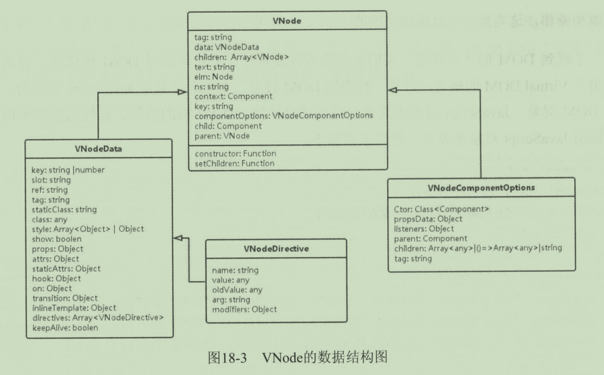
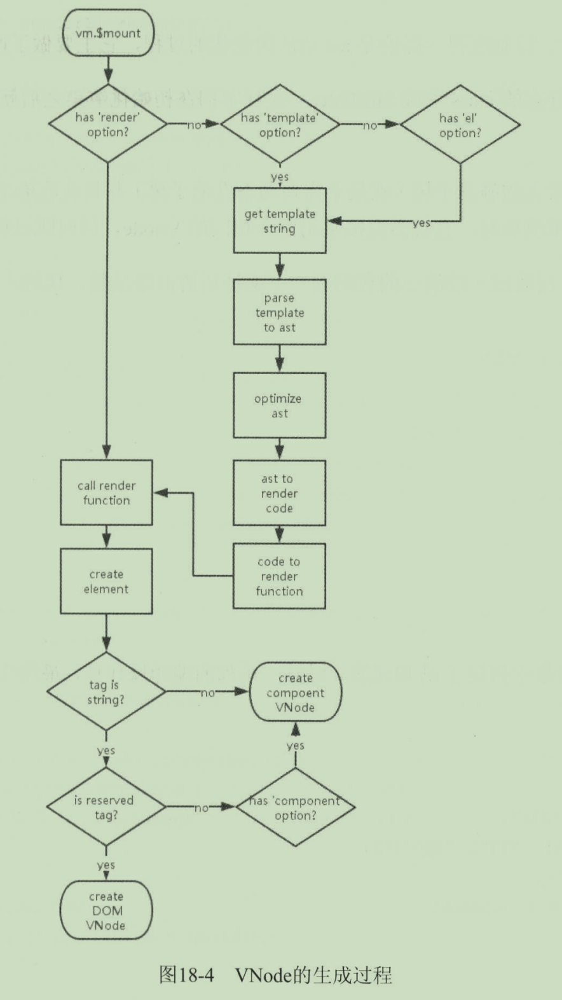

vue.js权威指南 第18章


VM选项的DOM部分

* 新增 render

  Vue.js 2.0新增了render字段，render字段是一个function，运行时会把模板中的内容经过Vue的编译，转换成渲染方法存入render字段，然后再执行。如果发现render字段已经存在，则跳过模板解析过程直接渲染。因此，在Vue.js 2.0中写一个模板和写一个render function是等价的。


### 服务端渲染

服务端渲染是Vue.js 2.0的新特性，它提供的接口如下：

* 新增 renderToString(component, done)方法
* 新增 renderToStream(component) 方法


## Virtual DOM

### 1. 创建VNode对象模拟DOM树

在Vue.js 2.0中，Virtual DOM是通过VNode类来表达的，每一个原生DOM元素或Vue组件都对应一个VNode对象。下面是VNode的数据结构：



#### 1. VNode

VNode用来描述DOM节点的主要信息，包括 `tag`、`text`、`elm`、`data`、`parent`、`children`等属性。它主要有两种生成方式，其中一种是由普通DOM元素生成；另一种是由Vue组件生成。

这两种方式生成的VNode对象的区别主要是在 `componentOptions` 的值上，如果是普通DOM元素生成的VNode对象，该值为空。


#### 2. VNodeComponentOptions

VNode中componentOptions属性的数据类型用来描述通过Vue组件生成VNode对象的一些组件相关参数，包括Ctor、propData、listeners、parent、children、tag等属性。


#### 3. VNodeData

VNode中data属性的数据类型用来描述VNode包含的一些节点数据，包括 slot、ref、staticClass、style、class、props、attrs、transition、directives等。


#### 4. VNodeDirective

VNodeData中directives属性的数据类型用来描述 VNode 存储的指令数据，包括：name、value、oldValue、arg、modifiers等。


下图是，VNode的生成过程。（p.302，i.320）




VNode生成最关键的点是，通过回调 `render()`，render方法在Vue.js 2.0中有两种生成方式：

* 第一种：直接在Vue对象的`option`中添加`render`字段；

* 第二种：像Vue.js 1.x那样写一个模板或指定一个el根元素，它会首先转换成模板，经过HTML语法解析器生成一个 AST抽象语法树，对语法树做优化，然后把语法树转换成代码片段，最后通过代码片段生成function添加option的render字段中。

  在整个过程中，特别值得一提的是AST优化的过程，它主要做了两件事情：

  * 检测出静态的 `class` 名和 `attributes`，这样它们在初始化渲染之后就永远都不会再被比对了。
  * 检测出最大的静态子树，并且从render渲染函数中萃取出来。这样在每次重渲染时，它就会直接重用完全相同的Vnode，同时跳过比对。

下面，我们通过一段简单的代码，看一下编译后的渲染函数：

```vue
<template>
	<h1> hello {{who}}</h1>
</template>

<script>
	new Vue({
    el: '#app',
    data: {
      who: 'leon'
    }
  })
</script>
```

我们在Vue对象中，指定了el根元素，经过一系列的编译后，最终生成 render方法：

```js
(function() {
  with (this) {
    return _h(_e('div'), { staticAttrs: { 'id': 'app' }}),
      [_h(_e('h1'), [('Hello ' + _s(who))])
  }
})
```

可以看到，render方法使用了with方法来包裹代码块，with(this)中的属性和方法相当于通过this来调用，这样写是为了减少代码量。

这里的this指向的是Vue对象实例，`_h`和`_e`方法都是和VNode相关创建的方法。源码定义如下：

```js
// src/core/instance/render.js

Vue.prototype._h = renderElementWithChildren
Vue.prototype._e = renderElement
```

`_h`和`_e`方法分别是 `renderElementWithChildren`、`renderElement`，源码定义见：`src/core/vdom/create-element.js`


