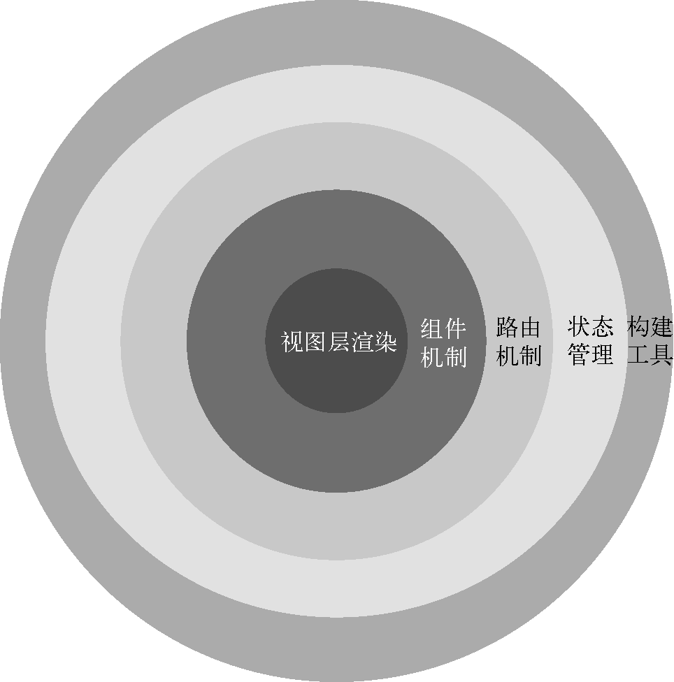
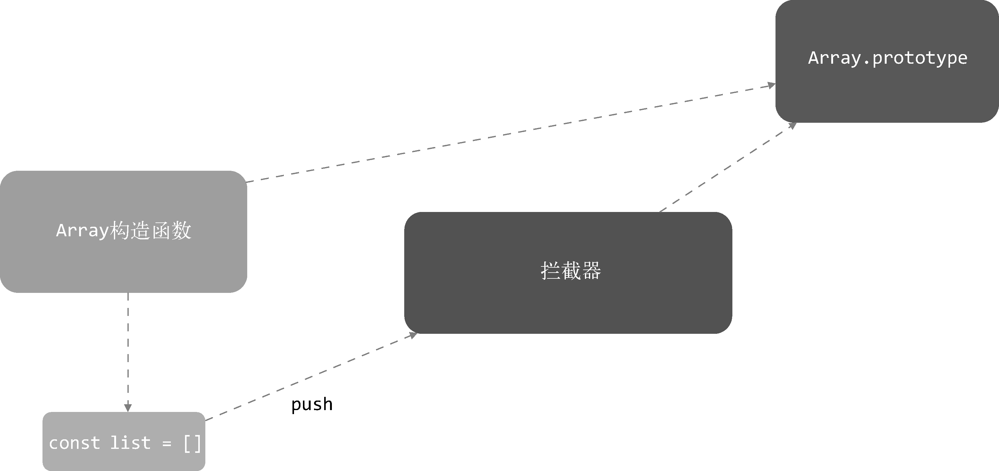
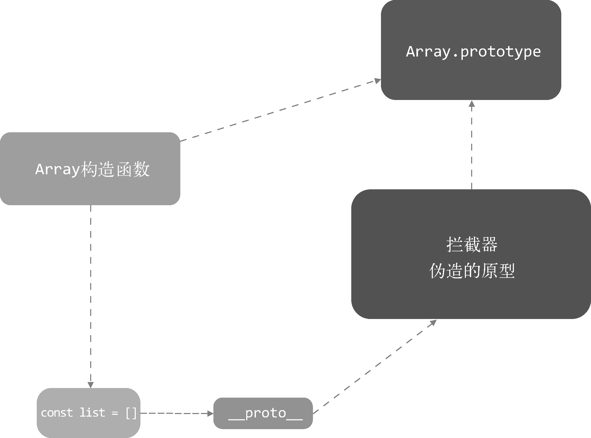
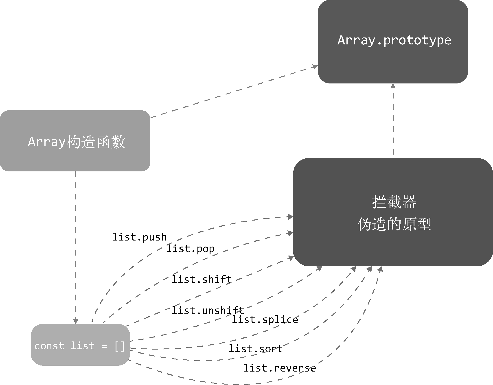

## 一、简介

### 框架分层

> The Progressive JavaScript Framework

The Progressive Framework，翻译成中文是：渐进式框架，即把框架分层。




## 二、Object的变化侦测

### 如何追踪变化

```js
function defineReactive(data, key, val) {
  Object.defineProperty(data, key, {
    enumerable: true,
    configurable: true,
    get: function() {
      return val
    },
    set: function(newVal) {
      if(val === newVal) {
        return
      }
      val = newVal
    }
  })
}
```

### 收集依赖

在 **getter** 中收集依赖，在 **setter** 中触发依赖。

```diff
  function defineReactive(data, key, val) {
+ let dep = []
    Object.defineProperty(data, key, {
      enumerable: true,
      configurable: true,
      get: function() {
+       dep.push(window.target)
        return val
      },
      set: function(newVal) {
        if(val === newVal) {
          return
        }
+       for(let i = 0; i < dep.length; i++) {
+         dep[i](newVal, val)
+       }
        val = newVal
      }
    })
  }
```

这里我们新增了数据 `dep`，用来存储被收集的依赖。然后在 `set` 被触发时，循环 `dep` 以触发收集到的依赖。

但是，这样写有点耦合，我们可以把依赖收集的代码封装成一个`Dep`类，它专门帮助我们管理依赖。它可以收集依赖、删除依赖或者向依赖发送通知等。如下：

```js
export default class Dep {
  constructor () {
    this.subs = []
  }
  
  addSub (sub) {
    this.subs.push(sub)
  }
  
  removeSub (sub) {
    remove(this.subs, sub)
  }
  
  depend () {
    if (window.target) {
      this.addSub(window.target)
    }
  }
  
  notify () {
    const subs = this.subs.slice();
    for(let i = 0, l = subs.length; i < l; i++) {
      subs[i].update()
    }
  }
}

function remove(arr, item) {
  if(arr.length) {
    const index = arr.indexOf(item)
    if(index > -1) {
      return arr.splice(index, 1)
    }
  }
}
```

改造一下之前的 `defineReactive`：

```diff
  function defineReactive(data, key, val) {
+ let dep = new Dep()
    Object.defineProperty(data, key, {
      enumerable: true,
      configurable: true,
      get: function() {
+       dep.depend()
        return val
      },
      set: function(newVal) {
        if(val === newVal) {
          return
        }
        val = newVal
+       dep.notify()
      }
    })
  }
```

这样，依赖就会收集到Dep中。

### 依赖是谁

在上面的代码中，我们收集的依赖是 `window.target`。

​		我们要通知用到数据的地方，而使用这个数据的地方有很多，而且类型还不一样，既有可能是模板，也有可能是watch，此时需要抽象出一个能集中处理这些情况的类。

然后，我们在依赖收集阶段只收集这个封装好的类的实例进来，通知也是只通知它一个。

接着，它再负责通知其它地方。

所以，我们要抽象的这个东西，就叫它 `Watcher`吧。


### Watcher

`Watcher`是一个中介角色，数据发生变化时通知它，然后它再通知其它地方。来看一个经典的使用方式：

```js
vm.$watch('a.b.c', function(newVal, oldVal) {
  // do something...
})
```

这段代码表示，当 `data.a.b.c` 属性发生变化时，触发第二个参数中的函数。

思考一下，怎么实现这个功能呢？

好像，只要把这个`watcher`实例添加到 `data.a.b.c` 属性的`Dep`中就行了。然后，当 `data.a.b.c` 的值发生变化时，通知 `Watcher`。接着，`Watcher` 再执行参数中的这个回调函数。代码如下：

```js
export default class Watcher {
  constructor (vm, expOrFn, cb) {
    this.vm = vm
    // 执行 this.getter() 就可以读取 data.a.b.c的内容
    this.getter = parsePath(expOrFn)
    this.cb = cb
    this.value = this.get()
  }
  
  get() {
    window.target = this;
    let value = this.getter.call(this.vm, this.vm)
    window.target = undefined
    return value
  }
  
  update () {
    const oldValue = this.value;
    this.value = this.get();
    this.cb.call(this.vm, this.value, oldValue)
  }
}
```

这段代码，可以把自己主动添加到 `data.a.b.c`的`Dep`中去。

上面的代码中 `parsePath` 是怎么读取一个字符串的 **keypath** 的呢，我们来看一下代码：

```js
/**
 * 解析简单路径
 **/
const bailRE = /[^\w.$]/

export function parsePath(path) {
  if(bailRE.test(path)) {
    return
  }
  // 将path用.分割成数组
  const segments = path.split('.')
  return function (obj) {
    // 循环遍历数组，一层一层去读取数据；最后拿到path中想到的数据
    for (let i = 0; i < segments.length; i++) {
      if(!obj) return;
      obj = obj[segments[i]]
    }
    return obj
  }
}
```


### 递归侦测所有key

上面，我们已经实现变化侦测的功能了，但只能侦测数据中的某一个属性。我们希望把数据中的所有属性（包括子属性）都侦测到，所以要封装一个 `Observer` 类。

这个类的作用是，将一个数据内的所有属性（包括子属性）都转换成 `gettser/setter` 的形式，然后去追踪它们的变化：

```js
/**
 * Observer类会附加到每一个被侦测的object上。
 * 一旦被附加上，Observer会将object的所有属性转换为 getter/setter 的形式
 * 来收集属性的依赖，并且当属性发生变化时，会通知这些依赖
 **/
export class Observer {
  constructor (value) {
    this.value = value
    
    if(!Array.isArray(value)){
      this.walk(value)
    }
  }
  
  /**
   * walk 会将每一个属性都转换成 getter/setter 的形式来侦测变化
   * 这个方法只有在数据类型为 Object 时被调用
   **/
  walk (obj) {
    const keys = Object.keys(obj)
    for (let i = 0; i < keys.length; i++) {
      defineReactive(obj, keys[i], obj[keys[i]])
    }
  }
}

function defineReactive (data, key, val) {
  if(typeof val === 'obj') {
    new Observer(val)
  }
  
  let dep = new Dep()
  Object.defineProperty(data, key, {
    enumerable: true,
    configurable: true,
    get: function() {
      dep.depend()
      return val
    },
    set: function() {
      if(val === newVal) {
        return
      }
      
      val = newVal
      dep.notify()
    }
  })
}
```


### 关于object的问题

当我们在 obj上新增一个 name属性，Vue.js无法侦测到这个变化，所以不会向依赖发送通知。

```js
new Vue(){
  data: {
    obj: {}
  },
  methods: {
    action() {
      this.obj.name = 'leon'
    }
  }
}
```

再比如，从obj中删除一个属性：

```js
new Vue({
  data: {
    obj: {
      name: 'leon'
    }
  },
  methods: {
    action() {
      delete this.obj.name
    }
  }
})
```

​		Vue.js通过`Object.defineProperty`来将对象的 `key` 转换成 `getter/setter` 的形式来追踪变化，但 `getter/setter` 只能追踪一个数据是否被修改，无法追踪新增属性和删除属性，所以才会导致上面例子中提到的问题。

为了解决这个问题，Vue.js提供了两个API  -- `vm.$set` 和 `vm.$delete`。


### 总结

变化侦测就是侦测数据的变化，当数据发生变化时，要能侦测到并发出通知。

Object 可能通过 `Object.defineProperty` 将属性转换成 `getter/setter` 的形式来追踪变化， **读取**数据时会触发 `getter`，**修改**数据时会触发 `setter`。

我们需要在 `getter` 中收集有哪些依赖使用了数据。当 `setter` 被触发时，去通知 `getter` 中收集的依赖数据发生了变化。

收集依赖需要为依赖找一个存储依赖的地方。为此，我们创建了 `Dep`，它用来收集依赖、删除依赖、向依赖发送消息等。

所谓的依赖，其实就是`Watcher`。只有`Watcher`触发的`getter`才会收集依赖，哪个`Watcher`触发了`getter`，就把哪个`Watcher`收集到`Dep`中。当数据发生变化时，会循环依赖列表，把所有的 Watcher 都通知一遍。

Watcher的原理是，先把自己设置到全局唯一的指定位置，然后读取数据。因为读取了数据，所以会触发这个数据的getter。接着，在getter中就会从全局唯一的那个位置读取当前正在读取数据的Watcher，并把这个Watcher收集到Dep中去。通过这样的方式，Watcher可以主动去订阅任意一个数据的变化。

此外，我们创建了Observer类，它的作用是把一个object中的所有数据（包括子数据）都转换成响应式的，也就是它会侦测object中所有数据（包括子数据）的变化。

由于在ES6之前JavaScript并没有提供元编程的能力，所以在对象上新增属性和删除属性都无法被追踪到。


## 三、Array的变化侦测

前面介绍 `Object` 的时候，我们说过其侦测方式是通过 `getter/setter` 实现的。

如果遇到 Array，我们可以举例说明一下：

```js
this.list.push(1)
```

使用了 `push` 方法来改变数组，并不会触发 `getter/setter`。


### 如何追踪变化

在JS中，没有提供可以拦截原型方法的能力。但，我们可以用自定义的方法来覆盖原生的原型方法（`Array.prototype`），每当使用Array原型上的方法操作数组时，其实执行的都是拦截器中提供的方法。然后，在拦截器中使用原生Array的原型方法去操作数组。




### 拦截器

在 Array 原型中，可以改变数组自身内容的方法有 7 个，分别是：`push`、 `pop 、 `shift`、 `unshift`、 `splice`、 `sort`  和  `reverse`。

* `src/core/observer/array.js`

```js
/*
 * not type checking this file because flow doesn't play well with
 * dynamically accessing methods on Array prototype
 */

import { def } from '../util/index'

const arrayProto = Array.prototype
export const arrayMethods = Object.create(arrayProto)

const methodsToPatch = [
  'push',
  'pop',
  'shift',
  'unshift',
  'splice',
  'sort',
  'reverse'
]

/**
 * Intercept mutating methods and emit events
 */
methodsToPatch.forEach(function (method) {
  // cache original method
  const original = arrayProto[method]
  def(arrayMethods, method, function mutator (...args) {
    const result = original.apply(this, args)
    const ob = this.__ob__
    let inserted
    switch (method) {
      case 'push':
      case 'unshift':
        inserted = args
        break
      case 'splice':
        inserted = args.slice(2)
        break
    }
    if (inserted) ob.observeArray(inserted)
    // notify change
    ob.dep.notify()
    return result
  })
})
```

在上面代码中，我们创建了变量 `arrayMethods`，它继承自 `Array.prototype`，具备其功能。未来我们使用 `arrayMethods` 去覆盖 `Array.prototype`。

接下来，在 `arrayMethods` 上使用 `Object.definePrototype`方法将那些可以改变数组自身内容的方法进行封装。


### 使用拦截器覆盖Array原型

​		有了拦截器之后，想要让它生效，就需要使用它去覆盖 `Array.prototype`。但我们不能直接覆盖，因为这样会污染全局的 `Array`，我们希望拦截操作只针对那些被侦测了变化的数据生效，也就是说希望拦截只覆盖那些响应式数组的原型。

* `src/core/observer/index.js`

  ```js
  /**
   * Observer class that is attached to each observed
   * object. Once attached, the observer converts the target
   * object's property keys into getter/setters that
   * collect dependencies and dispatch updates.
   */
  export class Observer {
    value: any;
    dep: Dep;
    vmCount: number; // number of vms that have this object as root $data
  
    constructor (value: any) {
      this.value = value
      this.dep = new Dep()
      this.vmCount = 0
    	// 在 value 上新增一个不可枚举的属性__ob__，这个属性的值就是当前Observer的实例
      def(value, '__ob__', this)
  
      if (Array.isArray(value)) {
        if (hasProto) {
          protoAugment(value, arrayMethods)
        } else {
          copyAugment(value, arrayMethods, arrayKeys)
        }
        this.observeArray(value)
      } else {
        this.walk(value)
      }
    }
  
    /**
     * Walk through all properties and convert them into
     * getter/setters. This method should only be called when
     * value type is Object.
     */
    walk (obj: Object) {
      const keys = Object.keys(obj)
      for (let i = 0; i < keys.length; i++) {
        defineReactive(obj, keys[i])
      }
    }
  
    /**
     * Observe a list of Array items.
     */
    observeArray (items: Array<any>) {
      for (let i = 0, l = items.length; i < l; i++) {
        observe(items[i])
      }
    }
  }
  
  // helpers
  
  /**
   * Augment a target Object or Array by intercepting
   * the prototype chain using __proto__
   */
  function protoAugment (target, src: Object) {
    /* eslint-disable no-proto */
    target.__proto__ = src
    /* eslint-enable no-proto */
  }
  
  /**
   * Augment a target Object or Array by defining
   * hidden properties.
   */
  /* istanbul ignore next */
  function copyAugment (target: Object, src: Object, keys: Array<string>) {
    for (let i = 0, l = keys.length; i < l; i++) {
      const key = keys[i]
      def(target, key, src[key])
    }
  }
  ```

  在上面代码 `protoAugment()` 函数中，可以看到有一行代码：`target.__proto__ = arrayMethods` ，它的作用是将 拦截器 `arrayMethods` 赋值给 `target.__proto__`，通过 `__proto__` 可以很巧妙地实现覆盖 `target` 原型的功能




上面的代码中，使用了 `hasProto` 来判断当前浏览器是否支持 `__proto__`：如果支持，则使用 `protoAugment` 函数来覆盖原型；如果不支持，则调用 `copyAugment` 函数将拦截器中的方法挂载到 `target`。




### 如何收集依赖

在 `Object` 的依赖中，它是在 `defineReactive`中的 `getter` 里使用 `Dep` 收集的，每个key都会有一个对应的 `Dep` 列表来存储依赖。

数组也是在 `getter` 中收集依赖的，在拦截器中触发依赖。


### 总结

Array追踪变化的方式和Object不一样，因为它是通过方法来改变内容的，所以我们通过创建拦截器去覆盖数组原型的方式来追踪变化。

为了不污染全局 `Array.prototype`，我们在 `Observer` 中针对那些需要侦测变化的数组使用 `__proto__` 来覆盖原型方法，但 `__proto__` 在ES6之前并不是标准属性，不是所有浏览器都支持它。

因此，针对不支持 `__proto__` 属性的浏览器，我们直接循环拦截（`copyAugment`），把拦截器中的方法直接设置到数组身上来拦截`Array.prototype`上的原生方法。

Array收集依赖的方式和Object一样，都是在 `getter` 中收集。但是，由于使用依赖的位置不同，数组要在拦截器中向依赖发消息，所以依赖不能像Object那样保存在 `defineReactive`中，而是把依赖保存在了 `Observer` 实例上。

在`Observer`中，我们对每个侦测了变化的数据都标上了印记 `__ob__`，并把this（Observer实例）保存在 `__ob__`上。这主要有两个作用：

* 一方面是，为了标记数据是否被侦测了变化（保证同一个数据只被侦测一次）
* 另一方面，可以很方便地通过数据取到 `__ob__`，从而拿到 `Observer` 实例上保存的依赖。

当拦截到数组发生变化时，向依赖发送通知。


## 四、变化侦测相关的API实现原理

### 1. vm.$watch

#### 1.1 用法

```js
vm.$watch(expOrFn, callback, [options])
```

* 参数：

  * `{string | Function} expOrFn`
  * `{Function | Object} callback`
  * `{Object} [options]`
    * `{boolean} deep`，参数设置为 true时，会监听对象内部值的变化
    * `{boolean} immediate`，参数设置为 true时，将立即以表达式的当前值触发回调

* 用法：用于观察一个表达式或 `computed` 函数在Vue.js实例上的变化。回调函数调用时，会从参数得到新数据（new value）和旧数据（old value）。表达式只接受以点分隔的路径，如：`a.b.c`；如果是一个比较复杂的表达式，可以用函数代替表达式。例如：

  ```js
  vm.$watch('a.b.c', function(newVal, oldVal) {
    // do something
  })
  ```


#### 1.2 watch的内部原理

`vm.$watch`其实是对 `	Watcher` 的一种封装。通过 `Watcher` 完全可以实现 `vm.$watch`的功能，但 `vm.$watch` 中的参数 `deep` 和 `immediate` 是 `Watcher` 中所没有的。

```js
Vue.prototype.$watch = function (
    expOrFn: string | Function,
    cb: any,
    options?: Object
  ): Function {
    const vm: Component = this
    if (isPlainObject(cb)) {
      return createWatcher(vm, expOrFn, cb, options)
    }
    options = options || {}
    options.user = true
    const watcher = new Watcher(vm, expOrFn, cb, options)
    if (options.immediate) {
      try {
        cb.call(vm, watcher.value)
      } catch (error) {
        handleError(error, vm, `callback for immediate watcher "${watcher.expression}"`)
      }
    }
    return function unwatchFn () {
      watcher.teardown()
    }
  }
```


