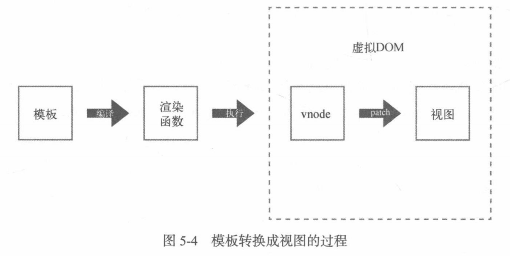
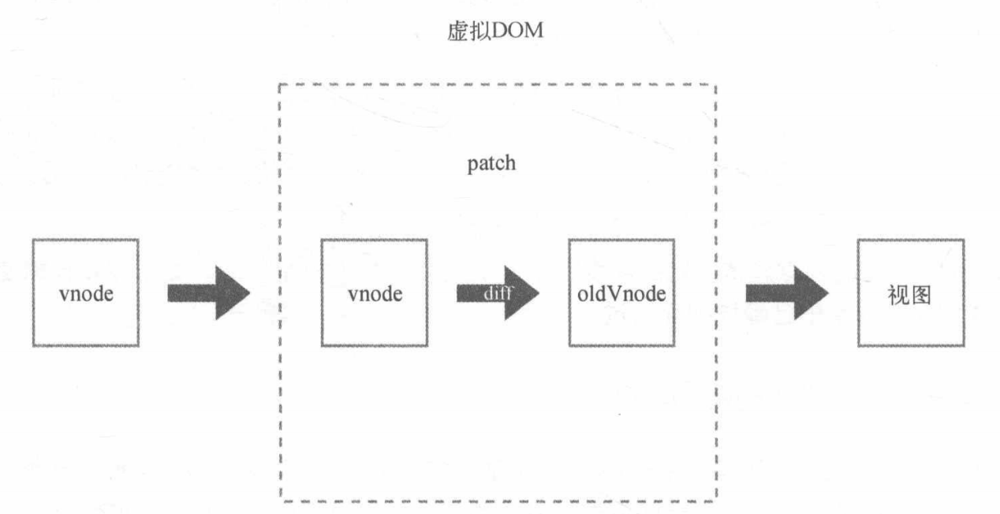
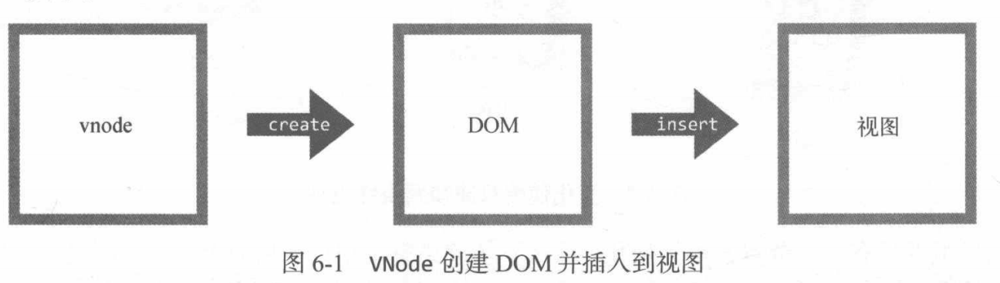

# 虚拟DOM

Vue.js 2.0 引入了虚拟DOM.

* 模板转换成视图过程



* 虚拟DOM的执行流程

  


## VNode

```js
export default class VNode {
  constructor (
    tag?: string,
    data?: VNodeData,
    children?: ?Array<VNode>,
    text?: string,
    elm?: Node,
    context?: Component,
    componentOptions?: VNodeComponentOptions,
    asyncFactory?: Function
  ) {
    this.tag = tag
    this.data = data
    this.children = children
    this.text = text
    this.elm = elm
    this.ns = undefined
    this.context = context
    // ...
    }
}
```

vnode可以理解成节点描述对象，它描述了应该怎样去创建真实的DOM节点。




由于每次渲染视图时，都是先创建vnode，然后使用它创建真实DOM插入到页面中，所以可以将上一次渲染视图时所创建的vnode缓存起来，之后每当需要重新渲染视图时，将新创建的vnode和上一次缓存的vnode进行对比，查看它们之间有哪些不一样的地方，找出这些不一样的地方并基于此修改真实的DOM。


### VNode的类型

vnode的类型有以下几种：

* 注释节点
* 文本节点
* 元素节点
* 组件节点
* 函数式组件
* 克隆节点

vnode是JS中的一个对象，不同类型的vnode之间其实只是属性不同，准确地说是有效属性不同。

因为当使用VNode类创建一个vnode时，通过参数为实例设置属性时，无效的属性会默认被赋值为 `undefined` 或 `false`。对于 vnode 身上的无效属性，可以直接忽略。


#### 1. 注释节点

```js
export const createEmptyVNode = (text: string = '') => {
  const node = new VNode()
  node.text = text
  node.isComment = true
  return node
}
```

#### 2. 文本节点

```js
export function createTextVNode (val: string | number) {
  return new VNode(undefined, undefined, undefined, String(val))
}
```

#### 3. 克隆节点

克隆节点是将现有节点的属性复制到新节点中，让新创建的节点和被克隆节点的属性保持一致，从而实现克隆效果。它的作用是，优化静态节点和插槽节点。

```js

// optimized shallow clone
// used for static nodes and slot nodes because they may be reused across
// multiple renders, cloning them avoids errors when DOM manipulations rely
// on their elm reference.
export function cloneVNode (vnode: VNode): VNode {
  const cloned = new VNode(
    vnode.tag,
    vnode.data,
    // #7975
    // clone children array to avoid mutating original in case of cloning
    // a child.
    vnode.children && vnode.children.slice(),
    vnode.text,
    vnode.elm,
    vnode.context,
    vnode.componentOptions,
    vnode.asyncFactory
  )
  cloned.ns = vnode.ns
  cloned.isStatic = vnode.isStatic
  cloned.key = vnode.key
  cloned.isComment = vnode.isComment
  cloned.fnContext = vnode.fnContext
  cloned.fnOptions = vnode.fnOptions
  cloned.fnScopeId = vnode.fnScopeId
  cloned.asyncMeta = vnode.asyncMeta
  cloned.isCloned = true
  return cloned
}
```

可以看出，克隆现有节点时，只需要将现有节点的属性全部复制到新节点中即可。

克隆节点和被克隆节点之后的唯一区别是 `isCloned`属性，克隆节点的 `isCloned`为`true`，被克隆的原始节点的`isCloned` 为`false`。


#### 4. 元素节点

元素节点通常会存在以下4种有效属性：

* `tag`：是一个节点的名称，如：`p`、`div`等
* `data`：该属性包含了一些节点上的数据，比如：`attrs`、`class`和`style`等
* `children`：当前节点的子节点列表
* `context`：当前组件的Vue.js实例


#### 5. 组件节点

组件节点和元素节点类似。但有以下两个独立的属性。

* `componentOptions`：组件节点的选项参数，其中包含`propsData`、`tag` 和 `children` 等信息。
* `componentInstance`：组件实例，也是Vue.js的实例


#### 6. 函数式组件

函数式组件和组件节点类似，它有两个独立的属性 `functionalContext`和`functionalOptions`


## patch

虚拟DOM最核心的部分是**patch**，它可以将 vnode渲染成真实的DOM。

patch也可以叫 **patching算法**，通过它渲染真实DOM时，并不是暴力覆盖原有DOM，而是比对新旧两个 vnode 之间有哪些不同，然后根据对比结果找出需要更新的节点进行更新。

